[https://learn.microsoft.com/en-us/aspnet/core/signalr/introduction?view=aspnetcore-9.0](https://learn.microsoft.com/en-us/aspnet/core/signalr/introduction?view=aspnetcore-9.0)
 
## Overview

**Protocols**  
The SignalR Protocol is a protocol for a two-way RPC over any message-based transport. Either party in the connection can invoke procedures on the other party, and procedures can return zero or more results or an error. SignalR provides two built-in hub protocols:
 
A text protocol that's based on **JSON**, which is the default.  
A binary protocol that's based on **MessagePack**, which generally creates smaller messages than JSON does.
 
**Users**  
A user in the system acts as an individual, but can also be part of a group. Messages can be sent to groups, and all group members are notified. A single user can connect from multiple client applications. For example, the same user can use a mobile device and a web browser and get real-time updates on both at the same time.
 
**Groups**  
A group consists of one or more connections. The server can create groups, add connections to a group, and remove connections from a group. A group has a specified name, which acts as its unique identifier. Groups serve as a scoping mechanism to help target messages. That is, real-time functionality can only be sent to users within a named group.
 
**Connections**  
A connection to a hub is represented by a unique identifier that's known only to the server and client. A single connection exists per hub type. Each client has a unique connection to the server. That is, a single user can be represented on multiple clients, but each client connection has its own identifier.
   

Mermaid: [https://mermaid.live/](https://mermaid.live/)

```mermaid
%%{init: {"themeVariables": {"fontSize": "10px"}} }%%
graph TD
    %% Users and their devices (clients)
    subgraph "👤 ADMIN"
        UA1["🖥️ Web Browser (Conn A1)"]
        UA2["📱 Mobile App (Conn A2)"]
    end
    subgraph "👤 PLANNER"
        UB1["🖥️ Web Browser (Conn B1)"]
    end
    subgraph "👤 OPERATOR"
        UC1["💻 Desktop App (Conn C1)"]
        UC2["📱 Tablet App (Conn C2)"]
    end
    %% Connections mapped to Groups
    subgraph "👥 Planning group"
        G1A1["Conn A1"]
        G1B1["Conn B1"]
    end
    subgraph "👥 Production Group"
        G2A2["Conn A2"]
        G2C1["Conn C1"]
        G2C2["Conn C2"]
    end
    %% Arrows showing mapping of connections to groups
    UA1 --> G1A1
    UB1 --> G1B1
    UA2 --> G2A2
    UC1 --> G2C1
    UC2 --> G2C2
    %% Optional notes
    G1B1 -.-> N1["💬 Message to Group 1 ➜ Notifies Conn A1 & Conn B1"]
    G2C2 -.-> N2["💬 Message to Group 2 ➜ Notifies Conn A2, C1 & C2"]
```


``
  
**Clients and the HubConnection class**  
The HubConnection class is a SignalR client concept, which represents the client's connection to the server Hub. It's defined within the Microsoft.AspNetCore.SignalR.Client namespace, and it's part of the Microsoft.AspNetCore.SignalR.Client NuGet package.
 
You create a HubConnection by using the builder pattern and the corresponding HubConnectionBuilder type. Given the hub's route (or System.Uri), you can create a HubConnection. The builder can also specify additional configuration options, including logging, the desired protocol, authentication token forwarding, and automatic reconnection, among others.
 
Authentication token forwarding is crucial for maintaining secure connections in SignalR applications. In practice, you would set the authentication token in the headers of the HTTP requests made by the SignalR client. This is often achieved by configuring the HttpClient used by SignalR, allowing you to add the necessary authorization headers that include your token.
 
To declare and implement authentication token forwarding in ASP.NET Core SignalR, you typically configure your HubConnection to include the necessary authentication tokens in the headers of the connection request. This is done using the HubConnectionBuilder to create the HubConnection. You would generally use the WithUrl method of the builder to specify the URL of the hub and include an HttpConnectionOptions object where you can set the headers. This allows you to attach your authentication token to the request.
 
We use the microsoft signalR client:  
Package: ==npm i @microsoft/signalr==
 
Repo & Readme: [https://github.com/dotnet/aspnetcore/blob/main/src/SignalR/clients/ts/signalr/README.md](https://github.com/dotnet/aspnetcore/blob/main/src/SignalR/clients/ts/signalr/README.md)
   

## Configuration

Sample code for the connection:
 
```js
const connection = new signalR.HubConnectionBuilder()
    .withUrl("https://localhost:5232/fullProductionSync")
    .build();

     withUrl(url: string, options: IHttpConnectionOptions): HubConnectionBuilder;

     /** An {@link @microsoft/signalr.HttpTransportType} value specifying the transport to use for t
     *                                                   he connection. 
     */
    transport?: HttpTransportType | ITransport;

    /** A function that provides an access token required for HTTP Bearer authentication.
     *
     * @returns {string | Promise\<string\>} A string containing the access token, or a Promise that resolves 
     *                                     to a string containing the access token.
     */
    accessTokenFactory?(): string | Promise\<string\>;
  


 let connection = new signalR.HubConnectionBuilder()
     .withUrl("/chathub", { 
        transport: signalR.HttpTransportType.WebSockets | signalR.HttpTransportType.LongPolling }
		accessTokenFactory: () =\> {
            // Get and return the access token.
            // This function can return a JavaScript Promise if asynchronous
            // logic is required to retrieve the access token.
        }

       ) 
     .build();

``` 


### Configure stateful reconnect

SignalR stateful reconnect reduces the perceived downtime of clients that have a temporary disconnect in their network connection, such as when switching network connections or a short temporary loss in access.
 
Stateful reconnect achieves this by:

- Temporarily buffering data on the server and client.
- Acknowledging messages received (ACK-ing) by both the server and client.
- Recognizing when a connection is up and replaying messages that might have been sent while the connection was down.
 
Opt in to stateful reconnect at both the server hub endpoint and the client:
 
Update the server hub endpoint configuration to enable the AllowStatefulReconnects option:


```js
app.MapHub\<MyHub\>("/hubName", options =\>  
{  
    options.AllowStatefulReconnects = true;  
});
```

 
Optionally, the maximum buffer size in bytes allowed by the server can be set globally or for a specific hub with the **StatefulReconnectBufferSize** option or the StatefulReconnectBufferSize option set for a specific hub. The StatefulReconnectBufferSize option is **optional** with a **default** of 100,000 bytes.
 
Update JavaScript or TypeScript client code to enable the withStatefulReconnect option:
```
const builder = new signalR.HubConnectionBuilder()
  .withUrl("/hubname")
  .withStatefulReconnect({ bufferSize: 1000 });  // Optional, defaults to 100,000
const connection = builder.build();
```
 
### Configure additional options

|   |   |   |
|---|---|---|
|JavaScript Option|Default Value|Description|
|accessTokenFactory|null|A function returning a string that is provided as a Bearer authentication token in HTTP requests.|
|transport|null|An HttpTransportType value specifying the transport to use for the connection.|
|headers|null|Dictionary of headers sent with every HTTP request. Sending headers in the browser doesn't work for WebSockets or the ServerSentEvents stream.|
|logMessageContent|null|Set to true to log the bytes/chars of messages sent and received by the client.|
|skipNegotiation|false|Set this to true to skip the negotiation step. Only supported when the WebSockets transport is the only enabled transport. This setting can't be enabled when using the Azure SignalR Service.|
|withCredentials|true|Specifies whether credentials will be sent with the CORS request. Azure App Service uses cookies for sticky sessions and needs this option enabled to work correctly. For more info on CORS with SignalR, see Security considerations in ASP.NET Core SignalR.|
|timeout|100,000|Timeout in milliseconds to apply to HTTP requests. This doesn't apply to Long Polling poll requests, EventSource, or WebSockets.|
   

### Groups

To create a group in a SignalR hub for tracking order status changes using an order object's unique identifier, you can define methods within your hub class. Here’s an example:
 
```csharp
public class OrderHub : Hub  
{  
    public async Task JoinOrderGroup(string orderId)  
    {  
        await Groups.AddToGroupAsync(Context.ConnectionId, orderId);  
    }
    
    public async Task NotifyOrderStatusChange(string orderId, string status)  
    {  
        await Clients.Group(orderId).SendAsync("OrderStatusChanged", status);  
    }  
}
```

In this example, the JoinOrderGroup method allows clients to join a group identified by the order ID. The NotifyOrderStatusChange method sends a notification to all clients in that group whenever the order status changes. This setup ensures that only clients interested in a specific order receive updates, making the application more efficient and enhancing user experience.
 
## Authentication & Authorization

**To implement authorization for groups in SignalR**, you can use ASP.NET Core's built-in authentication and authorization features. Here’s a general approach:
 
Define Policies: Create authorization policies in your Startup.cs file that specify the requirements for accessing certain groups.  
Authorize Hub Methods: Use the [Authorize] attribute on your hub methods to enforce these policies. This ensures that only authenticated users who meet the policy requirements can join or interact with specific groups.  
Group Management: When a user attempts to join a group, check if they meet the authorization requirements before adding them to the group.
 
```csharp
public class OrderHub : Hub  
{  
    [Authorize]  
    public async Task JoinOrderGroup(string orderId)  
    {  
        // Check if the user is authorized to join this order group  
        if (UserHasAccessToOrder(orderId))  
        {  
            await Groups.AddToGroupAsync(Context.ConnectionId, orderId);  
        }  
        else  
        {  
            throw new HubException("You are not authorized to join this group.");  
        }  
    }

    private bool UserHasAccessToOrder(string orderId)  
    {  
        // Implement your logic to check if the user has access to the order  
        // This could involve checking the user's roles or claims  
        return true; // Replace with actual authorization logic  
    }  
}
```
 
In this example, the JoinOrderGroup method checks if the user is authorized to join the specified order group. If not, it throws an exception, preventing unauthorized access. You can customize the UserHasAccessToOrder method to implement your specific authorization logic based on user roles or claims.


> [!INFO] Information
> If a **user has not joined a specific group** in SignalR, they will not receive messages that are sent to that group, even if they have established a connection to the hub and registered for events. In SignalR, group membership is essential for receiving targeted messages. When a message is sent to a group, only the clients that are members of that group will receive the message. Therefore, if a user is not part of a group, they will miss any messages intended for that group, regardless of their connection status to the hub or their event subscriptions.


> [!NOTE] Note
> Hubs are [transient](https://learn.microsoft.com/en-us/dotnet/core/extensions/dependency-injection#transient):
>  - Don't store state in a property of the hub class. Each hub method call is executed on a new hub instance.
>  - Don't instantiate a hub directly via dependency injection. To send messages to a client from elsewhere in your application  use an [IHubContext](https://learn.microsoft.com/en-us/aspnet/core/signalr/hubcontext?view=aspnetcore-9.0).
> - Use ==await== when calling asynchronous methods that depend on the hub staying alive. For example, a method such as ==Clients.All.SendAsync(...)== can fail if it's called without ==await== and the hub method completes before ==SendAsync== finishes.

  
**The Context object**  
The Hub class includes a Context property that contains the following properties with information about the connection:
 
|   |   |
|---|---|
|**Property**|**Description**|
|ConnectionId|Gets the unique ID for the connection, assigned by SignalR. There's one connection ID for each connection.|
|UserIdentifier|Gets the user identifier. By default, SignalR uses the ClaimTypes.NameIdentifier from the ClaimsPrincipal associated with the connection as the user identifier.|
|User|Gets the ClaimsPrincipal associated with the current user.|
|Items|Gets a key/value collection that can be used to share data within the scope of this connection. Data can be stored in this collection and it will persist for the connection across different hub method invocations.|
|Features|Gets the collection of features available on the connection. For now, this collection isn't needed in most scenarios, so it isn't documented in detail yet.|
|ConnectionAborted|Gets a CancellationToken that notifies when the connection is aborted.|
 
**The Clients objec**t  
The Hub class includes a Clients property that contains the following properties for communication between server and client:
 
|   |   |
|---|---|
|**Property**|**Description**|
|All|Calls a method on all connected clients|
|Caller|Calls a method on the client that invoked the hub method|
|Others|Calls a method on all connected clients except the client that invoked the method|
 
## Send messages to clients

To make calls to specific clients, use the properties of the Clients object. In the following example, there are three hub methods:
 
_SendMessage_ sends a message to all connected clients, using Clients.All.  
_SendMessageToCaller_ sends a message back to the caller, using Clients.Caller.  
_SendMessageToGroup_ sends a message to all clients in the SignalR Users group.
 
```csharp
public async Task SendMessage(string user, string message)
    => await Clients.All.SendAsync("ReceiveMessage", user, message);

public async Task SendMessageToCaller(string user, string message)
    => await Clients.Caller.SendAsync("ReceiveMessage", user, message);

public async Task SendMessageToGroup(string user, string message)
    => await Clients.Group("SignalR Users").SendAsync("ReceiveMessage", user, message);
```

## Inject services into a hub

Hub constructors can accept services from DI as parameters, which can be stored in properties on the class for use in a hub method.
 
When injecting multiple services for different hub methods or as an alternative way of writing code, hub methods can also accept services from DI. By default, hub method parameters are inspected and resolved from DI if possible.
 
```csharp
services.AddSingleton\<IDatabaseService, DatabaseServiceImpl\>();

// ...

public class ChatHub : Hub  
{  
    public Task SendMessage(string user, string message, IDatabaseService dbService)  
    {  
        var userName = dbService.GetUserName(user);  
        return Clients.All.SendAsync("ReceiveMessage", userName, message);  
    }  
}
```
 
## Browser sleeping tab

Some browsers have a tab freezing or sleeping feature to reduce computer resource usage for inactive tabs. This can cause SignalR connections to close and may result in an unwanted user experience. Browsers use heuristics to figure out if a tab should be put to sleep, such as:
 
Playing audio  
Holding a web lock  
Holding an IndexedDB lock  
Being connected to a USB device  
Capturing video or audio  
Being mirrored  
Capturing a window or display  
Browser heuristics may change over time and can differ between browsers. Check the support matrix and figure out what method works best for your scenarios.
 
To avoid putting an app to sleep, the app should trigger one of the heuristics that the browser uses.
 
The following code example shows how to use a Web Lock to keep a tab awake and avoid an unexpected connection closure.
 
```csharp
var lockResolver;  
if (navigator && navigator.locks && navigator.locks.request) {  
    const promise = new Promise((res) => {  
        lockResolver = res;  
    });
	navigator.locks.request('unique_lock_name', { mode: "shared" }, () => {  
        return promise;  
    });  
}
```


For the preceding code example:
 
Web Locks are experimental. The conditional check confirms that the browser supports Web Locks.  
The promise resolver, lockResolver, is stored so that the lock can be released when it's acceptable for the tab to sleep.  
When closing the connection, the lock is released by calling lockResolver(). When the lock is released, the tab is allowed to sleep.