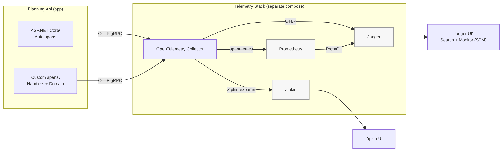
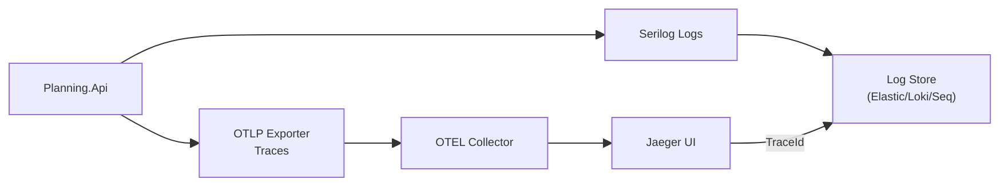
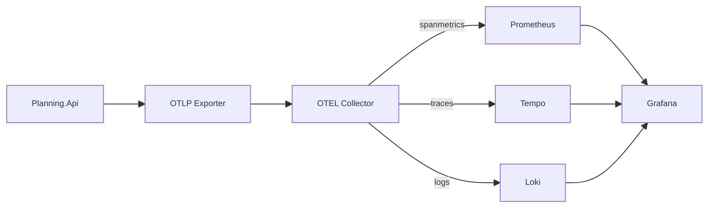

 

   
 
## 1) Correlation logs ↔ traces με Serilog (TraceId/SpanId)
   

   

## 2) Full OTEL (Traces + Logs) μέσω Collector
   



  
## 3) Grafana Stack (Metrics + Traces + Logs)


      
Πρόσθεσε monitoring στο repo  
No tasks in progress  
Στο τρέχων repo έχω βάλει telemetry kai jaeger. Τώρα θέλω να βάλω και το monitoring
       
Κατάλαβα. Όταν λες “monitoring”, εννοείς:

1. **Metrics + dashboards** (π.χ. Prometheus + Grafana)
2. **APM/Cloud monitoring** (π.χ. Application Insights, Datadog, New Relic)
3. **Logs/metrics/traces μαζί** (π.χ. Grafana stack, ELK)
4. **Health checks / readiness** endpoints
   Και για ποια services θέλεις να το βάλουμε; μόνο `planning-api` ή σε όλα;  
   Αν θέλεις Prometheus+Grafana, μπορώ να:
	- προσθέσω OpenTelemetry **metrics** exporter
	- εκθέσω `/metrics`
	- βάλω τους containers στο docker-compose.override.yml
	- δώσω βασικό dashboard

Πες μου τι προτιμάς (stack + scope) και το κάνω.  
Δες αυτό το link [https://www.jaegertracing.io/docs/2.14/architecture/spm/#option-1-promql-compatible-backend-configuration](https://www.jaegertracing.io/docs/2.14/architecture/spm/#option-1-promql-compatible-backend-configuration)  

Το link περιγράφει το SPM (Monitor tab) του Jaeger και ειδικά το “Option 1: PromQL‑compatible backend configuration”. Τα βασικά βήματα που ζητάει είναι: ([jaegertracing.io](https://www.jaegertracing.io/docs/2.14/architecture/spm/))

- Ενεργοποίηση **SpanMetrics connector** στον OpenTelemetry Collector ώστε να παράγει RED metrics από spans.
- Export των metrics σε **Prometheus exporter endpoint** (π.χ. 0.0.0.0 (line 8889)) και Prometheus να τα κάνει scrape.
- Ρύθμιση **metrics storage** στο `jaeger_storage` extension με PromQL backend (π.χ. Prometheus) και δήλωση `metrics_storage` στο `jaeger_query`.
- Ενεργοποίηση UI με `monitor.menuEnabled=true`.

Αν θέλεις, πες μου:

5. Θες να στήσουμε **Prometheus + OTEL Collector** στο `docker-compose` σου για να ενεργοποιηθεί το Monitor tab;
6. Θα χρησιμοποιήσουμε Prometheus ως PromQL backend ή άλλο (π.χ. Mimir, Thanos);

Μπορώ να σου κάνω τις ακριβείς αλλαγές στα configs του repo.  
1
    
EditedPlanning.Api.csproj
 
```
                \<PackageReference Include="OpenTelemetry.Instrumentation.AspNetCore" Version="1.6.0-rc.1" /\>
                \<PackageReference Include="OpenTelemetry.Instrumentation.Http" Version="1.6.0-rc.1" /\>
                \<PackageReference Include="OpenTelemetry.Exporter.Jaeger" Version="1.6.0-rc.1" /\>
        \</ItemGroup\>
                \<PackageReference Include="OpenTelemetry.Instrumentation.Http" Version="1.6.0-rc.1" /\>
                \<PackageReference Include="OpenTelemetry.Exporter.Jaeger" Version="1.6.0-rc.1" /\>
                \<PackageReference Include="OpenTelemetry.Exporter.OpenTelemetryProtocol" Version="1.6.0-rc.1" /\>
        \</ItemGroup\>
```
 
EditedStartup.cs
   

```
                        if (_environment.IsDevelopment()
                                && Configuration.GetValue\<bool\>("DebugRequestLogging:EnableOpenTelemetry"))
                        {
                                var enableJaeger = Configuration.GetValue\<bool\>("DebugRequestLogging:EnableJaeger");
                                var grpcMethodAllowList = Configuration
                                        .GetSection("DebugRequestLogging:GrpcMethodAllowList")
                                        .Get\<string[]\>() ?? Array.Empty\<string\>();
                                var grpcMethodAllowListSet = new HashSet\<string\>(grpcMethodAllowList, StringComparer.OrdinalIgnoreCase);
                        if (_environment.IsDevelopment()
                                && Configuration.GetValue\<bool\>("DebugRequestLogging:EnableOpenTelemetry"))
                        {
                                var enableJaeger = Configuration.GetValue\<bool\>("DebugRequestLogging:EnableJaeger");
                                var otlpEndpoint = Configuration.GetValue\<string\>("DebugRequestLogging:OtlpEndpoint");
                                var grpcMethodAllowList = Configuration
                                        .GetSection("DebugRequestLogging:GrpcMethodAllowList")
                                        .Get\<string[]\>() ?? Array.Empty\<string\>();
                                var grpcMethodAllowListSet = new HashSet\<string\>(grpcMethodAllowList, StringComparer.OrdinalIgnoreCase);

                                                                }
                                                        })
                                                        .AddHttpClientInstrumentation();
                                                        })
                                                        .AddHttpClientInstrumentation();

                                                if (enableJaeger)
                                                {
                                                        builder.AddJaegerExporter(options =\>
                                                        {
                                                                var agentHost = Configuration.GetValue\<string\>("DebugRequestLogging:JaegerAgentHost");
                                                                var agentPort = Configuration.GetValue\<int?\>("DebugRequestLogging:JaegerAgentPort");

                                                if (enableJaeger)
                                                {
                                                        builder.AddJaegerExporter(options =\>
                                                        {
                                                                var agentHost = Configuration.GetValue\<string\>("DebugRequestLogging:JaegerAgentHost");
                                                                var agentPort = Configuration.GetValue\<int?\>("DebugRequestLogging:JaegerAgentPort");

                                                                if (!string.IsNullOrWhiteSpace(agentHost))
                                                                {
                                                                        options.AgentPort = agentPort.Value;
                                                                }
                                                        });
                                                }
                                        });
                        }
                                                                        options.AgentPort = agentPort.Value;
                                                                }
                                                        });
                                                }

                                                if (!string.IsNullOrWhiteSpace(otlpEndpoint))
                                                {
                                                        builder.AddOtlpExporter(options =\>
                                                        {
                                                                options.Endpoint = new Uri(otlpEndpoint);
                                                                options.Protocol = OtlpExportProtocol.Grpc;
                                                        });
                                                }
                                        });
                        }
```
 
Editedappsettings.Development.json
 
```
        "DebugRequestLogging": {
                "EnableGrpcRequestLogging": true,
                "EnableOpenTelemetry": true,
                "EnableJaeger": true,
                "JaegerAgentHost": "jaeger",
                "JaegerAgentPort": 6831,
                "GrpcMethodAllowList": []
        }
}
                "EnableGrpcRequestLogging": true,
                "EnableOpenTelemetry": true,
                "EnableJaeger": true,
                "OtlpEndpoint": " http://otel-collector:4317",
                "JaegerAgentHost": "jaeger",
                "JaegerAgentPort": 6831,
                "GrpcMethodAllowList": []
        }
}
```
 Created otel-collector.yml
 
```
receivers:
  otlp:
    protocols:
      grpc:
      http:

exporters:
  jaeger:
    endpoint: jaeger:14250
    tls:
      insecure: true
  prometheus:
    endpoint: "0.0.0.0:8889"

connectors:
  spanmetrics:
    namespace: traces_spanmetrics
```
 
```
service:
  pipelines:
    traces:
      receivers: [otlp]
      exporters: [jaeger, spanmetrics]
    metrics:
      receivers: [spanmetrics]
      exporters: [prometheus]
```
 Created prometheus.yml
 
```
global:
  scrape_interval: 15s
```
 
```
scrape_configs:
  - job_name: "otel-collector"
    static_configs:
      - targets: ["otel-collector:8889"]
```
 Editedc:\Users\michael\developer\scpCloud\docker-compose.override.yml
   

```
  planning-api:
    environment:
      - ASPNETCORE_ENVIRONMENT=Development
      - ConnectionString=Server=sqldata;Database=ScpCloudPlanning;User Id=sa;Password=Pass@word;Trust Server Certificate=True
      - ASPNETCORE_URLS=https://+:443;http://+:80
      - ASPNETCORE_Kestrel__EndpointDefaults__Protocols=http2
      - DebugRequestLogging__EnableOpenTelemetry=true
      - DebugRequestLogging__EnableJaeger=true
      - DebugRequestLogging__JaegerEndpoint=http://jaeger:14268/api/traces
      - DebugRequestLogging__JaegerAgentHost=jaeger
      - DebugRequestLogging__JaegerAgentPort=6831
      - UrlsConfig__GrpcProduction=https://production-api:443 
      - EventBusConnection=${ESHOP_AZURE_SERVICE_BUS:-rabbitmq}
  planning-api:
    environment:
      - ASPNETCORE_ENVIRONMENT=Development
      - ConnectionString=Server=sqldata;Database=ScpCloudPlanning;User Id=sa;Password=Pass@word;Trust Server Certificate=True
      - ASPNETCORE_URLS=https://+:443;http://+:80
      - ASPNETCORE_Kestrel__EndpointDefaults__Protocols=http2
      - DebugRequestLogging__EnableOpenTelemetry=true
      - DebugRequestLogging__EnableJaeger=true
      - DebugRequestLogging__OtlpEndpoint=http://otel-collector:4317
      - DebugRequestLogging__JaegerEndpoint=http://jaeger:14268/api/traces
      - DebugRequestLogging__JaegerAgentHost=jaeger
      - DebugRequestLogging__JaegerAgentPort=6831
      - UrlsConfig__GrpcProduction=https://production-api:443 
      - EventBusConnection=${ESHOP_AZURE_SERVICE_BUS:-rabbitmq}
      - EventBusUserName=
      - webproductionbff

  jaeger:
    image: jaegertracing/all-in-one:1.56
    ports:
      - "16686:16686"
      - "14268:14268"
      - "6831:6831/udp"

    
volumes:
  scp-sqldata:
    external: false
  jaeger:
    image: jaegertracing/all-in-one:1.56
    environment:
      - METRICS_STORAGE_TYPE=prometheus
      - PROMETHEUS_SERVER_URL=http://prometheus:9090
      - PROMETHEUS_QUERY_SUPPORT_SPANMETRICS_CONNECTOR=true
    ports:
      - "16686:16686"
      - "14268:14268"
      - "6831:6831/udp"

  otel-collector:
    image: otel/opentelemetry-collector:0.96.0
    command: ["--config=/etc/otelcol/config.yaml"]
    ports:
      - "4317:4317"
      - "4318:4318"
    volumes:
      - ./observability/otel-collector.yml:/etc/otelcol/config.yaml:ro
    depends_on:
      - jaeger

  prometheus:
    image: prom/prometheus:v2.50.1
    ports:
      - "9090:9090"
    volumes:
      - ./observability/prometheus.yml:/etc/prometheus/prometheus.yml:ro
    depends_on:
      - otel-collector
```
 
```
    
volumes:
  scp-sqldata:
    external: false
  scp-nosqldata:
```
 Editedc:\Users\michael\developer\scpCloud\docker-compose.override.yml
 
```
      - "5211:443"
    depends_on:
      - rabbitmq
      - sqldata
      - production-api 
      - jaeger
    depends_on:
      - rabbitmq
      - sqldata
      - production-api 
      - jaeger
      - otel-collector
    volumes:
```
 Έβαλα Prometheus + OTEL Collector (spanmetrics) και έδεσα το `planning-api` να στέλνει traces και προς τον collector για SPM.  
Τι άλλαξε

- Προσθήκη OTLP exporter στο `planning-api` και config για OTLP endpoint.
- Νέα configs για OTEL Collector και Prometheus.
- Νέες υπηρεσίες `otel-collector` και `prometheus` στο docker-compose.override.yml.
- Jaeger env για PromQL backend (Monitor tab).

Αρχεία

- Planning.Api.csproj
- Startup.cs
- appsettings.Development.json
- docker-compose.override.yml
- otel-collector.yml
- prometheus.yml

Σημείωση

- Το Jaeger image είναι `jaegertracing/all-in-one:1.56`. Το link που έδωσες αφορά docs 2.14· αν θες πλήρη συμβατότητα με το Monitor tab της 2.14, μπορεί να χρειαστεί αλλαγή image/version. Πες μου αν θέλεις να το ανεβάσω και να ρυθμίσω ανάλογα.

Next steps (αν θες)

- `docker compose up -d jaeger otel-collector prometheus planning-api`
- Άνοιξε Jaeger UI: 
    
    ```
    http://localhost:16686
    ```
    
     και Prometheus: 
    
    ```
    http://localhost:9090
    ```
    

Θες να προχωρήσω και σε αλλαγή Jaeger image/version ώστε να ταιριάζει 100% με το docs 2.14;  
6 files changed+134-63  
UndoReview  
Planning.Api.csproj  
Startup.cs  
appsettings.Development.json  
docker-compose.override.yml  
otel-collector.yml  
prometheus.yml  
Όχι αλλά γιατί έχουμε βάλει 1.6rc στα nuget packages δεν υπήρχε άλλη?  
Καλό point. Τα 1.6.0‑rc.1 ήταν ήδη στο project πριν κάνουμε τις αλλαγές· απλώς πρόσθεσα το OTLP exporter στην ίδια σειρά/έκδοση για συμβατότητα. Δεν το άλλαξα σε stable γιατί θα χρειαζόταν συνολική αναβάθμιση των OpenTelemetry packages.  
Αν θέλεις, μπορώ να τα ανεβάσω σε stable (π.χ. 1.6.0 ή νεότερο), αλλά καλύτερα να τα κάνουμε όλα μαζί ώστε να μην έχουμε version mismatch. Θες να το κάνω;  
Ας κάνω ένα commit πρώτα και βλέπουμε  
Οκ. Κάνε το commit και όταν είσαι έτοιμος συνέχισε.  
Αν θες, μπορώ μετά να ανεβάσω όλα τα OpenTelemetry NuGet σε stable με μία στοχευμένη αλλαγή.  
Με βάση τα actiity sources που έχω ΄βαλει τι θα έπρεπε να δω στο monitoring?  
Θες να μιλάμε για το **Jaeger Monitor (SPM)** ή γενικά για metrics σε Prometheus/Grafana;  
Και ποια activity sources έχεις βάλει; Π.χ. στη Startup.cs βλέπω:

113. `"Planning.Api.Scheduling"`
114. `"Planning.Domain.Scheduling"`

Έχεις προσθέσει κι άλλα ή custom `ActivitySource` names αλλού; Αν μου πεις ακριβώς τα sources, σου λέω τι metrics/labels θα εμφανιστούν.  
οχι ειναι αυτά που βρήκες. Στο SPM τι θα δω και πως;  
Στο Jaeger **SPM (Monitor tab)**, με τα sources που έχεις (και με το spanmetrics connector), θα βλέπεις για το service Planning.Api:

116. **Operations** ανά span name (π.χ. gRPC methods όπως `/package.Service/Method`, HTTP endpoints, ή custom Activity names από `Planning.Api.Scheduling` / `Planning.Domain.Scheduling`).
117. **RED metrics** ανά operation:
118. **Rate** (requests/sec)
119. **Errors** (error rate)
120. **Duration/Latency** (p95/p99 ανάλογα με το UI)

Πώς το βλέπεις:

122. Άνοιξε Jaeger UI: 
    
    ```
    http://localhost:16686
    ```
    
123. Πήγαινε **Monitor** tab
124. Διάλεξε service Planning.Api
125. Διάλεξε χρονικό range και operation (ή “All Operations”)

Τι χρειάζεται για να γεμίσει:

127. Να περάσει **traffic** (gRPC/HTTP) ώστε να δημιουργηθούν spans
128. Ο **otel-collector** να στέλνει spanmetrics → Prometheus
129. Το Jaeger να είναι ρυθμισμένο με Prometheus ως metrics storage (το κάναμε)

Αν δεν βλέπεις τίποτα:

131. Check Prometheus targets 
    
    ```
    http://localhost:9090/targets
    ```
    
     (otel-collector up)
132. Check Jaeger logs για metrics storage
133. Βεβαιώσου ότι τα spans παράγονται (Traces tab στο Jaeger)

Αν θες, μπορώ να σου δείξω και συγκεκριμένα metric names/queries που αντιστοιχούν στα operations σου.


Δε φαίνεται να δουλεύει
 
Το error στο Prometheus λέει ότι **δεν μπορεί να resolve το hostname** `otel-collector`. Συνήθως σημαίνει ότι ο Prometheus container δεν είναι στο ίδιο docker network ή ο `otel-collector` δεν τρέχει.  
Πήγα να δω `docker compose ps` αλλά ο Docker daemon δεν είναι προσβάσιμος από εδώ (“Access is denied”). Θα χρειαστώ εσύ να τρέξεις δυο εντολές και να μου πεις το output:

139. `docker compose ps`
140. `docker compose logs otel-collector --tail 200`

Επίσης έλεγξε αν ο `otel-collector` container όντως τρέχει.  
Γρήγορος έλεγχος: στο Prometheus UI, το error δείχνει `lookup otel-collector on 127.0.0.11:53: no such host`, άρα:

142. είτε ο `otel-collector` **δεν είναι up**
143. είτε ο Prometheus **δεν είναι στο ίδιο compose project/network**

Πες μου τι βγάζουν οι εντολές και το φτιάχνουμε άμεσα.  
to container toy collector den sikothike 2026-01-23 13:00:37.317 | Error: failed to get config: cannot unmarshal the configuration: 2 error(s) decoding: 2026-01-23 13:00:37.317 | 2026-01-23 13:00:37.317 | * error decoding 'connectors': unknown type: "spanmetrics" for id: "spanmetrics" (valid values: [forward]) 2026-01-23 13:00:37.317 | * error decoding 'exporters': unknown type: "jaeger" for id: "jaeger" (valid values: [opencensus file kafka prometheus prometheusremotewrite debug logging otlp otlphttp zipkin]) 2026-01-23 13:00:37.317 | 2026/01/23 11:00:37 collector server run finished with error: failed to get config: cannot unmarshal the configuration: 2 error(s) decoding: 2026-01-23 13:00:37.317 | 2026-01-23 13:00:37.317 | * error decoding 'connectors': unknown type: "spanmetrics" for id: "spanmetrics" (valid values: [forward]) 2026-01-23 13:00:37.317 | * error decoding 'exporters': unknown type: "jaeger" for id: "jaeger" (valid values: [opencensus file kafka prometheus prometheusremotewrite debug logging otlp otlphttp zipkin]) 2026-01-23 13:12:07.359 | Error: failed to get config: cannot unmarshal the configuration: 2 error(s) decoding: 2026-01-23 13:12:07.359 | 2026-01-23 13:12:07.359 | * error decoding 'connectors': unknown type: "spanmetrics" for id: "spanmetrics" (valid values: [forward]) 2026-01-23 13:12:07.359 | * error decoding 'exporters': unknown type: "jaeger" for id: "jaeger" (valid values: [prometheus prometheusremotewrite logging file kafka opencensus debug otlp otlphttp zipkin]) 2026-01-23 13:12:07.359 | 2026/01/23 11:12:07 collector server run finished with error: failed to get config: cannot unmarshal the configuration: 2 error(s) decoding: 2026-01-23 13:12:07.359 | 2026-01-23 13:12:07.359 | * error decoding 'connectors': unknown type: "spanmetrics" for id: "spanmetrics" (valid values: [forward]) 2026-01-23 13:12:07.359 | * error decoding 'exporters': unknown type: "jaeger" for id: "jaeger" (valid values: [prometheus prometheusremotewrite logging file kafka opencensus debug otlp otlphttp zipkin]) 2026-01-23 13:18:22.177 | Error: failed to get config: cannot unmarshal the configuration: 2 error(s) decoding: 2026-01-23 13:18:22.177 | 2026-01-23 13:18:22.177 | * error decoding 'connectors': unknown type: "spanmetrics" for id: "spanmetrics" (valid values: [forward]) 2026-01-23 13:18:22.177 | * error decoding 'exporters': unknown type: "jaeger" for id: "jaeger" (valid values: [debug file prometheusremotewrite zipkin logging otlp otlphttp kafka opencensus prometheus]) 2026-01-23 13:18:22.177 | 2026/01/23 11:18:22 collector server run finished with error: failed to get config: cannot unmarshal the configuration: 2 error(s) decoding: 2026-01-23 13:18:22.177 | 2026-01-23 13:18:22.177 | * error decoding 'connectors': unknown type: "spanmetrics" for id: "spanmetrics" (valid values: [forward]) 2026-01-23 13:18:22.177 | * error decoding 'exporters': unknown type: "jaeger" for id: "jaeger" (valid values: [debug file prometheusremotewrite zipkin logging otlp otlphttp kafka opencensus prometheus])  
Editedc:\Users\michael\developer\scpCloud\docker-compose.override.yml
 
```
  otel-collector:
    image: otel/opentelemetry-collector:0.96.0
    image: otel/opentelemetry-collector-contrib:0.96.0
    command: ["--config=/etc/otelcol/config.yaml"]
```
 Το error δείχνει ότι ο collector που τρέχει είναι **core** και δεν έχει `spanmetrics` connector ούτε `jaeger` exporter. Χρειάζεται **contrib** image.  
Έκανα την αλλαγή:

147. docker-compose.override.yml → `otel/opentelemetry-collector-contrib:0.96.0`

Τώρα κάνε:

149. `docker compose up -d otel-collector`
150. `docker compose logs otel-collector --tail 50`

Αν ξεκινήσει σωστά, στο Prometheus targets θα γίνει “UP”.  
1 file changed  
UndoReview  
docker-compose.override.yml  
πως τρέχω την εφαρμογή από cli?  
Αν θες όλο το stack με docker compose, από το repo root:  
docker compose up -d  
Αν θες μόνο το planning-api + τα observability services:  
docker compose up -d planning-api jaeger otel-collector prometheus  
Αν θες να το τρέξεις locally χωρίς docker (μέσα από το project):  
dotnet run --project Services\Planning\Planning.Api\Planning.Api.csproj  
Πες μου ποιο τρόπο προτιμάς.  
to container den sikonetai 2026-01-23 13:37:28.256 | Error: failed to get config: cannot unmarshal the configuration: 1 error(s) decoding: 2026-01-23 13:37:28.256 | 2026-01-23 13:37:28.256 | * error decoding 'exporters': unknown type: "jaeger" for id: "jaeger" (valid values: [awscloudwatchlogs carbon clickhouse splunk_hec debug otlphttp googlecloud alibabacloud_logservice googlemanagedprometheus instana kafka pulsar syslog awss3 signalfx tencentcloud_logservice otlp elasticsearch honeycombmarker opensearch prometheus prometheusremotewrite logging awsemf awsxray dynatrace mezmo sapm logicmonitor awskinesis azuredataexplorer azuremonitor cassandra coralogix datadog dataset logzio loki opencensus sentry skywalking zipkin file googlecloudpubsub influxdb loadbalancing sumologic]) 2026-01-23 13:37:28.256 | 2026/01/23 11:37:28 collector server run finished with error: failed to get config: cannot unmarshal the configuration: 1 error(s) decoding: 2026-01-23 13:37:28.256 | 2026-01-23 13:37:28.256 | * error decoding 'exporters': unknown type: "jaeger" for id: "jaeger" (valid values: [awscloudwatchlogs carbon clickhouse splunk_hec debug otlphttp googlecloud alibabacloud_logservice googlemanagedprometheus instana kafka pulsar syslog awss3 signalfx tencentcloud_logservice otlp elasticsearch honeycombmarker opensearch prometheus prometheusremotewrite logging awsemf awsxray dynatrace mezmo sapm logicmonitor awskinesis azuredataexplorer azuremonitor cassandra coralogix datadog dataset logzio loki opencensus sentry skywalking zipkin file googlecloudpubsub influxdb loadbalancing sumologic])  
Editedotel-collector.yml
 
```
exporters:
  jaeger:
    endpoint: jaeger:14250
  otlp:
    endpoint: jaeger:4317
    tls:
      receivers: [otlp]
      exporters: [jaeger, spanmetrics]
      exporters: [otlp, spanmetrics]
    metrics:
```
 Editedc:\Users\michael\developer\scpCloud\docker-compose.override.yml
 
```
      - PROMETHEUS_QUERY_SUPPORT_SPANMETRICS_CONNECTOR=true
      - COLLECTOR_OTLP_ENABLED=true
    ports:
```
 Το `jaeger` exporter δεν υποστηρίζεται πλέον από τον collector. Το άλλαξα σε **OTLP exporter** προς τον Jaeger και ενεργοποίησα OTLP receiver στον Jaeger.  
Αλλαγές:

156. otel-collector.yml: `jaeger` → `otlp` exporter (endpoint jaeger (line 4317))
157. docker-compose.override.yml: `COLLECTOR_OTLP_ENABLED=true` στο jaeger

Τώρα τρέξε:  
docker compose up -d jaeger otel-collector  
Αν θέλεις, στείλε τα logs του `otel-collector` αν συνεχίζει να μην σηκώνεται:  
docker compose logs otel-collector --tail 50  
2 files changed+4-3  
UndoReview  
docker-compose.override.yml  
otel-collector.yml  
Doyleyei tora o collector, piso sto monitor opmos de vlepo kati pali  
Ωραία που σηκώθηκε ο collector. Αν στο **Jaeger Monitor (SPM)** δεν βλέπεις κάτι, συνήθως σημαίνει ότι **δεν έχουν παραχθεί spans** ή **δεν φτάνουν metrics στο Prometheus**.  
Γρήγορα checks:

159. **Υπάρχουν spans στο Jaeger;**
160. Jaeger UI → Search
161. Service: Planning.Api
162. Κάνε μερικά requests και δες αν εμφανίζονται traces.
163. **Prometheus target είναι UP;**
164. ```
    http://localhost:9090/targets
    ```
    
165. Θες `otel-collector` να είναι **UP** (όχι DOWN).
166. **Υπάρχουν spanmetrics;**
167. Στο Prometheus “Graph”, δοκίμασε query:
    
    ```
    traces_spanmetrics_calls_total
    ```
    
    Αν επιστρέφει time series, τότε SPM θα πρέπει να δείξει.
168. **Έχεις traffic;**
169. Πρέπει να χτυπήσεις τα gRPC/HTTP endpoints του `planning-api` (ώστε να δημιουργηθούν spans).

Αν θες, πες μου:

171. Βλέπεις traces στο Jaeger Search;
172. Είναι UP το target του Prometheus;
173. Τι επιστρέφει το query `traces_spanmetrics_calls_total` στο Prometheus;

Με αυτά θα το κλειδώσουμε άμεσα.


(No content)  
Τέλεια — τώρα **υπάρχουν spanmetrics** στο Prometheus, άρα το SPM έχει δεδομένα. Αν παρ’ όλα αυτά το Monitor tab στο Jaeger είναι άδειο, τότε το πρόβλημα είναι στο **Jaeger metrics storage wiring**.  
Δοκίμασε αυτά:

177. **Jaeger UI → Monitor tab → service** Planning.ApiΑν είναι άδειο, προχώρα στο 2.
178. **Έλεγξε ότι το Jaeger query βλέπει metrics******Στα logs του Jaeger πρέπει να φαίνεται ότι χρησιμοποιεί Prometheus ως metrics storage.Τρέξε:docker compose logs jaeger --tail 200
179. **Force time range******Στο Monitor tab, βάλε συγκεκριμένο range (π.χ. “Last 15 minutes”) και κάνε μερικά requests ακόμα για να δημιουργηθούν spans.

Αν θες, στείλε μου το `docker compose logs jaeger --tail 200` για να δούμε αν το query έχει φορτώσει Prometheus metrics storage.  
2026-01-23 13:41:53.768 | 2026/01/23 11:41:53 maxprocs: Leaving GOMAXPROCS=16: CPU quota undefined 2026-01-23 13:41:53.865 | 2026/01/23 11:41:53 application version: git-commit=ecbae67ea32f189df1ddb4ec2da46d5fcd328b03, git-version=v1.56.0, build-date=2024-04-03T19:57:40Z 2026-01-23 13:41:53.867 | {"level":"info","ts":1769168513.8674538,"caller":"flags/service.go:110","msg":"Mounting metrics handler on admin server","route":"/metrics"} 2026-01-23 13:41:53.867 | {"level":"info","ts":1769168513.8677258,"caller":"flags/service.go:116","msg":"Mounting expvar handler on admin server","route":"/debug/vars"} 2026-01-23 13:41:53.869 | {"level":"info","ts":1769168513.8693066,"caller":"flags/admin.go:130","msg":"Mounting health check on admin server","route":"/"} 2026-01-23 13:41:53.869 | {"level":"info","ts":1769168513.8695168,"caller":"flags/admin.go:144","msg":"Starting admin HTTP server","http-addr":":14269"} 2026-01-23 13:41:53.869 | {"level":"info","ts":1769168513.8695781,"caller":"flags/admin.go:122","msg":"Admin server started","http.host-port":"[::]:14269","health-status":"unavailable"} 2026-01-23 13:41:53.870 | {"level":"info","ts":1769168513.8700655,"caller":"grpcclientconn.go:429","msg":"[core][Channel #1] Channel created","system":"grpc","grpc_log":true} 2026-01-23 13:41:53.870 | {"level":"info","ts":1769168513.8702872,"caller":"grpcclientconn.go:1724","msg":"[core][Channel #1] original dial target is: \"localhost:4317\"","system":"grpc","grpc_log":true} 2026-01-23 13:41:53.870 | {"level":"info","ts":1769168513.8704286,"caller":"grpcclientconn.go:1731","msg":"[core][Channel #1] parsed dial target is: resolver.Target{URL:url.URL{Scheme:\"localhost\", Opaque:\"4317\", User:(*url.Userinfo)(nil), Host:\"\", Path:\"\", RawPath:\"\", OmitHost:false, ForceQuery:false, RawQuery:\"\", Fragment:\"\", RawFragment:\"\"}}","system":"grpc","grpc_log":true} 2026-01-23 13:41:53.870 | {"level":"info","ts":1769168513.870446,"caller":"grpcclientconn.go:1745","msg":"[core][Channel #1] fallback to scheme \"passthrough\"","system":"grpc","grpc_log":true} 2026-01-23 13:41:53.870 | {"level":"info","ts":1769168513.8704648,"caller":"grpcclientconn.go:1753","msg":"[core][Channel #1] parsed dial target is: passthrough:///localhost:4317","system":"grpc","grpc_log":true} 2026-01-23 13:41:53.870 | {"level":"info","ts":1769168513.8704777,"caller":"grpcclientconn.go:1876","msg":"[core][Channel #1] Channel authority set to \"localhost:4317\"","system":"grpc","grpc_log":true} 2026-01-23 13:41:53.871 | {"level":"info","ts":1769168513.870916,"caller":"grpcresolver_wrapper.go:197","msg":"[core][Channel #1] Resolver state updated: {\n \"Addresses\": [\n {\n \"Addr\": \"localhost:4317\",\n \"ServerName\": \"\",\n \"Attributes\": null,\n \"BalancerAttributes\": null,\n \"Metadata\": null\n }\n ],\n \"Endpoints\": [\n {\n \"Addresses\": [\n {\n \"Addr\": \"localhost:4317\",\n \"ServerName\": \"\",\n \"Attributes\": null,\n \"BalancerAttributes\": null,\n \"Metadata\": null\n }\n ],\n \"Attributes\": null\n }\n ],\n \"ServiceConfig\": null,\n \"Attributes\": null\n} (resolver returned new addresses)","system":"grpc","grpc_log":true} 2026-01-23 13:41:53.871 | {"level":"info","ts":1769168513.8710349,"caller":"grpcbalancer_wrapper.go:161","msg":"[core][Channel #1] Channel switches to new LB policy \"pick_first\"","system":"grpc","grpc_log":true} 2026-01-23 13:41:53.871 | {"level":"info","ts":1769168513.8711705,"caller":"grpcbalancer_wrapper.go:213","msg":"[core][Channel #1 SubChannel #2] Subchannel created","system":"grpc","grpc_log":true} 2026-01-23 13:41:53.871 | {"level":"info","ts":1769168513.871292,"caller":"grpcclientconn.go:532","msg":"[core][Channel #1] Channel Connectivity change to CONNECTING","system":"grpc","grpc_log":true} 2026-01-23 13:41:53.871 | {"level":"info","ts":1769168513.8713882,"caller":"grpcclientconn.go:335","msg":"[core][Channel #1] Channel exiting idle mode","system":"grpc","grpc_log":true} 2026-01-23 13:41:53.871 | {"level":"info","ts":1769168513.8715816,"caller":"grpcclientconn.go:1223","msg":"[core][Channel #1 SubChannel #2] Subchannel Connectivity change to CONNECTING","system":"grpc","grpc_log":true} 2026-01-23 13:41:53.873 | {"level":"info","ts":1769168513.8726604,"caller":"grpcclientconn.go:1338","msg":"[core][Channel #1 SubChannel #2] Subchannel picks a new address \"localhost:4317\" to connect","system":"grpc","grpc_log":true} 2026-01-23 13:41:53.873 | {"level":"info","ts":1769168513.872974,"caller":"memory/factory.go:85","msg":"Memory storage initialized","configuration":{"MaxTraces":0}} 2026-01-23 13:41:53.875 | {"level":"warn","ts":1769168513.8752475,"caller":"grpcclientconn.go:1400","msg":"[core][Channel #1 SubChannel #2] grpc: addrConn.createTransport failed to connect to {Addr: \"localhost:4317\", ServerName: \"localhost:4317\", }. Err: connection error: desc = \"transport: Error while dialing: dial tcp [::1]:4317: connect: connection refused\"","system":"grpc","grpc_log":true} 2026-01-23 13:41:53.875 | {"level":"info","ts":1769168513.8753157,"caller":"grpcclientconn.go:1225","msg":"[core][Channel #1 SubChannel #2] Subchannel Connectivity change to TRANSIENT_FAILURE, last error: connection error: desc = \"transport: Error while dialing: dial tcp [::1]:4317: connect: connection refused\"","system":"grpc","grpc_log":true} 2026-01-23 13:41:53.875 | {"level":"info","ts":1769168513.8753438,"caller":"grpcclientconn.go:532","msg":"[core][Channel #1] Channel Connectivity change to TRANSIENT_FAILURE","system":"grpc","grpc_log":true} 2026-01-23 13:41:53.876 | {"level":"info","ts":1769168513.875241,"caller":"metricsstore/reader.go:79","msg":"Creating metrics reader","configuration":{"ServerURL":"http://prometheus:9090","ConnectTimeout":30000000000,"TLS":{"Enabled":false,"CAPath":"","CertPath":"","KeyPath":"","ServerName":"","ClientCAPath":"","CipherSuites":null,"MinVersion":"","MaxVersion":"","SkipHostVerify":false,"ReloadInterval":0},"TokenFilePath":"","TokenOverrideFromContext":true,"SupportSpanmetricsConnector":true,"MetricNamespace":"","LatencyUnit":"ms","NormalizeCalls":false,"NormalizeDuration":false}} 2026-01-23 13:41:53.876 | {"level":"info","ts":1769168513.8758004,"caller":"metricsstore/reader.go:109","msg":"Prometheus reader initialized","addr":"http://prometheus:9090"} 2026-01-23 13:41:53.876 | {"level":"info","ts":1769168513.8763013,"caller":"static/strategy_store.go:146","msg":"Loading sampling strategies","filename":"/etc/jaeger/sampling_strategies.json"} 2026-01-23 13:41:53.887 | {"level":"info","ts":1769168513.887326,"caller":"grpcserver.go:679","msg":"[core][Server #3] Server created","system":"grpc","grpc_log":true} 2026-01-23 13:41:53.887 | {"level":"info","ts":1769168513.8875568,"caller":"server/grpc.go:104","msg":"Starting jaeger-collector gRPC server","grpc.host-port":"[::]:14250"} 2026-01-23 13:41:53.887 | {"level":"info","ts":1769168513.8876162,"caller":"server/http.go:56","msg":"Starting jaeger-collector HTTP server","http host-port":":14268"} 2026-01-23 13:41:53.888 | {"level":"info","ts":1769168513.887892,"caller":"grpcserver.go:879","msg":"[core][Server #3 ListenSocket #4] ListenSocket created","system":"grpc","grpc_log":true} 2026-01-23 13:41:53.888 | {"level":"info","ts":1769168513.888117,"caller":"app/collector.go:146","msg":"Not listening for Zipkin HTTP traffic, port not configured"} 2026-01-23 13:41:53.888 | {"level":"info","ts":1769168513.8882387,"caller":"handler/otlp_receiver.go:77","msg":"OTLP receiver status change","status":"StatusStarting"} 2026-01-23 13:41:53.888 | {"level":"warn","ts":1769168513.888376,"caller":"internalwarning.go:42","msg":"Using the 0.0.0.0 address exposes this server to every network interface, which may facilitate Denial of Service attacks. Enable the feature gate to change the default and remove this warning.","documentation":"https://github.com/open-telemetry/opentelemetry-collector/blob/main/docs/security-best-practices.md#safeguards-against-denial-of-service-attacks","feature gate ID":"component.UseLocalHostAsDefaultHost"} 2026-01-23 13:41:53.888 | {"level":"info","ts":1769168513.8885002,"caller":"grpcserver.go:679","msg":"[core][Server #5] Server created","system":"grpc","grpc_log":true} 2026-01-23 13:41:53.889 | {"level":"info","ts":1769168513.8886635,"caller":"otlpreceiverotlp.go:102","msg":"Starting GRPC server","endpoint":"0.0.0.0:4317"} 2026-01-23 13:41:53.889 | {"level":"warn","ts":1769168513.888921,"caller":"internalwarning.go:42","msg":"Using the 0.0.0.0 address exposes this server to every network interface, which may facilitate Denial of Service attacks. Enable the feature gate to change the default and remove this warning.","documentation":"https://github.com/open-telemetry/opentelemetry-collector/blob/main/docs/security-best-practices.md#safeguards-against-denial-of-service-attacks","feature gate ID":"component.UseLocalHostAsDefaultHost"} 2026-01-23 13:41:53.889 | {"level":"info","ts":1769168513.888996,"caller":"otlpreceiverotlp.go:152","msg":"Starting HTTP server","endpoint":"0.0.0.0:4318"} 2026-01-23 13:41:53.889 | {"level":"info","ts":1769168513.889215,"caller":"grpcserver.go:879","msg":"[core][Server #5 ListenSocket #6] ListenSocket created","system":"grpc","grpc_log":true} 2026-01-23 13:41:53.889 | {"level":"info","ts":1769168513.8893561,"caller":"grpc/builder.go:74","msg":"Agent requested insecure grpc connection to collector(s)"} 2026-01-23 13:41:53.889 | {"level":"info","ts":1769168513.889486,"caller":"grpcclientconn.go:429","msg":"[core][Channel #7] Channel created","system":"grpc","grpc_log":true} 2026-01-23 13:41:53.889 | {"level":"info","ts":1769168513.889506,"caller":"grpcclientconn.go:1724","msg":"[core][Channel #7] original dial target is: \"localhost:14250\"","system":"grpc","grpc_log":true} 2026-01-23 13:41:53.889 | {"level":"info","ts":1769168513.8895698,"caller":"grpcclientconn.go:1731","msg":"[core][Channel #7] parsed dial target is: resolver.Target{URL:url.URL{Scheme:\"localhost\", Opaque:\"14250\", User:(*url.Userinfo)(nil), Host:\"\", Path:\"\", RawPath:\"\", OmitHost:false, ForceQuery:false, RawQuery:\"\", Fragment:\"\", RawFragment:\"\"}}","system":"grpc","grpc_log":true} 2026-01-23 13:41:53.889 | {"level":"info","ts":1769168513.8896317,"caller":"grpcclientconn.go:1745","msg":"[core][Channel #7] fallback to scheme \"passthrough\"","system":"grpc","grpc_log":true} 2026-01-23 13:41:53.889 | {"level":"info","ts":1769168513.8897016,"caller":"grpcclientconn.go:1753","msg":"[core][Channel #7] parsed dial target is: passthrough:///localhost:14250","system":"grpc","grpc_log":true} 2026-01-23 13:41:53.889 | {"level":"info","ts":1769168513.8897486,"caller":"grpcclientconn.go:1876","msg":"[core][Channel #7] Channel authority set to \"localhost:14250\"","system":"grpc","grpc_log":true} 2026-01-23 13:41:53.890 | {"level":"info","ts":1769168513.8902364,"caller":"grpcresolver_wrapper.go:197","msg":"[core][Channel #7] Resolver state updated: {\n \"Addresses\": [\n {\n \"Addr\": \"localhost:14250\",\n \"ServerName\": \"\",\n \"Attributes\": null,\n \"BalancerAttributes\": null,\n \"Metadata\": null\n }\n ],\n \"Endpoints\": [\n {\n \"Addresses\": [\n {\n \"Addr\": \"localhost:14250\",\n \"ServerName\": \"\",\n \"Attributes\": null,\n \"BalancerAttributes\": null,\n \"Metadata\": null\n }\n ],\n \"Attributes\": null\n }\n ],\n \"ServiceConfig\": null,\n \"Attributes\": null\n} (resolver returned new addresses)","system":"grpc","grpc_log":true} 2026-01-23 13:41:53.890 | {"level":"info","ts":1769168513.8907564,"caller":"grpcbalancer_wrapper.go:161","msg":"[core][Channel #7] Channel switches to new LB policy \"round_robin\"","system":"grpc","grpc_log":true} 2026-01-23 13:41:53.891 | {"level":"info","ts":1769168513.8911512,"caller":"grpcbalancer_wrapper.go:213","msg":"[core][Channel #7 SubChannel #8] Subchannel created","system":"grpc","grpc_log":true} 2026-01-23 13:41:53.891 | {"level":"info","ts":1769168513.8913953,"caller":"base/balancer.go:182","msg":"[roundrobin]roundrobinPicker: Build called with info: {map[]}","system":"grpc","grpc_log":true} 2026-01-23 13:41:53.892 | {"level":"info","ts":1769168513.8916512,"caller":"grpcclientconn.go:532","msg":"[core][Channel #7] Channel Connectivity change to CONNECTING","system":"grpc","grpc_log":true} 2026-01-23 13:41:53.892 | {"level":"info","ts":1769168513.8916917,"caller":"grpcclientconn.go:1223","msg":"[core][Channel #7 SubChannel #8] Subchannel Connectivity change to CONNECTING","system":"grpc","grpc_log":true} 2026-01-23 13:41:53.892 | {"level":"info","ts":1769168513.8919945,"caller":"grpcclientconn.go:1338","msg":"[core][Channel #7 SubChannel #8] Subchannel picks a new address \"localhost:14250\" to connect","system":"grpc","grpc_log":true} 2026-01-23 13:41:53.892 | {"level":"info","ts":1769168513.8921196,"caller":"grpcclientconn.go:335","msg":"[core][Channel #7] Channel exiting idle mode","system":"grpc","grpc_log":true} 2026-01-23 13:41:53.892 | {"level":"info","ts":1769168513.8926265,"caller":"grpc/builder.go:115","msg":"Checking connection to collector"} 2026-01-23 13:41:53.892 | {"level":"info","ts":1769168513.892688,"caller":"grpc/builder.go:131","msg":"Agent collector connection state change","dialTarget":"localhost:14250","status":"CONNECTING"} 2026-01-23 13:41:53.893 | {"level":"info","ts":1769168513.8928096,"caller":"grpcclientconn.go:1223","msg":"[core][Channel #7 SubChannel #8] Subchannel Connectivity change to READY","system":"grpc","grpc_log":true} 2026-01-23 13:41:53.893 | {"level":"info","ts":1769168513.8929653,"caller":"base/balancer.go:182","msg":"[roundrobin]roundrobinPicker: Build called with info: {map[SubConn(id:8):{{Addr: \"localhost:14250\", ServerName: \"\", }}]}","system":"grpc","grpc_log":true} 2026-01-23 13:41:53.893 | {"level":"info","ts":1769168513.8929887,"caller":"grpcclientconn.go:532","msg":"[core][Channel #7] Channel Connectivity change to READY","system":"grpc","grpc_log":true} 2026-01-23 13:41:53.893 | {"level":"info","ts":1769168513.893005,"caller":"grpc/builder.go:131","msg":"Agent collector connection state change","dialTarget":"localhost:14250","status":"READY"} 2026-01-23 13:41:53.894 | {"level":"info","ts":1769168513.8937864,"caller":"all-in-one/main.go:265","msg":"Starting agent"} 2026-01-23 13:41:53.894 | {"level":"info","ts":1769168513.8940375,"caller":"app/agent.go:69","msg":"Starting jaeger-agent HTTP server","http-port":5778} 2026-01-23 13:41:53.894 | {"level":"info","ts":1769168513.8942382,"caller":"grpcserver.go:679","msg":"[core][Server #11] Server created","system":"grpc","grpc_log":true} 2026-01-23 13:41:53.895 | {"level":"info","ts":1769168513.8954544,"caller":"app/static_handler.go:109","msg":"Using UI configuration","path":""} 2026-01-23 13:41:53.896 | {"level":"info","ts":1769168513.8958073,"caller":"app/server.go:236","msg":"Query server started","http_addr":"[::]:16686","grpc_addr":"[::]:16685"} 2026-01-23 13:41:53.896 | {"level":"info","ts":1769168513.8958843,"caller":"healthcheck/handler.go:129","msg":"Health Check state change","status":"ready"} 2026-01-23 13:41:53.896 | {"level":"info","ts":1769168513.8959143,"caller":"app/server.go:319","msg":"Starting GRPC server","port":16685,"addr":":16685"} 2026-01-23 13:41:53.896 | {"level":"info","ts":1769168513.8959203,"caller":"app/server.go:301","msg":"Starting HTTP server","port":16686,"addr":":16686"} 2026-01-23 13:41:53.896 | {"level":"info","ts":1769168513.8959446,"caller":"grpcserver.go:879","msg":"[core][Server #11 ListenSocket #12] ListenSocket created","system":"grpc","grpc_log":true} 2026-01-23 13:41:54.876 | {"level":"info","ts":1769168514.876392,"caller":"grpcclientconn.go:1225","msg":"[core][Channel #1 SubChannel #2] Subchannel Connectivity change to IDLE, last error: connection error: desc = \"transport: Error while dialing: dial tcp [::1]:4317: connect: connection refused\"","system":"grpc","grpc_log":true} 2026-01-23 13:41:54.876 | {"level":"info","ts":1769168514.876513,"caller":"grpcclientconn.go:1223","msg":"[core][Channel #1 SubChannel #2] Subchannel Connectivity change to CONNECTING","system":"grpc","grpc_log":true} 2026-01-23 13:41:54.876 | {"level":"info","ts":1769168514.8765316,"caller":"grpcclientconn.go:1338","msg":"[core][Channel #1 SubChannel #2] Subchannel picks a new address \"localhost:4317\" to connect","system":"grpc","grpc_log":true} 2026-01-23 13:41:54.882 | {"level":"info","ts":1769168514.8823655,"caller":"grpcclientconn.go:1223","msg":"[core][Channel #1 SubChannel #2] Subchannel Connectivity change to READY","system":"grpc","grpc_log":true} 2026-01-23 13:41:54.882 | {"level":"info","ts":1769168514.8824527,"caller":"grpcclientconn.go:532","msg":"[core][Channel #1] Channel Connectivity change to READY","system":"grpc","grpc_log":true}  
Searched web for Jaeger v1.56 PROMETHEUS_QUERY_SUPPORT_SPANMETRICS_CONNECTOR env var namespace MetricNamespace PROMETHEUS_QUERY_NAMESPACE  
Searched web for PROMETHEUS_QUERY_NAMESPACE Jaeger environment variable spanmetrics connector MetricNamespace  
Editedc:\Users\michael\developer\scpCloud\docker-compose.override.yml
 
```
      - PROMETHEUS_QUERY_SUPPORT_SPANMETRICS_CONNECTOR=true
      - PROMETHEUS_QUERY_NAMESPACE=traces_spanmetrics
      - PROMETHEUS_QUERY_NORMALIZE_CALLS=true
      - PROMETHEUS_QUERY_NORMALIZE_DURATION=true
      - COLLECTOR_OTLP_ENABLED=true
```
 Στα logs του Jaeger φαίνεται ότι το metrics reader ξεκινά με:

183. `MetricNamespace:""` και
184. `NormalizeCalls:false`, `NormalizeDuration:false`

Αυτό σημαίνει ότι **ψάχνει για** `calls` **/** `duration` **χωρίς namespace**, ενώ τα metrics που έχεις στο Prometheus είναι `traces_spanmetrics_calls_total` (normalized + namespaced). Άρα το Monitor μένει άδειο.  
Έκανα τις ρυθμίσεις ώστε ο Jaeger query να ψάχνει σωστά:

186. `PROMETHEUS_QUERY_NAMESPACE=traces_spanmetrics`
187. `PROMETHEUS_QUERY_NORMALIZE_CALLS=true`
188. `PROMETHEUS_QUERY_NORMALIZE_DURATION=true`

Αρχείο:

190. docker-compose.override.yml

Τώρα κάνε restart:  
docker compose up -d jaeger  
Μετά ξαναδοκίμασε Monitor tab. Αν ακόμη δεν δείξει, στείλε μου:  
docker compose logs jaeger --tail 50  
Αυτό πρέπει να το διορθώσει.  
1 file changed  
UndoReview  
docker-compose.override.yml  
2026-01-23 13:52:30.161 | {"level":"info","ts":1769169150.1612566,"caller":"flags/service.go:139","msg":"Shutting down"} 2026-01-23 13:52:30.161 | {"level":"info","ts":1769169150.161432,"caller":"healthcheck/handler.go:129","msg":"Health Check state change","status":"unavailable"} 2026-01-23 13:52:30.161 | {"level":"info","ts":1769169150.1614826,"caller":"app/agent.go:89","msg":"shutting down agent's HTTP server","addr":"[::]:5778"} 2026-01-23 13:52:30.161 | {"level":"info","ts":1769169150.1615708,"caller":"app/agent.go:73","msg":"agent's http server exiting"} 2026-01-23 13:52:30.162 | {"level":"info","ts":1769169150.1618228,"caller":"grpcclientconn.go:532","msg":"[core][Channel #7] Channel Connectivity change to SHUTDOWN","system":"grpc","grpc_log":true} 2026-01-23 13:52:30.162 | {"level":"info","ts":1769169150.1619048,"caller":"grpcresolver_wrapper.go:100","msg":"[core][Channel #7] Closing the name resolver","system":"grpc","grpc_log":true} 2026-01-23 13:52:30.162 | {"level":"info","ts":1769169150.161917,"caller":"grpcbalancer_wrapper.go:178","msg":"[core][Channel #7] ccBalancerWrapper: closing","system":"grpc","grpc_log":true} 2026-01-23 13:52:30.162 | {"level":"info","ts":1769169150.161931,"caller":"grpc/builder.go:131","msg":"Agent collector connection state change","dialTarget":"localhost:14250","status":"SHUTDOWN"} 2026-01-23 13:52:30.162 | {"level":"info","ts":1769169150.1619468,"caller":"grpcclientconn.go:1223","msg":"[core][Channel #7 SubChannel #8] Subchannel Connectivity change to SHUTDOWN","system":"grpc","grpc_log":true} 2026-01-23 13:52:30.162 | {"level":"info","ts":1769169150.161955,"caller":"grpcclientconn.go:1171","msg":"[core][Channel #7 SubChannel #8] Subchannel deleted","system":"grpc","grpc_log":true} 2026-01-23 13:52:30.162 | {"level":"info","ts":1769169150.1620708,"caller":"grpcclientconn.go:1173","msg":"[core][Channel #7] Channel deleted","system":"grpc","grpc_log":true} 2026-01-23 13:52:30.162 | {"level":"info","ts":1769169150.1621323,"caller":"grpcserver.go:818","msg":"[core][Server #3 ListenSocket #4] ListenSocket deleted","system":"grpc","grpc_log":true} 2026-01-23 13:52:30.162 | {"level":"info","ts":1769169150.1621861,"caller":"healthcheck/handler.go:129","msg":"Health Check state change","status":"unavailable"} 2026-01-23 13:52:30.162 | {"level":"info","ts":1769169150.162227,"caller":"handler/otlp_receiver.go:77","msg":"OTLP receiver status change","status":"StatusStopping"} 2026-01-23 13:52:30.162 | {"level":"info","ts":1769169150.1624348,"caller":"grpcserver.go:818","msg":"[core][Server #5 ListenSocket #6] ListenSocket deleted","system":"grpc","grpc_log":true} 2026-01-23 13:52:30.163 | {"level":"info","ts":1769169150.162757,"caller":"grpcclientconn.go:1223","msg":"[core][Channel #1 SubChannel #2] Subchannel Connectivity change to IDLE","system":"grpc","grpc_log":true} 2026-01-23 13:52:30.163 | {"level":"info","ts":1769169150.1629362,"caller":"grpcclientconn.go:532","msg":"[core][Channel #1] Channel Connectivity change to IDLE","system":"grpc","grpc_log":true} 2026-01-23 13:52:30.163 | {"level":"info","ts":1769169150.1632895,"caller":"handler/otlp_receiver.go:77","msg":"OTLP receiver status change","status":"StatusStopped"} 2026-01-23 13:52:30.163 | {"level":"info","ts":1769169150.1636612,"caller":"grpcserver.go:818","msg":"[core][Server #11 ListenSocket #12] ListenSocket deleted","system":"grpc","grpc_log":true} 2026-01-23 13:52:30.164 | {"level":"info","ts":1769169150.1637776,"caller":"healthcheck/handler.go:129","msg":"Health Check state change","status":"unavailable"} 2026-01-23 13:52:30.164 | {"level":"info","ts":1769169150.163789,"caller":"healthcheck/handler.go:129","msg":"Health Check state change","status":"unavailable"} 2026-01-23 13:52:30.164 | {"level":"info","ts":1769169150.1640399,"caller":"grpcclientconn.go:532","msg":"[core][Channel #1] Channel Connectivity change to SHUTDOWN","system":"grpc","grpc_log":true} 2026-01-23 13:52:30.164 | {"level":"info","ts":1769169150.1640873,"caller":"grpcresolver_wrapper.go:100","msg":"[core][Channel #1] Closing the name resolver","system":"grpc","grpc_log":true} 2026-01-23 13:52:30.164 | {"level":"info","ts":1769169150.1641219,"caller":"grpcbalancer_wrapper.go:178","msg":"[core][Channel #1] ccBalancerWrapper: closing","system":"grpc","grpc_log":true} 2026-01-23 13:52:30.164 | {"level":"info","ts":1769169150.1641703,"caller":"grpcclientconn.go:1223","msg":"[core][Channel #1 SubChannel #2] Subchannel Connectivity change to SHUTDOWN","system":"grpc","grpc_log":true} 2026-01-23 13:52:30.164 | {"level":"info","ts":1769169150.1641939,"caller":"grpcclientconn.go:1171","msg":"[core][Channel #1 SubChannel #2] Subchannel deleted","system":"grpc","grpc_log":true} 2026-01-23 13:52:30.164 | {"level":"info","ts":1769169150.1642022,"caller":"grpcclientconn.go:1173","msg":"[core][Channel #1] Channel deleted","system":"grpc","grpc_log":true} 2026-01-23 13:52:30.164 | {"level":"info","ts":1769169150.164357,"caller":"flags/service.go:147","msg":"Shutdown complete"} 2026-01-23 13:52:31.339 | 2026/01/23 11:52:31 maxprocs: Leaving GOMAXPROCS=16: CPU quota undefined 2026-01-23 13:52:31.347 | 2026/01/23 11:52:31 application version: git-commit=ecbae67ea32f189df1ddb4ec2da46d5fcd328b03, git-version=v1.56.0, build-date=2024-04-03T19:57:40Z 2026-01-23 13:52:31.348 | {"level":"info","ts":1769169151.3484173,"caller":"flags/service.go:110","msg":"Mounting metrics handler on admin server","route":"/metrics"} 2026-01-23 13:52:31.348 | {"level":"info","ts":1769169151.3485253,"caller":"flags/service.go:116","msg":"Mounting expvar handler on admin server","route":"/debug/vars"} 2026-01-23 13:52:31.348 | {"level":"info","ts":1769169151.348715,"caller":"flags/admin.go:130","msg":"Mounting health check on admin server","route":"/"} 2026-01-23 13:52:31.348 | {"level":"info","ts":1769169151.3487847,"caller":"flags/admin.go:144","msg":"Starting admin HTTP server","http-addr":":14269"} 2026-01-23 13:52:31.348 | {"level":"info","ts":1769169151.3488204,"caller":"flags/admin.go:122","msg":"Admin server started","http.host-port":"[::]:14269","health-status":"unavailable"} 2026-01-23 13:52:31.349 | {"level":"info","ts":1769169151.3490026,"caller":"grpcclientconn.go:429","msg":"[core][Channel #1] Channel created","system":"grpc","grpc_log":true} 2026-01-23 13:52:31.349 | {"level":"info","ts":1769169151.3490674,"caller":"grpcclientconn.go:1724","msg":"[core][Channel #1] original dial target is: \"localhost:4317\"","system":"grpc","grpc_log":true} 2026-01-23 13:52:31.349 | {"level":"info","ts":1769169151.349102,"caller":"grpcclientconn.go:1731","msg":"[core][Channel #1] parsed dial target is: resolver.Target{URL:url.URL{Scheme:\"localhost\", Opaque:\"4317\", User:(*url.Userinfo)(nil), Host:\"\", Path:\"\", RawPath:\"\", OmitHost:false, ForceQuery:false, RawQuery:\"\", Fragment:\"\", RawFragment:\"\"}}","system":"grpc","grpc_log":true} 2026-01-23 13:52:31.349 | {"level":"info","ts":1769169151.3491096,"caller":"grpcclientconn.go:1745","msg":"[core][Channel #1] fallback to scheme \"passthrough\"","system":"grpc","grpc_log":true} 2026-01-23 13:52:31.349 | {"level":"info","ts":1769169151.349118,"caller":"grpcclientconn.go:1753","msg":"[core][Channel #1] parsed dial target is: passthrough:///localhost:4317","system":"grpc","grpc_log":true} 2026-01-23 13:52:31.349 | {"level":"info","ts":1769169151.349125,"caller":"grpcclientconn.go:1876","msg":"[core][Channel #1] Channel authority set to \"localhost:4317\"","system":"grpc","grpc_log":true} 2026-01-23 13:52:31.349 | {"level":"info","ts":1769169151.3493438,"caller":"grpcresolver_wrapper.go:197","msg":"[core][Channel #1] Resolver state updated: {\n \"Addresses\": [\n {\n \"Addr\": \"localhost:4317\",\n \"ServerName\": \"\",\n \"Attributes\": null,\n \"BalancerAttributes\": null,\n \"Metadata\": null\n }\n ],\n \"Endpoints\": [\n {\n \"Addresses\": [\n {\n \"Addr\": \"localhost:4317\",\n \"ServerName\": \"\",\n \"Attributes\": null,\n \"BalancerAttributes\": null,\n \"Metadata\": null\n }\n ],\n \"Attributes\": null\n }\n ],\n \"ServiceConfig\": null,\n \"Attributes\": null\n} (resolver returned new addresses)","system":"grpc","grpc_log":true} 2026-01-23 13:52:31.349 | {"level":"info","ts":1769169151.3494503,"caller":"grpcbalancer_wrapper.go:161","msg":"[core][Channel #1] Channel switches to new LB policy \"pick_first\"","system":"grpc","grpc_log":true} 2026-01-23 13:52:31.349 | {"level":"info","ts":1769169151.3495564,"caller":"grpcbalancer_wrapper.go:213","msg":"[core][Channel #1 SubChannel #2] Subchannel created","system":"grpc","grpc_log":true} 2026-01-23 13:52:31.349 | {"level":"info","ts":1769169151.3496091,"caller":"grpcclientconn.go:532","msg":"[core][Channel #1] Channel Connectivity change to CONNECTING","system":"grpc","grpc_log":true} 2026-01-23 13:52:31.349 | {"level":"info","ts":1769169151.3496656,"caller":"grpcclientconn.go:335","msg":"[core][Channel #1] Channel exiting idle mode","system":"grpc","grpc_log":true} 2026-01-23 13:52:31.349 | {"level":"info","ts":1769169151.349754,"caller":"grpcclientconn.go:1223","msg":"[core][Channel #1 SubChannel #2] Subchannel Connectivity change to CONNECTING","system":"grpc","grpc_log":true} 2026-01-23 13:52:31.349 | {"level":"info","ts":1769169151.3498197,"caller":"grpcclientconn.go:1338","msg":"[core][Channel #1 SubChannel #2] Subchannel picks a new address \"localhost:4317\" to connect","system":"grpc","grpc_log":true} 2026-01-23 13:52:31.350 | {"level":"info","ts":1769169151.3499281,"caller":"memory/factory.go:85","msg":"Memory storage initialized","configuration":{"MaxTraces":0}} 2026-01-23 13:52:31.350 | {"level":"info","ts":1769169151.3505769,"caller":"metricsstore/reader.go:79","msg":"Creating metrics reader","configuration":{"ServerURL":"http://prometheus:9090","ConnectTimeout":30000000000,"TLS":{"Enabled":false,"CAPath":"","CertPath":"","KeyPath":"","ServerName":"","ClientCAPath":"","CipherSuites":null,"MinVersion":"","MaxVersion":"","SkipHostVerify":false,"ReloadInterval":0},"TokenFilePath":"","TokenOverrideFromContext":true,"SupportSpanmetricsConnector":true,"MetricNamespace":"","LatencyUnit":"ms","NormalizeCalls":false,"NormalizeDuration":false}} 2026-01-23 13:52:31.350 | {"level":"info","ts":1769169151.3507144,"caller":"metricsstore/reader.go:109","msg":"Prometheus reader initialized","addr":"http://prometheus:9090"} 2026-01-23 13:52:31.351 | {"level":"warn","ts":1769169151.3513458,"caller":"grpcclientconn.go:1400","msg":"[core][Channel #1 SubChannel #2] grpc: addrConn.createTransport failed to connect to {Addr: \"localhost:4317\", ServerName: \"localhost:4317\", }. Err: connection error: desc = \"transport: Error while dialing: dial tcp [::1]:4317: connect: connection refused\"","system":"grpc","grpc_log":true} 2026-01-23 13:52:31.351 | {"level":"info","ts":1769169151.3513348,"caller":"static/strategy_store.go:146","msg":"Loading sampling strategies","filename":"/etc/jaeger/sampling_strategies.json"} 2026-01-23 13:52:31.351 | {"level":"info","ts":1769169151.3514404,"caller":"grpcclientconn.go:1225","msg":"[core][Channel #1 SubChannel #2] Subchannel Connectivity change to TRANSIENT_FAILURE, last error: connection error: desc = \"transport: Error while dialing: dial tcp [::1]:4317: connect: connection refused\"","system":"grpc","grpc_log":true} 2026-01-23 13:52:31.352 | {"level":"info","ts":1769169151.3515058,"caller":"grpcclientconn.go:532","msg":"[core][Channel #1] Channel Connectivity change to TRANSIENT_FAILURE","system":"grpc","grpc_log":true} 2026-01-23 13:52:31.361 | {"level":"info","ts":1769169151.361521,"caller":"grpcserver.go:679","msg":"[core][Server #3] Server created","system":"grpc","grpc_log":true} 2026-01-23 13:52:31.361 | {"level":"info","ts":1769169151.3616867,"caller":"server/grpc.go:104","msg":"Starting jaeger-collector gRPC server","grpc.host-port":"[::]:14250"} 2026-01-23 13:52:31.361 | {"level":"info","ts":1769169151.3617384,"caller":"server/http.go:56","msg":"Starting jaeger-collector HTTP server","http host-port":":14268"} 2026-01-23 13:52:31.361 | {"level":"info","ts":1769169151.3617892,"caller":"grpcserver.go:879","msg":"[core][Server #3 ListenSocket #4] ListenSocket created","system":"grpc","grpc_log":true} 2026-01-23 13:52:31.362 | {"level":"info","ts":1769169151.3620265,"caller":"app/collector.go:146","msg":"Not listening for Zipkin HTTP traffic, port not configured"} 2026-01-23 13:52:31.362 | {"level":"info","ts":1769169151.3620875,"caller":"handler/otlp_receiver.go:77","msg":"OTLP receiver status change","status":"StatusStarting"} 2026-01-23 13:52:31.362 | {"level":"warn","ts":1769169151.362109,"caller":"internalwarning.go:42","msg":"Using the 0.0.0.0 address exposes this server to every network interface, which may facilitate Denial of Service attacks. Enable the feature gate to change the default and remove this warning.","documentation":"https://github.com/open-telemetry/opentelemetry-collector/blob/main/docs/security-best-practices.md#safeguards-against-denial-of-service-attacks","feature gate ID":"component.UseLocalHostAsDefaultHost"} 2026-01-23 13:52:31.362 | {"level":"info","ts":1769169151.36219,"caller":"grpcserver.go:679","msg":"[core][Server #5] Server created","system":"grpc","grpc_log":true} 2026-01-23 13:52:31.362 | {"level":"info","ts":1769169151.3622022,"caller":"otlpreceiverotlp.go:102","msg":"Starting GRPC server","endpoint":"0.0.0.0:4317"} 2026-01-23 13:52:31.362 | {"level":"warn","ts":1769169151.3623202,"caller":"internalwarning.go:42","msg":"Using the 0.0.0.0 address exposes this server to every network interface, which may facilitate Denial of Service attacks. Enable the feature gate to change the default and remove this warning.","documentation":"https://github.com/open-telemetry/opentelemetry-collector/blob/main/docs/security-best-practices.md#safeguards-against-denial-of-service-attacks","feature gate ID":"component.UseLocalHostAsDefaultHost"} 2026-01-23 13:52:31.362 | {"level":"info","ts":1769169151.362386,"caller":"otlpreceiverotlp.go:152","msg":"Starting HTTP server","endpoint":"0.0.0.0:4318"} 2026-01-23 13:52:31.362 | {"level":"info","ts":1769169151.3624358,"caller":"grpc/builder.go:74","msg":"Agent requested insecure grpc connection to collector(s)"} 2026-01-23 13:52:31.362 | {"level":"info","ts":1769169151.3624594,"caller":"grpcserver.go:879","msg":"[core][Server #5 ListenSocket #6] ListenSocket created","system":"grpc","grpc_log":true} 2026-01-23 13:52:31.362 | {"level":"info","ts":1769169151.3624706,"caller":"grpcclientconn.go:429","msg":"[core][Channel #7] Channel created","system":"grpc","grpc_log":true} 2026-01-23 13:52:31.362 | {"level":"info","ts":1769169151.3625083,"caller":"grpcclientconn.go:1724","msg":"[core][Channel #7] original dial target is: \"localhost:14250\"","system":"grpc","grpc_log":true} 2026-01-23 13:52:31.362 | {"level":"info","ts":1769169151.3625574,"caller":"grpcclientconn.go:1731","msg":"[core][Channel #7] parsed dial target is: resolver.Target{URL:url.URL{Scheme:\"localhost\", Opaque:\"14250\", User:(*url.Userinfo)(nil), Host:\"\", Path:\"\", RawPath:\"\", OmitHost:false, ForceQuery:false, RawQuery:\"\", Fragment:\"\", RawFragment:\"\"}}","system":"grpc","grpc_log":true} 2026-01-23 13:52:31.362 | {"level":"info","ts":1769169151.3625698,"caller":"grpcclientconn.go:1745","msg":"[core][Channel #7] fallback to scheme \"passthrough\"","system":"grpc","grpc_log":true} 2026-01-23 13:52:31.362 | {"level":"info","ts":1769169151.36258,"caller":"grpcclientconn.go:1753","msg":"[core][Channel #7] parsed dial target is: passthrough:///localhost:14250","system":"grpc","grpc_log":true} 2026-01-23 13:52:31.362 | {"level":"info","ts":1769169151.3625867,"caller":"grpcclientconn.go:1876","msg":"[core][Channel #7] Channel authority set to \"localhost:14250\"","system":"grpc","grpc_log":true} 2026-01-23 13:52:31.362 | {"level":"info","ts":1769169151.362745,"caller":"grpcresolver_wrapper.go:197","msg":"[core][Channel #7] Resolver state updated: {\n \"Addresses\": [\n {\n \"Addr\": \"localhost:14250\",\n \"ServerName\": \"\",\n \"Attributes\": null,\n \"BalancerAttributes\": null,\n \"Metadata\": null\n }\n ],\n \"Endpoints\": [\n {\n \"Addresses\": [\n {\n \"Addr\": \"localhost:14250\",\n \"ServerName\": \"\",\n \"Attributes\": null,\n \"BalancerAttributes\": null,\n \"Metadata\": null\n }\n ],\n \"Attributes\": null\n }\n ],\n \"ServiceConfig\": null,\n \"Attributes\": null\n} (resolver returned new addresses)","system":"grpc","grpc_log":true} 2026-01-23 13:52:31.362 | {"level":"info","ts":1769169151.3628304,"caller":"grpcbalancer_wrapper.go:161","msg":"[core][Channel #7] Channel switches to new LB policy \"round_robin\"","system":"grpc","grpc_log":true} 2026-01-23 13:52:31.362 | {"level":"info","ts":1769169151.3628948,"caller":"grpcbalancer_wrapper.go:213","msg":"[core][Channel #7 SubChannel #8] Subchannel created","system":"grpc","grpc_log":true} 2026-01-23 13:52:31.363 | {"level":"info","ts":1769169151.362988,"caller":"base/balancer.go:182","msg":"[roundrobin]roundrobinPicker: Build called with info: {map[]}","system":"grpc","grpc_log":true} 2026-01-23 13:52:31.363 | {"level":"info","ts":1769169151.3630717,"caller":"grpcclientconn.go:532","msg":"[core][Channel #7] Channel Connectivity change to CONNECTING","system":"grpc","grpc_log":true} 2026-01-23 13:52:31.363 | {"level":"info","ts":1769169151.363094,"caller":"grpcclientconn.go:335","msg":"[core][Channel #7] Channel exiting idle mode","system":"grpc","grpc_log":true} 2026-01-23 13:52:31.363 | {"level":"info","ts":1769169151.3632193,"caller":"grpcclientconn.go:1223","msg":"[core][Channel #7 SubChannel #8] Subchannel Connectivity change to CONNECTING","system":"grpc","grpc_log":true} 2026-01-23 13:52:31.363 | {"level":"info","ts":1769169151.3633585,"caller":"grpc/builder.go:115","msg":"Checking connection to collector"} 2026-01-23 13:52:31.363 | {"level":"info","ts":1769169151.3634737,"caller":"grpc/builder.go:131","msg":"Agent collector connection state change","dialTarget":"localhost:14250","status":"CONNECTING"} 2026-01-23 13:52:31.363 | {"level":"info","ts":1769169151.3634272,"caller":"grpcclientconn.go:1338","msg":"[core][Channel #7 SubChannel #8] Subchannel picks a new address \"localhost:14250\" to connect","system":"grpc","grpc_log":true} 2026-01-23 13:52:31.364 | {"level":"info","ts":1769169151.3640406,"caller":"all-in-one/main.go:265","msg":"Starting agent"} 2026-01-23 13:52:31.364 | {"level":"info","ts":1769169151.364192,"caller":"app/agent.go:69","msg":"Starting jaeger-agent HTTP server","http-port":5778} 2026-01-23 13:52:31.365 | {"level":"info","ts":1769169151.3653438,"caller":"grpcclientconn.go:1223","msg":"[core][Channel #7 SubChannel #8] Subchannel Connectivity change to READY","system":"grpc","grpc_log":true} 2026-01-23 13:52:31.366 | {"level":"info","ts":1769169151.3659065,"caller":"base/balancer.go:182","msg":"[roundrobin]roundrobinPicker: Build called with info: {map[SubConn(id:8):{{Addr: \"localhost:14250\", ServerName: \"\", }}]}","system":"grpc","grpc_log":true} 2026-01-23 13:52:31.366 | {"level":"info","ts":1769169151.3659341,"caller":"grpcserver.go:679","msg":"[core][Server #11] Server created","system":"grpc","grpc_log":true} 2026-01-23 13:52:31.367 | {"level":"info","ts":1769169151.365958,"caller":"grpcclientconn.go:532","msg":"[core][Channel #7] Channel Connectivity change to READY","system":"grpc","grpc_log":true} 2026-01-23 13:52:31.367 | {"level":"info","ts":1769169151.3670697,"caller":"grpc/builder.go:131","msg":"Agent collector connection state change","dialTarget":"localhost:14250","status":"READY"} 2026-01-23 13:52:31.367 | {"level":"info","ts":1769169151.367513,"caller":"app/static_handler.go:109","msg":"Using UI configuration","path":""} 2026-01-23 13:52:31.367 | {"level":"info","ts":1769169151.367712,"caller":"app/server.go:236","msg":"Query server started","http_addr":"[::]:16686","grpc_addr":"[::]:16685"} 2026-01-23 13:52:31.367 | {"level":"info","ts":1769169151.3677568,"caller":"healthcheck/handler.go:129","msg":"Health Check state change","status":"ready"} 2026-01-23 13:52:31.367 | {"level":"info","ts":1769169151.3677807,"caller":"app/server.go:319","msg":"Starting GRPC server","port":16685,"addr":":16685"} 2026-01-23 13:52:31.367 | {"level":"info","ts":1769169151.367805,"caller":"grpcserver.go:879","msg":"[core][Server #11 ListenSocket #12] ListenSocket created","system":"grpc","grpc_log":true} 2026-01-23 13:52:31.367 | {"level":"info","ts":1769169151.3678625,"caller":"app/server.go:301","msg":"Starting HTTP server","port":16686,"addr":":16686"} 2026-01-23 13:52:32.352 | {"level":"info","ts":1769169152.3525817,"caller":"grpcclientconn.go:1225","msg":"[core][Channel #1 SubChannel #2] Subchannel Connectivity change to IDLE, last error: connection error: desc = \"transport: Error while dialing: dial tcp [::1]:4317: connect: connection refused\"","system":"grpc","grpc_log":true} 2026-01-23 13:52:32.352 | {"level":"info","ts":1769169152.3526738,"caller":"grpcclientconn.go:1223","msg":"[core][Channel #1 SubChannel #2] Subchannel Connectivity change to CONNECTING","system":"grpc","grpc_log":true} 2026-01-23 13:52:32.352 | {"level":"info","ts":1769169152.3526893,"caller":"grpcclientconn.go:1338","msg":"[core][Channel #1 SubChannel #2] Subchannel picks a new address \"localhost:4317\" to connect","system":"grpc","grpc_log":true} 2026-01-23 13:52:32.353 | {"level":"info","ts":1769169152.3533008,"caller":"grpcclientconn.go:1223","msg":"[core][Channel #1 SubChannel #2] Subchannel Connectivity change to READY","system":"grpc","grpc_log":true} 2026-01-23 13:52:32.353 | {"level":"info","ts":1769169152.3533447,"caller":"grpcclientconn.go:532","msg":"[core][Channel #1] Channel Connectivity change to READY","system":"grpc","grpc_log":true}  
Editedc:\Users\michael\developer\scpCloud\docker-compose.override.yml
 
```
    image: jaegertracing/all-in-one:1.56
    environment:
      - METRICS_STORAGE_TYPE=prometheus
      - PROMETHEUS_SERVER_URL=http://prometheus:9090
      - PROMETHEUS_QUERY_SUPPORT_SPANMETRICS_CONNECTOR=true
      - PROMETHEUS_QUERY_NAMESPACE=traces_spanmetrics
      - PROMETHEUS_QUERY_NORMALIZE_CALLS=true
      - PROMETHEUS_QUERY_NORMALIZE_DURATION=true
      - COLLECTOR_OTLP_ENABLED=true
    command:
      - "--metrics-storage.type=prometheus"
      - "--prometheus.server-url=http://prometheus:9090"
      - "--prometheus.query.support-spanmetrics-connector=true"
      - "--prometheus.query.namespace=traces_spanmetrics"
      - "--prometheus.query.normalize-calls=true"
      - "--prometheus.query.normalize-duration=true"
      - "--collector.otlp.enabled=true"
    ports:
```
 Στα logs φαίνεται ότι **δεν φορτώνει** το `PROMETHEUS_QUERY_NAMESPACE` κλπ (βλέπεις ακόμα `MetricNamespace:""` και Normalize false). Για να μην παίζουμε με env vars, το έβαλα **ως flags** στο Jaeger command (είναι πιο αξιόπιστο).  
Έκανα αλλαγή σε:

194. docker-compose.override.yml

Τώρα κάνε restart μόνο το Jaeger:  
docker compose up -d jaeger  
Μετά έλεγξε logs να δούμε ότι πήρε τα flags:  
docker compose logs jaeger --tail 20  
Θα πρέπει να δεις στο reader.go:

196. `MetricNamespace:"traces_spanmetrics"`
197. `NormalizeCalls:true`
198. `NormalizeDuration:true`

Αν τα δεις αυτά, το Monitor tab θα γεμίσει.  
1 file changed  
UndoReview  
docker-compose.override.yml  
Ta container poy σχετιζονται με το telemetry γενικώς θέλω να τα τρέχω εκτός εφαρμογής σε ένα ξεχωριστό compose και βέβαια αν δεν τα τρέξω να μη σκάει η εφαρμογή, γίνεται;  
Ναι, γίνεται. Προτείνω:

200. **Telemetry σε ξεχωριστό compose** (π.χ. docker-compose.telemetry.yml)
201. **Το app να μην εξαρτάται** από αυτά (αφαιρούμε `depends_on` από `planning-api`)
202. **OTLP exporter να μένει**· αν δεν τρέχει collector, απλώς δεν στέλνει traces (δεν πρέπει να σκάει)

Θες να το κάνω έτσι;

204. Να δημιουργήσω νέο docker-compose.telemetry.yml με `jaeger`, `otel-collector`, `prometheus`
205. Να αφαιρέσω τα `depends_on` προς αυτά από `planning-api`
206. Να αφήσουμε τα env vars, ώστε όταν τρέχει telemetry να δουλεύει αυτόματα

Πες “ναι” και προχωράω.  
Να αφήσουμε τα env vars, ώστε όταν τρέχει telemetry να δουλεύει αυτόματα? Με την προυποθεση ότι έχω σηκώσει τα containe toy telemetry sostaq  
Editedc:\Users\michael\developer\scpCloud\docker-compose.override.yml
 
```
      - production-api 
      - jaeger
      - otel-collector
    volumes:
      - ${APPDATA}/Microsoft/UserSecrets:/root/.microsoft/usersecrets:ro
      - ${APPDATA}/ASP.NET/Https:/root/.aspnet/https:ro
    volumes:
      - ${APPDATA}/Microsoft/UserSecrets:/root/.microsoft/usersecrets:ro
      - ${APPDATA}/ASP.NET/Https:/root/.aspnet/https:ro
```
   

```
  jaeger:
    image: jaegertracing/all-in-one:1.56
    command:
      - "--metrics-storage.type=prometheus"
      - "--prometheus.server-url=http://prometheus:9090"
      - "--prometheus.query.support-spanmetrics-connector=true"
      - "--prometheus.query.namespace=traces_spanmetrics"
      - "--prometheus.query.normalize-calls=true"
      - "--prometheus.query.normalize-duration=true"
      - "--collector.otlp.enabled=true"
    ports:
      - "16686:16686"
      - "14268:14268"
      - "6831:6831/udp"

  otel-collector:
    image: otel/opentelemetry-collector-contrib:0.96.0
    command: ["--config=/etc/otelcol/config.yaml"]
    ports:
      - "4317:4317"
      - "4318:4318"
    volumes:
      - ./observability/otel-collector.yml:/etc/otelcol/config.yaml:ro
    depends_on:
      - jaeger

  prometheus:
    image: prom/prometheus:v2.50.1
    ports:
      - "9090:9090"
    volumes:
      - ./observability/prometheus.yml:/etc/prometheus/prometheus.yml:ro
    depends_on:
      - otel-collector
```
 
```
    
volumes:
```
 Createdc:\Users\michael\developer\scpCloud\docker-compose.telemetry.yml
 
```
services:
  jaeger:
    image: jaegertracing/all-in-one:1.56
    command:
      - "--metrics-storage.type=prometheus"
      - "--prometheus.server-url=http://prometheus:9090"
      - "--prometheus.query.support-spanmetrics-connector=true"
      - "--prometheus.query.namespace=traces_spanmetrics"
      - "--prometheus.query.normalize-calls=true"
      - "--prometheus.query.normalize-duration=true"
      - "--collector.otlp.enabled=true"
    ports:
      - "16686:16686"
      - "14268:14268"
      - "6831:6831/udp"

  otel-collector:
    image: otel/opentelemetry-collector-contrib:0.96.0
    command: ["--config=/etc/otelcol/config.yaml"]
    ports:
      - "4317:4317"
      - "4318:4318"
    volumes:
      - ./observability/otel-collector.yml:/etc/otelcol/config.yaml:ro
    depends_on:
      - jaeger
```
 
```
  prometheus:
    image: prom/prometheus:v2.50.1
    ports:
      - "9090:9090"
    volumes:
      - ./observability/prometheus.yml:/etc/prometheus/prometheus.yml:ro
    depends_on:
      - otel-collector
```
 Έτοιμο. Έβγαλα τα telemetry containers από το main compose και τα έβαλα σε ξεχωριστό docker-compose.telemetry.yml. Τα env vars μένουν στο app, ώστε αν σηκώσεις το telemetry stack να δουλεύει αυτόματα.  
Τι άλλαξε

219. Αφαίρεσα `jaeger`, `otel-collector`, `prometheus` από docker-compose.override.yml
220. Αφαίρεσα `depends_on` προς telemetry από `planning-api`
221. Νέο docker-compose.telemetry.yml με τα telemetry services

Αρχεία

223. docker-compose.override.yml
224. docker-compose.telemetry.yml

Πώς τα τρέχεις

226. App μόνο:

docker compose up -d

228. Telemetry stack:

docker compose -f docker-compose.telemetry.yml up -d

230. Και τα δύο μαζί:

docker compose up -ddocker compose -f docker-compose.telemetry.yml up -d  
Αν θέλεις, μπορώ να προσθέσω και μικρό README snippet ή script για πιο εύκολη εκκίνηση.  
2 files changed+38-41  
UndoReview  
docker-compose.override.yml  
docker-compose.telemetry.yml  
[12:03:13 ERR] Hosting failed to start Autofac.Core.DependencyResolutionException: An exception was thrown while activating λ:OpenTelemetry.Trace.TracerProvider. ---\> System.Net.Sockets.SocketException (00000005, 0xFFFDFFFF): Name or service not known at System.Net.Dns.GetHostEntryOrAddressesCore(String hostName, Boolean justAddresses, AddressFamily addressFamily, Nullable1 startingTimestamp) at System.Net.Dns.GetHostAddresses(String hostNameOrAddress, AddressFamily family) at System.Net.Sockets.UdpClient.Connect(String hostname, Int32 port) at OpenTelemetry.Exporter.Jaeger.Implementation.JaegerUdpClient.Connect() at OpenTelemetry.Exporter.JaegerExporter..ctor(JaegerExporterOptions options, TProtocolFactory protocolFactory, IJaegerClient client) at OpenTelemetry.Exporter.JaegerExporter..ctor(JaegerExporterOptions options) at OpenTelemetry.Trace.JaegerExporterHelperExtensions.BuildJaegerExporterProcessor(JaegerExporterOptions options, IServiceProvider serviceProvider) at OpenTelemetry.Trace.JaegerExporterHelperExtensions.\<\>c__DisplayClass2_0.\<AddJaegerExporter\>b__1(IServiceProvider sp) at OpenTelemetry.Trace.TracerProviderBuilderExtensions.\<\>c__DisplayClass8_0.\<AddProcessor\>b__0(IServiceProvider sp, TracerProviderBuilder builder) at OpenTelemetry.Trace.OpenTelemetryDependencyInjectionTracingServiceCollectionExtensions.ConfigureTracerProviderBuilderCallbackWrapper.ConfigureBuilder(IServiceProvider serviceProvider, TracerProviderBuilder tracerProviderBuilder) at OpenTelemetry.Trace.TracerProviderSdk..ctor(IServiceProvider serviceProvider, Boolean ownsServiceProvider) at OpenTelemetry.Trace.TracerProviderBuilderBase.\<\>c.\<.ctor\>b__3_0(IServiceProvider sp) at Autofac.Extensions.DependencyInjection.AutofacRegistration.\<\>c__DisplayClass5_0.\<Register\>b__1(IComponentContext context, IEnumerable1 parameters) at Autofac.Core.Activators.Delegate.DelegateActivator.ActivateInstance(IComponentContext context, IEnumerable1 parameters) at Autofac.Core.Activators.Delegate.DelegateActivator.\<ConfigurePipeline\>b__2_0(ResolveRequestContext context, Action1 next) at Autofac.Core.Resolving.Middleware.DelegateMiddleware.Execute(ResolveRequestContext context, Action1 next) at Autofac.Core.Resolving.Pipeline.ResolvePipelineBuilder.\<\>c__DisplayClass14_0.\<BuildPipeline\>b__1(ResolveRequestContext context) at Autofac.Core.Resolving.Middleware.DisposalTrackingMiddleware.Execute(ResolveRequestContext context, Action1 next) at Autofac.Core.Resolving.Pipeline.ResolvePipelineBuilder.\<\>c__DisplayClass14_0.\<BuildPipeline\>b__1(ResolveRequestContext context) at Autofac.Extensions.DependencyInjection.KeyedServiceMiddleware.Execute(ResolveRequestContext context, Action1 next) at Autofac.Core.Resolving.Pipeline.ResolvePipelineBuilder.\<\>c__DisplayClass14_0.\<BuildPipeline\>b__1(ResolveRequestContext context) at Autofac.Core.Resolving.Middleware.ActivatorErrorHandlingMiddleware.Execute(ResolveRequestContext context, Action1 next) --- End of inner exception stack trace --- at Autofac.Core.Resolving.Middleware.ActivatorErrorHandlingMiddleware.Execute(ResolveRequestContext context, Action1 next) at Autofac.Core.Resolving.Pipeline.ResolvePipelineBuilder.\<\>c__DisplayClass14_0.\<BuildPipeline\>b__1(ResolveRequestContext context) at Autofac.Core.Pipeline.ResolvePipeline.Invoke(ResolveRequestContext context) at Autofac.Core.Resolving.Middleware.RegistrationPipelineInvokeMiddleware.Execute(ResolveRequestContext context, Action1 next) at Autofac.Core.Resolving.Pipeline.ResolvePipelineBuilder.\<\>c__DisplayClass14_0.\<BuildPipeline\>b__1(ResolveRequestContext context) at Autofac.Core.Resolving.Middleware.SharingMiddleware.\<\>c__DisplayClass5_0.\<Execute\>b__0() at Autofac.Core.Lifetime.LifetimeScope.CreateSharedInstance(Guid id, Func1 creator) at Autofac.Core.Lifetime.LifetimeScope.CreateSharedInstance(Guid primaryId, Nullable1 qualifyingId, Func1 creator) at Autofac.Core.Resolving.Middleware.SharingMiddleware.Execute(ResolveRequestContext context, Action1 next) at Autofac.Core.Resolving.Pipeline.ResolvePipelineBuilder.\<\>c__DisplayClass14_0.\<BuildPipeline\>b__1(ResolveRequestContext context) at Autofac.Core.Resolving.Pipeline.ResolvePipelineBuilder.\<\>c__DisplayClass14_0.\<BuildPipeline\>b__1(ResolveRequestContext context) at Autofac.Core.Resolving.Middleware.CircularDependencyDetectorMiddleware.Execute(ResolveRequestContext context, Action1 next) at Autofac.Core.Resolving.Pipeline.ResolvePipelineBuilder.\<\>c__DisplayClass14_0.\<BuildPipeline\>b__1(ResolveRequestContext context) at Autofac.Core.Pipeline.ResolvePipeline.Invoke(ResolveRequestContext context) at Autofac.Core.Resolving.ResolveOperation.GetOrCreateInstance(ISharingLifetimeScope currentOperationScope, ResolveRequest& request) at Autofac.Core.Resolving.ResolveOperation.ExecuteOperation(ResolveRequest& request) at Autofac.Core.Resolving.ResolveOperation.Execute(ResolveRequest& request) at Autofac.Core.Lifetime.LifetimeScope.ResolveComponent(ResolveRequest& request) at Autofac.Core.Lifetime.LifetimeScope.Autofac.IComponentContext.ResolveComponent(ResolveRequest& request) at Autofac.ResolutionExtensions.TryResolveService(IComponentContext context, Service service, IEnumerable1 parameters, Object& instance) at Autofac.ResolutionExtensions.ResolveOptionalService(IComponentContext context, Service service, IEnumerable1 parameters) at Autofac.ResolutionExtensions.ResolveOptional(IComponentContext context, Type serviceType, IEnumerable1 parameters) at Autofac.ResolutionExtensions.ResolveOptional(IComponentContext context, Type serviceType) at Autofac.Extensions.DependencyInjection.AutofacServiceProvider.GetService(Type serviceType) at Microsoft.Extensions.DependencyInjection.ServiceProviderServiceExtensions.GetService[T](https://file+.vscode-resource.vscode-cdn.net/c%3A/Users/michael/.vscode/extensions/openai.chatgpt-0.4.62-win32-x64/webview/IServiceProvider%20provider) at OpenTelemetry.Extensions.Hosting.Implementation.TelemetryHostedService.Initialize(IServiceProvider serviceProvider) at OpenTelemetry.Extensions.Hosting.Implementation.TelemetryHostedService.StartAsync(CancellationToken cancellationToken) at Microsoft.Extensions.Hosting.Internal.Host.\<StartAsync\>b__15_1(IHostedService service, CancellationToken token) at Microsoft.Extensions.Hosting.Internal.Host.ForeachService[T](IEnumerable1 services, CancellationToken token, Boolean concurrent, Boolean abortOnFirstException, List1 exceptions, Func3 operation) Exception thrown: 'Autofac.Core.DependencyResolutionException' in System.Private.CoreLib.dll An unhandled exception of type 'Autofac.Core.DependencyResolutionException' occurred in System.Private.CoreLib.dll: 'An exception was thrown while activating λ:OpenTelemetry.Trace.TracerProvider.' Stack trace: \> at Autofac.Core.Resolving.Middleware.ActivatorErrorHandlingMiddleware.Execute(ResolveRequestContext context, Action1 next) \> at Autofac.Core.Resolving.Pipeline.ResolvePipelineBuilder.\<\>c__DisplayClass14_0.\<BuildPipeline\>b__1(ResolveRequestContext context) \> at Autofac.Core.Pipeline.ResolvePipeline.Invoke(ResolveRequestContext context) \> at Autofac.Core.Resolving.Middleware.RegistrationPipelineInvokeMiddleware.Execute(ResolveRequestContext context, Action1 next) \> at Autofac.Core.Resolving.Pipeline.ResolvePipelineBuilder.\<\>c__DisplayClass14_0.\<BuildPipeline\>b__1(ResolveRequestContext context) \> at Autofac.Core.Resolving.Middleware.SharingMiddleware.\<\>c__DisplayClass5_0.\<Execute\>b__0() \> at Autofac.Core.Lifetime.LifetimeScope.CreateSharedInstance(Guid id, Func1 creator) \> at Autofac.Core.Lifetime.LifetimeScope.CreateSharedInstance(Guid primaryId, Nullable1 qualifyingId, Func1 creator) \> at Autofac.Core.Resolving.Middleware.SharingMiddleware.Execute(ResolveRequestContext context, Action1 next) \> at Autofac.Core.Resolving.Pipeline.ResolvePipelineBuilder.\<\>c__DisplayClass14_0.\<BuildPipeline\>b__1(ResolveRequestContext context) \> at Autofac.Core.Resolving.Pipeline.ResolvePipelineBuilder.\<\>c__DisplayClass14_0.\<BuildPipeline\>b__1(ResolveRequestContext context) \> at Autofac.Core.Resolving.Middleware.CircularDependencyDetectorMiddleware.Execute(ResolveRequestContext context, Action1 next) \> at Autofac.Core.Resolving.Pipeline.ResolvePipelineBuilder.\<\>c__DisplayClass14_0.\<BuildPipeline\>b__1(ResolveRequestContext context) \> at Autofac.Core.Pipeline.ResolvePipeline.Invoke(ResolveRequestContext context) \> at Autofac.Core.Resolving.ResolveOperation.InvokePipeline(ResolveRequest& request, DefaultResolveRequestContext requestContext) \> at Autofac.Core.Resolving.ResolveOperation.GetOrCreateInstance(ISharingLifetimeScope currentOperationScope, ResolveRequest& request) \> at Autofac.Core.Resolving.ResolveOperation.ExecuteOperation(ResolveRequest& request) \> at Autofac.Core.Resolving.ResolveOperation.Execute(ResolveRequest& request) \> at Autofac.Core.Lifetime.LifetimeScope.ResolveComponent(ResolveRequest& request) \> at Autofac.Core.Lifetime.LifetimeScope.Autofac.IComponentContext.ResolveComponent(ResolveRequest& request) \> at Autofac.ResolutionExtensions.TryResolveService(IComponentContext context, Service service, IEnumerable1 parameters, Object& instance) \> at Autofac.ResolutionExtensions.ResolveOptionalService(IComponentContext context, Service service, IEnumerable1 parameters) \> at Autofac.ResolutionExtensions.ResolveOptional(IComponentContext context, Type serviceType, IEnumerable1 parameters) \> at Autofac.ResolutionExtensions.ResolveOptional(IComponentContext context, Type serviceType) \> at Autofac.Extensions.DependencyInjection.AutofacServiceProvider.GetService(Type serviceType) \> at Microsoft.Extensions.DependencyInjection.ServiceProviderServiceExtensions.GetService[T](https://file+.vscode-resource.vscode-cdn.net/c%3A/Users/michael/.vscode/extensions/openai.chatgpt-0.4.62-win32-x64/webview/IServiceProvider%20provider) \> at OpenTelemetry.Extensions.Hosting.Implementation.TelemetryHostedService.Initialize(IServiceProvider serviceProvider) \> at OpenTelemetry.Extensions.Hosting.Implementation.TelemetryHostedService.StartAsync(CancellationToken cancellationToken) \> at Microsoft.Extensions.Hosting.Internal.Host.\<\<StartAsync\>b__15_1\>d.MoveNext() \> at Microsoft.Extensions.Hosting.Internal.Host.\<ForeachService\>d__181.MoveNext() \> at Microsoft.Extensions.Hosting.Internal.Host.\<StartAsync\>d__15.MoveNext() \> at Microsoft.Extensions.Hosting.HostingAbstractionsHostExtensions.\<RunAsync\>d__4.MoveNext() \> at Microsoft.Extensions.Hosting.HostingAbstractionsHostExtensions.\<RunAsync\>d__4.MoveNext() \> at Microsoft.Extensions.Hosting.HostingAbstractionsHostExtensions.Run(IHost host) \> at Planning.Api.Program.Main(String[] args) in C:\Users\michael\developer\scpCloud\Services\Planning\Planning.Api\Program.cs:line 35  
EditedStartup.cs
 
```
using System.Collections.Generic;
using System.Data.Common;
using System.Net.Http;
using System.Net.Security;
using System.Security.Cryptography.X509Certificates;
using System.Data.Common;
using System.Net.Http;
using System.Net.Security;
using System.Net;
using System.Security.Cryptography.X509Certificates;
using ProductionGrpcContracts = Production.Grpc.Contracts;
                                                {
                                                        builder.AddJaegerExporter(options =\>
                                                        var agentHost = Configuration.GetValue\<string\>("DebugRequestLogging:JaegerAgentHost");
                                                        var agentPort = Configuration.GetValue\<int?\>("DebugRequestLogging:JaegerAgentPort");
                                                        var canResolveAgentHost = false;

                                                        if (!string.IsNullOrWhiteSpace(agentHost))
                                                        {
                                                                var agentHost = Configuration.GetValue\<string\>("DebugRequestLogging:JaegerAgentHost");
                                                                var agentPort = Configuration.GetValue\<int?\>("DebugRequestLogging:JaegerAgentPort");

                                                                if (!string.IsNullOrWhiteSpace(agentHost))
                                                                {
                                                                        options.AgentHost = agentHost;
                                                                }

                                                                if (agentPort.HasValue && agentPort.Value \> 0)
                                                                {
                                                                try
                                                                {
                                                                        Dns.GetHostAddresses(agentHost);
                                                                        canResolveAgentHost = true;
                                                                }
                                                                catch (SocketException ex)
                                                                {
                                                                        Log.Logger.Warning(ex, "Jaeger agent host could not be resolved. Skipping Jaeger exporter.");
                                                                }
                                                        }

                                                        if (canResolveAgentHost)
                                                        {
                                                                builder.AddJaegerExporter(options =\>
                                                                {
                                                                        options.AgentHost = agentHost;
```
 
```
                                                                if (agentPort.HasValue && agentPort.Value \> 0)
                                                                {
                                                                        options.AgentPort = agentPort.Value;
                                                                }
                                                        });
                                                                });
                                                        }
                                                }
```
 Αυτό το crash έρχεται από τον Jaeger UDP exporter όταν **δεν μπορεί να κάνει resolve** το `JaegerAgentHost` (π.χ. `jaeger` εκτός docker). Για να μην σκάει η εφαρμογή όταν το telemetry δεν τρέχει, έβαλα guard: αν δεν μπορεί να γίνει resolve το host, **δεν ενεργοποιείται** ο Jaeger exporter.  
Αλλαγή:

236. Startup.cs (πρόσθεσα DNS resolve check + warning, και μόνο τότε κάνει `AddJaegerExporter`)

Τώρα η app δεν θα πέφτει όταν τα telemetry containers είναι κάτω.  
Όταν τα σηκώνεις (και το `jaeger` hostname resolve-άρει), ο exporter ενεργοποιείται κανονικά.  
Θες να κάνω το ίδιο guard και για το OTLP (αν θέλεις να μην κάνει καν απόπειρα όταν δεν τρέχει ο collector);  
1 file changed  
UndoReview  
Startup.cs  
An den xrei;azetai oxi mi to kaneis  
Οκ, δεν πειράζω το OTLP.  
Αν χρειαστεί αργότερα, το προσθέτω.  
πως γινεται το τελεμετρυ container na l;egetai "telemetry" ki oxi scpcloud?  
Για να λέγεται το project/stack **telemetry** αντί για **scpcloud**, δώσε project name στο compose.  
Πιο απλό:  
docker compose -p telemetry -f docker-compose.telemetry.yml up -d  
Εναλλακτικά με env:  
$env:COMPOSE_PROJECT_NAME="telemetry"docker compose -f docker-compose.telemetry.yml up -d  
(Σε PowerShell το env ισχύει για το ίδιο session.)  
Θες να το κάνουμε μόνιμο με `.env` ή script;  
2026-01-23 14:10:04.286 | 2026/01/23 12:10:04 maxprocs: Leaving GOMAXPROCS=16: CPU quota undefined 2026-01-23 14:10:04.297 | 2026/01/23 12:10:04 application version: git-commit=ecbae67ea32f189df1ddb4ec2da46d5fcd328b03, git-version=v1.56.0, build-date=2024-04-03T19:57:40Z 2026-01-23 14:10:04.298 | Error: unknown flag: --metrics-storage.type 2026-01-23 14:10:04.299 | Usage: 2026-01-23 14:10:04.299 | jaeger-all-in-one [flags] 2026-01-23 14:10:04.299 | jaeger-all-in-one [command] 2026-01-23 14:10:04.299 | 2026-01-23 14:10:04.299 | Available Commands: 2026-01-23 14:10:04.299 | completion Generate the autocompletion script for the specified shell 2026-01-23 14:10:04.299 | docs Generates documentation 2026-01-23 14:10:04.299 | env Help about environment variables. 2026-01-23 14:10:04.299 | help Help about any command 2026-01-23 14:10:04.299 | print-config Print names and values of configuration options 2026-01-23 14:10:04.299 | status Print the status. 2026-01-23 14:10:04.299 | version Print the version. 2026-01-23 14:10:04.299 | 2026-01-23 14:10:04.299 | Flags: 2026-01-23 14:10:04.299 | --admin.http.host-port string The host:port (e.g. 127.0.0.1:14269 or :14269) for the admin server, including health check, /metrics, etc. (default ":14269") 2026-01-23 14:10:04.299 | --admin.http.tls.cert string Path to a TLS Certificate file, used to identify this server to clients 2026-01-23 14:10:04.299 | --admin.http.tls.cipher-suites string Comma-separated list of cipher suites for the server, values are from tls package constants ( [https://golang.org/pkg/crypto/tls/#pkg-constants](https://golang.org/pkg/crypto/tls/#pkg-constants)). 2026-01-23 14:10:04.299 | --admin.http.tls.client-ca string Path to a TLS CA (Certification Authority) file used to verify certificates presented by clients (if unset, all clients are permitted) 2026-01-23 14:10:04.299 | --admin.http.tls.enabled Enable TLS on the server 2026-01-23 14:10:04.299 | --admin.http.tls.key string Path to a TLS Private Key file, used to identify this server to clients 2026-01-23 14:10:04.299 | --admin.http.tls.max-version string Maximum TLS version supported (Possible values: 1.0, 1.1, 1.2, 1.3) 2026-01-23 14:10:04.299 | --admin.http.tls.min-version string Minimum TLS version supported (Possible values: 1.0, 1.1, 1.2, 1.3) 2026-01-23 14:10:04.299 | --collector.enable-span-size-metrics Enables metrics based on processed span size, which are more expensive to calculate. 2026-01-23 14:10:04.299 | --collector.grpc-server.host-port string The host:port (e.g. 127.0.0.1:12345 or :12345) of the collector's gRPC server (default ":14250") 2026-01-23 14:10:04.299 | --collector.grpc-server.max-connection-age duration The maximum amount of time a connection may exist. Set this value to a few seconds or minutes on highly elastic environments, so that clients discover new collector nodes frequently. See [https://pkg.go.dev/google.golang.org/grpc/keepalive#ServerParameters](https://pkg.go.dev/google.golang.org/grpc/keepalive#ServerParameters) (default 0s) 2026-01-23 14:10:04.299 | --collector.grpc-server.max-connection-age-grace duration The additive period after MaxConnectionAge after which the connection will be forcibly closed. See [https://pkg.go.dev/google.golang.org/grpc/keepalive#ServerParameters](https://pkg.go.dev/google.golang.org/grpc/keepalive#ServerParameters) (default 0s) 2026-01-23 14:10:04.299 | --collector.grpc-server.max-message-size int The maximum receivable message size for the collector's gRPC server (default 4194304) 2026-01-23 14:10:04.299 | --collector.grpc.tls.cert string Path to a TLS Certificate file, used to identify this server to clients 2026-01-23 14:10:04.299 | --collector.grpc.tls.cipher-suites string Comma-separated list of cipher suites for the server, values are from tls package constants ( [https://golang.org/pkg/crypto/tls/#pkg-constants](https://golang.org/pkg/crypto/tls/#pkg-constants)). 2026-01-23 14:10:04.299 | --collector.grpc.tls.client-ca string Path to a TLS CA (Certification Authority) file used to verify certificates presented by clients (if unset, all clients are permitted) 2026-01-23 14:10:04.299 | --collector.grpc.tls.enabled Enable TLS on the server 2026-01-23 14:10:04.299 | --collector.grpc.tls.key string Path to a TLS Private Key file, used to identify this server to clients 2026-01-23 14:10:04.299 | --collector.grpc.tls.max-version string Maximum TLS version supported (Possible values: 1.0, 1.1, 1.2, 1.3) 2026-01-23 14:10:04.299 | --collector.grpc.tls.min-version string Minimum TLS version supported (Possible values: 1.0, 1.1, 1.2, 1.3) 2026-01-23 14:10:04.299 | --collector.http-server.host-port string The host:port (e.g. 127.0.0.1:12345 or :12345) of the collector's HTTP server (default ":14268") 2026-01-23 14:10:04.299 | --collector.http-server.idle-timeout duration See [https://pkg.go.dev/net/http#Server](https://pkg.go.dev/net/http#Server) (default 0s) 2026-01-23 14:10:04.299 | --collector.http-server.read-header-timeout duration See [https://pkg.go.dev/net/http#Server](https://pkg.go.dev/net/http#Server) (default 2s) 2026-01-23 14:10:04.299 | --collector.http-server.read-timeout duration See [https://pkg.go.dev/net/http#Server](https://pkg.go.dev/net/http#Server) (default 0s) 2026-01-23 14:10:04.299 | --collector.http.tls.cert string Path to a TLS Certificate file, used to identify this server to clients 2026-01-23 14:10:04.299 | --collector.http.tls.cipher-suites string Comma-separated list of cipher suites for the server, values are from tls package constants ( [https://golang.org/pkg/crypto/tls/#pkg-constants](https://golang.org/pkg/crypto/tls/#pkg-constants)). 2026-01-23 14:10:04.299 | --collector.http.tls.client-ca string Path to a TLS CA (Certification Authority) file used to verify certificates presented by clients (if unset, all clients are permitted) 2026-01-23 14:10:04.299 | --collector.http.tls.enabled Enable TLS on the server 2026-01-23 14:10:04.300 | --collector.http.tls.key string Path to a TLS Private Key file, used to identify this server to clients 2026-01-23 14:10:04.300 | --collector.http.tls.max-version string Maximum TLS version supported (Possible values: 1.0, 1.1, 1.2, 1.3) 2026-01-23 14:10:04.300 | --collector.http.tls.min-version string Minimum TLS version supported (Possible values: 1.0, 1.1, 1.2, 1.3) 2026-01-23 14:10:04.300 | --collector.num-workers int The number of workers pulling items from the queue (default 50) 2026-01-23 14:10:04.300 | --collector.otlp.enabled Enables OpenTelemetry OTLP receiver on dedicated HTTP and gRPC ports (default true) 2026-01-23 14:10:04.300 | --collector.otlp.grpc.host-port string The host:port (e.g. 127.0.0.1:12345 or :12345) of the collector's gRPC server 2026-01-23 14:10:04.300 | --collector.otlp.grpc.max-connection-age duration The maximum amount of time a connection may exist. Set this value to a few seconds or minutes on highly elastic environments, so that clients discover new collector nodes frequently. See [https://pkg.go.dev/google.golang.org/grpc/keepalive#ServerParameters](https://pkg.go.dev/google.golang.org/grpc/keepalive#ServerParameters) (default 0s) 2026-01-23 14:10:04.300 | --collector.otlp.grpc.max-connection-age-grace duration The additive period after MaxConnectionAge after which the connection will be forcibly closed. See [https://pkg.go.dev/google.golang.org/grpc/keepalive#ServerParameters](https://pkg.go.dev/google.golang.org/grpc/keepalive#ServerParameters) (default 0s) 2026-01-23 14:10:04.300 | --collector.otlp.grpc.max-message-size int The maximum receivable message size for the collector's gRPC server (default 4194304) 2026-01-23 14:10:04.300 | --collector.otlp.grpc.tls.cert string Path to a TLS Certificate file, used to identify this server to clients 2026-01-23 14:10:04.300 | --collector.otlp.grpc.tls.cipher-suites string Comma-separated list of cipher suites for the server, values are from tls package constants ( [https://golang.org/pkg/crypto/tls/#pkg-constants](https://golang.org/pkg/crypto/tls/#pkg-constants)). 2026-01-23 14:10:04.300 | --collector.otlp.grpc.tls.client-ca string Path to a TLS CA (Certification Authority) file used to verify certificates presented by clients (if unset, all clients are permitted) 2026-01-23 14:10:04.300 | --collector.otlp.grpc.tls.enabled Enable TLS on the server 2026-01-23 14:10:04.300 | --collector.otlp.grpc.tls.key string Path to a TLS Private Key file, used to identify this server to clients 2026-01-23 14:10:04.300 | --collector.otlp.grpc.tls.max-version string Maximum TLS version supported (Possible values: 1.0, 1.1, 1.2, 1.3) 2026-01-23 14:10:04.300 | --collector.otlp.grpc.tls.min-version string Minimum TLS version supported (Possible values: 1.0, 1.1, 1.2, 1.3) 2026-01-23 14:10:04.300 | --collector.otlp.grpc.tls.reload-interval duration The duration after which the certificate will be reloaded (0s means will not be reloaded) (default 0s) 2026-01-23 14:10:04.300 | --collector.otlp.http.cors.allowed-headers string Comma-separated CORS allowed headers. See [https://developer.mozilla.org/en-US/docs/Web/HTTP/Headers/Access-Control-Allow-Headers](https://developer.mozilla.org/en-US/docs/Web/HTTP/Headers/Access-Control-Allow-Headers) 2026-01-23 14:10:04.300 | --collector.otlp.http.cors.allowed-origins string Comma-separated CORS allowed origins. See [https://developer.mozilla.org/en-US/docs/Web/HTTP/Headers/Access-Control-Allow-Origin](https://developer.mozilla.org/en-US/docs/Web/HTTP/Headers/Access-Control-Allow-Origin) 2026-01-23 14:10:04.300 | --collector.otlp.http.host-port string The host:port (e.g. 127.0.0.1:12345 or :12345) of the collector's HTTP server 2026-01-23 14:10:04.300 | --collector.otlp.http.idle-timeout duration See [https://pkg.go.dev/net/http#Server](https://pkg.go.dev/net/http#Server) (default 0s) 2026-01-23 14:10:04.300 | --collector.otlp.http.read-header-timeout duration See [https://pkg.go.dev/net/http#Server](https://pkg.go.dev/net/http#Server) (default 2s) 2026-01-23 14:10:04.300 | --collector.otlp.http.read-timeout duration See [https://pkg.go.dev/net/http#Server](https://pkg.go.dev/net/http#Server) (default 0s) 2026-01-23 14:10:04.300 | --collector.otlp.http.tls.cert string Path to a TLS Certificate file, used to identify this server to clients 2026-01-23 14:10:04.300 | --collector.otlp.http.tls.cipher-suites string Comma-separated list of cipher suites for the server, values are from tls package constants ( [https://golang.org/pkg/crypto/tls/#pkg-constants](https://golang.org/pkg/crypto/tls/#pkg-constants)). 2026-01-23 14:10:04.300 | --collector.otlp.http.tls.client-ca string Path to a TLS CA (Certification Authority) file used to verify certificates presented by clients (if unset, all clients are permitted) 2026-01-23 14:10:04.300 | --collector.otlp.http.tls.enabled Enable TLS on the server 2026-01-23 14:10:04.300 | --collector.otlp.http.tls.key string Path to a TLS Private Key file, used to identify this server to clients 2026-01-23 14:10:04.300 | --collector.otlp.http.tls.max-version string Maximum TLS version supported (Possible values: 1.0, 1.1, 1.2, 1.3) 2026-01-23 14:10:04.300 | --collector.otlp.http.tls.min-version string Minimum TLS version supported (Possible values: 1.0, 1.1, 1.2, 1.3) 2026-01-23 14:10:04.300 | --collector.otlp.http.tls.reload-interval duration The duration after which the certificate will be reloaded (0s means will not be reloaded) (default 0s) 2026-01-23 14:10:04.300 | --collector.queue-size int The queue size of the collector (default 2000) 2026-01-23 14:10:04.300 | --collector.queue-size-memory uint (experimental) The max memory size in MiB to use for the dynamic queue. 2026-01-23 14:10:04.300 | --collector.tags string One or more tags to be added to the Process tags of all spans passing through this collector. Ex: key1=value1,key2=${envVar:defaultValue} 2026-01-23 14:10:04.300 | --collector.zipkin.cors.allowed-headers string Comma-separated CORS allowed headers. See [https://developer.mozilla.org/en-US/docs/Web/HTTP/Headers/Access-Control-Allow-Headers](https://developer.mozilla.org/en-US/docs/Web/HTTP/Headers/Access-Control-Allow-Headers) 2026-01-23 14:10:04.300 | --collector.zipkin.cors.allowed-origins string Comma-separated CORS allowed origins. See [https://developer.mozilla.org/en-US/docs/Web/HTTP/Headers/Access-Control-Allow-Origin](https://developer.mozilla.org/en-US/docs/Web/HTTP/Headers/Access-Control-Allow-Origin) 2026-01-23 14:10:04.300 | --collector.zipkin.host-port string The host:port (e.g. 127.0.0.1:9411 or :9411) of the collector's Zipkin server (disabled by default) 2026-01-23 14:10:04.300 | --collector.zipkin.keep-alive KeepAlive configures allow Keep-Alive for Zipkin HTTP server (enabled by default) (default true) 2026-01-23 14:10:04.300 | --collector.zipkin.tls.cert string Path to a TLS Certificate file, used to identify this server to clients 2026-01-23 14:10:04.300 | --collector.zipkin.tls.cipher-suites string Comma-separated list of cipher suites for the server, values are from tls package constants ( [https://golang.org/pkg/crypto/tls/#pkg-constants](https://golang.org/pkg/crypto/tls/#pkg-constants)). 2026-01-23 14:10:04.300 | --collector.zipkin.tls.client-ca string Path to a TLS CA (Certification Authority) file used to verify certificates presented by clients (if unset, all clients are permitted) 2026-01-23 14:10:04.300 | --collector.zipkin.tls.enabled Enable TLS on the server 2026-01-23 14:10:04.300 | --collector.zipkin.tls.key string Path to a TLS Private Key file, used to identify this server to clients 2026-01-23 14:10:04.300 | --collector.zipkin.tls.max-version string Maximum TLS version supported (Possible values: 1.0, 1.1, 1.2, 1.3) 2026-01-23 14:10:04.300 | --collector.zipkin.tls.min-version string Minimum TLS version supported (Possible values: 1.0, 1.1, 1.2, 1.3) 2026-01-23 14:10:04.300 | --config-file string Configuration file in JSON, TOML, YAML, HCL, or Java properties formats (default none). See spf13/viper for precedence. 2026-01-23 14:10:04.300 | --downsampling.hashsalt string Salt used when hashing trace id for downsampling. 2026-01-23 14:10:04.300 | --downsampling.ratio float Ratio of spans passed to storage after downsampling (between 0 and 1), e.g ratio = 0.3 means we are keeping 30% of spans and dropping 70% of spans; ratio = 1.0 disables downsampling. (default 1) 2026-01-23 14:10:04.300 | -h, --help help for jaeger-all-in-one 2026-01-23 14:10:04.300 | --http-server.host-port string host:port of the http server (e.g. for /sampling point and /baggageRestrictions endpoint) (default ":5778") 2026-01-23 14:10:04.300 | --log-level string Minimal allowed log Level. For more levels see [https://github.com/uber-go/zap](https://github.com/uber-go/zap) (default "info") 2026-01-23 14:10:04.300 | --memory.max-traces int The maximum amount of traces to store in memory. The default number of traces is unbounded. 2026-01-23 14:10:04.300 | --metrics-backend string Defines which metrics backend to use for metrics reporting: prometheus, none, or expvar (deprecated, will be removed after 2024-01-01 or in release v1.53.0, whichever is later) (default "prometheus") 2026-01-23 14:10:04.300 | --metrics-http-route string Defines the route of HTTP endpoint for metrics backends that support scraping (default "/metrics") 2026-01-23 14:10:04.300 | --multi-tenancy.enabled Enable tenancy header when receiving or querying 2026-01-23 14:10:04.300 | --multi-tenancy.header string HTTP header carrying tenant (default "x-tenant") 2026-01-23 14:10:04.300 | --multi-tenancy.tenants string comma-separated list of allowed values for --multi-tenancy.header header. (If not supplied, tenants are not restricted) 2026-01-23 14:10:04.300 | --processor.jaeger-binary.server-host-port string host:port for the UDP server (default ":6832") 2026-01-23 14:10:04.300 | --processor.jaeger-binary.server-max-packet-size int max packet size for the UDP server (default 65000) 2026-01-23 14:10:04.300 | --processor.jaeger-binary.server-queue-size int length of the queue for the UDP server (default 1000) 2026-01-23 14:10:04.300 | --processor.jaeger-binary.server-socket-buffer-size int socket buffer size for UDP packets in bytes 2026-01-23 14:10:04.300 | --processor.jaeger-binary.workers int how many workers the processor should run (default 10) 2026-01-23 14:10:04.300 | --processor.jaeger-compact.server-host-port string host:port for the UDP server (default ":6831") 2026-01-23 14:10:04.300 | --processor.jaeger-compact.server-max-packet-size int max packet size for the UDP server (default 65000) 2026-01-23 14:10:04.300 | --processor.jaeger-compact.server-queue-size int length of the queue for the UDP server (default 1000) 2026-01-23 14:10:04.300 | --processor.jaeger-compact.server-socket-buffer-size int socket buffer size for UDP packets in bytes 2026-01-23 14:10:04.300 | --processor.jaeger-compact.workers int how many workers the processor should run (default 10) 2026-01-23 14:10:04.300 | --processor.zipkin-compact.server-host-port string host:port for the UDP server (default ":5775") 2026-01-23 14:10:04.300 | --processor.zipkin-compact.server-max-packet-size int max packet size for the UDP server (default 65000) 2026-01-23 14:10:04.300 | --processor.zipkin-compact.server-queue-size int length of the queue for the UDP server (default 1000) 2026-01-23 14:10:04.300 | --processor.zipkin-compact.server-socket-buffer-size int socket buffer size for UDP packets in bytes 2026-01-23 14:10:04.300 | --processor.zipkin-compact.workers int how many workers the processor should run (default 10) 2026-01-23 14:10:04.300 | --query.additional-headers strings Additional HTTP response headers. Can be specified multiple times. Format: "Key: Value" (default []) 2026-01-23 14:10:04.300 | --query.base-path string The base path for all HTTP routes, e.g. /jaeger; useful when running behind a reverse proxy. See [https://github.com/jaegertracing/jaeger/blob/main/examples/reverse-proxy/README.md](https://github.com/jaegertracing/jaeger/blob/main/examples/reverse-proxy/README.md) (default "/") 2026-01-23 14:10:04.300 | --query.bearer-token-propagation Allow propagation of bearer token to be used by storage plugins 2026-01-23 14:10:04.300 | --query.enable-tracing Enables emitting jaeger-query traces 2026-01-23 14:10:04.300 | --query.grpc-server.host-port string The host:port (e.g. 127.0.0.1:14250 or :14250) of the query's gRPC server (default ":16685") 2026-01-23 14:10:04.300 | --query.grpc.tls.cert string Path to a TLS Certificate file, used to identify this server to clients 2026-01-23 14:10:04.300 | --query.grpc.tls.cipher-suites string Comma-separated list of cipher suites for the server, values are from tls package constants ( [https://golang.org/pkg/crypto/tls/#pkg-constants](https://golang.org/pkg/crypto/tls/#pkg-constants)). 2026-01-23 14:10:04.300 | --query.grpc.tls.client-ca string Path to a TLS CA (Certification Authority) file used to verify certificates presented by clients (if unset, all clients are permitted) 2026-01-23 14:10:04.300 | --query.grpc.tls.enabled Enable TLS on the server 2026-01-23 14:10:04.300 | --query.grpc.tls.key string Path to a TLS Private Key file, used to identify this server to clients 2026-01-23 14:10:04.300 | --query.grpc.tls.max-version string Maximum TLS version supported (Possible values: 1.0, 1.1, 1.2, 1.3) 2026-01-23 14:10:04.300 | --query.grpc.tls.min-version string Minimum TLS version supported (Possible values: 1.0, 1.1, 1.2, 1.3) 2026-01-23 14:10:04.300 | --query.http-server.host-port string The host:port (e.g. 127.0.0.1:14268 or :14268) of the query's HTTP server (default ":16686") 2026-01-23 14:10:04.300 | --query.http.tls.cert string Path to a TLS Certificate file, used to identify this server to clients 2026-01-23 14:10:04.300 | --query.http.tls.cipher-suites string Comma-separated list of cipher suites for the server, values are from tls package constants ( [https://golang.org/pkg/crypto/tls/#pkg-constants](https://golang.org/pkg/crypto/tls/#pkg-constants)). 2026-01-23 14:10:04.300 | --query.http.tls.client-ca string Path to a TLS CA (Certification Authority) file used to verify certificates presented by clients (if unset, all clients are permitted) 2026-01-23 14:10:04.300 | --query.http.tls.enabled Enable TLS on the server 2026-01-23 14:10:04.300 | --query.http.tls.key string Path to a TLS Private Key file, used to identify this server to clients 2026-01-23 14:10:04.300 | --query.http.tls.max-version string Maximum TLS version supported (Possible values: 1.0, 1.1, 1.2, 1.3) 2026-01-23 14:10:04.300 | --query.http.tls.min-version string Minimum TLS version supported (Possible values: 1.0, 1.1, 1.2, 1.3) 2026-01-23 14:10:04.300 | --query.log-static-assets-access Log when static assets are accessed (for debugging) 2026-01-23 14:10:04.300 | --query.max-clock-skew-adjustment duration The maximum delta by which span timestamps may be adjusted in the UI due to clock skew; set to 0s to disable clock skew adjustments (default 0s) 2026-01-23 14:10:04.300 | --query.static-files string The directory path override for the static assets for the UI 2026-01-23 14:10:04.300 | --query.ui-config string The path to the UI configuration file in JSON format 2026-01-23 14:10:04.300 | --reporter.grpc.discovery.min-peers int Max number of collectors to which the agent will try to connect at any given time (default 3) 2026-01-23 14:10:04.300 | --reporter.grpc.host-port string Comma-separated string representing host:port of a static list of collectors to connect to directly 2026-01-23 14:10:04.300 | --reporter.grpc.retry.max uint Sets the maximum number of retries for a call (default 3) 2026-01-23 14:10:04.300 | --reporter.grpc.tls.ca string Path to a TLS CA (Certification Authority) file used to verify the remote server(s) (by default will use the system truststore) 2026-01-23 14:10:04.300 | --reporter.grpc.tls.cert string Path to a TLS Certificate file, used to identify this process to the remote server(s) 2026-01-23 14:10:04.300 | --reporter.grpc.tls.enabled Enable TLS when talking to the remote server(s) 2026-01-23 14:10:04.300 | --reporter.grpc.tls.key string Path to a TLS Private Key file, used to identify this process to the remote server(s) 2026-01-23 14:10:04.300 | --reporter.grpc.tls.server-name string Override the TLS server name we expect in the certificate of the remote server(s) 2026-01-23 14:10:04.300 | --reporter.grpc.tls.skip-host-verify (insecure) Skip server's certificate chain and host name verification 2026-01-23 14:10:04.300 | --reporter.type string Reporter type to use e.g. grpc (default "grpc") 2026-01-23 14:10:04.300 | --sampling.strategies-file string The path for the sampling strategies file in JSON format. See sampling documentation to see format of the file 2026-01-23 14:10:04.300 | --sampling.strategies-reload-interval duration Reload interval to check and reload sampling strategies file. Zero value means no reloading (default 0s) 2026-01-23 14:10:04.300 | --span-storage.type string (deprecated) please use SPAN_STORAGE_TYPE environment variable. Run this binary with the 'env' command for help. 2026-01-23 14:10:04.300 | 2026-01-23 14:10:04.300 | Use "jaeger-all-in-one [command] --help" for more information about a command. 2026-01-23 14:10:04.300 | 2026-01-23 14:10:04.300 | 2026/01/23 12:10:04 unknown flag: --metrics-storage.type  
Editedc:\Users\michael\developer\scpCloud\docker-compose.telemetry.yml
 
```
    image: jaegertracing/all-in-one:1.56
    command:
      - "--metrics-storage.type=prometheus"
      - "--prometheus.server-url=http://prometheus:9090"
      - "--prometheus.query.support-spanmetrics-connector=true"
      - "--prometheus.query.namespace=traces_spanmetrics"
      - "--prometheus.query.normalize-calls=true"
      - "--prometheus.query.normalize-duration=true"
      - "--collector.otlp.enabled=true"
    environment:
      - METRICS_STORAGE_TYPE=prometheus
      - PROMETHEUS_SERVER_URL=http://prometheus:9090
      - PROMETHEUS_QUERY_SUPPORT_SPANMETRICS_CONNECTOR=true
      - PROMETHEUS_QUERY_NAMESPACE=traces_spanmetrics
      - PROMETHEUS_QUERY_NORMALIZE_CALLS=true
      - PROMETHEUS_QUERY_NORMALIZE_DURATION=true
      - COLLECTOR_OTLP_ENABLED=true
    ports:
```
 Το error είναι επειδή το `jaeger-all-in-one:1.56` **δεν υποστηρίζει αυτά τα flags**. Στο telemetry compose είχαμε βάλει `command` με flags, οπότε σκάει.  
Το γύρισα σε **environment vars** (που υποστηρίζει το 1.56).  
Αρχείο:

240. docker-compose.telemetry.yml

Τώρα:  
docker compose -p telemetry -f docker-compose.telemetry.yml up -d  
Αν θέλεις να ελέγξουμε ότι πήρε τα settings, δώσε:  
docker compose -p telemetry -f docker-compose.telemetry.yml logs jaeger --tail 50  
1 file changed  
UndoReview  
docker-compose.telemetry.yml  
trexei tora alla den katagrafei traces  
Αυτό συνήθως συμβαίνει γιατί το app **δεν μπορεί να φτάσει τον OTEL collector** όταν είναι σε άλλο compose/network.  
Χρειάζομαι 2 πληροφορίες:

242. Το `planning-api` τρέχει **μέσα σε docker** ή **local (dotnet run)**;
243. Τι έχεις στο `DebugRequestLogging__OtlpEndpoint` αυτή τη στιγμή;

Με ξεχωριστό compose, υπάρχουν 2 εύκολες λύσεις:  
**A) App σε docker → στείλε OTLP στον host μέσω port**

245. Βάλε στο docker-compose.override.yml:- DebugRequestLogging__OtlpEndpoint=http://host.docker.internal:4317(ο collector έχει ήδη port 4317 mapped)

**B) App σε docker → κοινό docker network**

247. Δημιουργούμε shared network και στα δύο compose, ώστε να βλέπει `otel-collector` hostname.

Πες μου ποιο setup έχεις (docker ή local) και τι endpoint έχεις τώρα, για να στο φτιάξω ακριβώς.  
1  
Editedc:\Users\michael\developer\scpCloud\docker-compose.override.yml
 
```
      - DebugRequestLogging__EnableJaeger=true
      - DebugRequestLogging__OtlpEndpoint=http://otel-collector:4317
      - DebugRequestLogging__OtlpEndpoint=http://host.docker.internal:4317
      - DebugRequestLogging__JaegerEndpoint=http://jaeger:14268/api/traces
```
 Έβαλα το OTLP endpoint να δείχνει στον host ώστε το app container να βρίσκει τον collector του ξεχωριστού compose.  
Αλλαγή:

251. docker-compose.override.yml → host.docker.internal (line 4317)

Τώρα κάνε restart το planning-api:  
docker compose up -d planning-api  
Μετά δοκίμασε ξανά requests και δες Jaeger traces. Αν ακόμα δεν γράφει, στείλε μου:  
docker compose logs planning-api --tail 100  
1 file changed  
UndoReview  
docker-compose.override.yml


Πρέπει να ειναι οκ τώρα  
Ναι, φαίνεται σωστό — το SPM δείχνει πλέον metrics για Planning.Api και βλέπεις operation (`POST /SchedulingBoard/RescheduleAllCampaigns`). Άρα το pipeline δουλεύει.  
Αν θες να δεις περισσότερα:

255. Κάνε περισσότερα requests για να γεμίσουν τα charts.
256. Άλλαξε time range σε “Last 1 hour” για πιο καθαρή εικόνα.

Θες να κάνω cleanup/έναν μικρό οδηγό (README) για το πώς σηκώνεται το telemetry stack ξεχωριστά;  
Επειδή θέλω να πάω το βρανψη πολυ πίσω μπορείς να κρατήσεις αυτές τις αλλαγές ώτστε να τις σβήσω και να προσπαθήσεις μετά να τις εφαρμόσεις πάλι;  
Ναι. Θες να τις κρατήσουμε ως:

258. `git stash` (γρήγορο, προσωρινό)
259. patch file (π.χ. `telemetry.patch` που εφαρμόζεται μετά)

Πες μου ποιο προτιμάς.  
μάλλον patch file γιατί τα σημεία που μπαίνουν θα αλλάξουν στον κώδικα οπότε θα πρέπει να κάνουμε resolve
                     

Έτοιμο. Έφτιαξα patch αρχείο από το commit με τις αλλαγές.  
Αρχείο:

276. `telemetry-monitoring.patch`

Πώς να το εφαρμόσεις μετά:

278. Αν θέλεις να κρατήσει και commit message:git am --3way telemetry-monitoring.patch
279. Αν θέλεις απλώς τις αλλαγές χωρίς commit:git apply --3way telemetry-monitoring.patch

Αν υπάρξουν conflicts, θα κάνεις resolve και συνεχίζεις (με `git am --continue` αν πας με `git am`).  
Kane add ayto to patch
                
Έγινε apply το patch, με εξαίρεση το αρχείο που λείπει από το repo.  
Εφαρμόστηκαν αλλαγές σε:

293. ScheduleCampaignCommandHandler.cs
294. ScheduleFromCampaignCommandHandler.cs
295. ScheduleToCampaignCommandHandler.cs
296. ScheduleUnscheduledCampaignsCommandHandler.cs
297. Startup.cs

Δεν εφαρμόστηκε το κομμάτι για:

299. ScheduleCampaignsCommandHandler.cs(το αρχείο δεν υπάρχει στο repo)

Υπήρξαν και προειδοποιήσεις για whitespace (extra blank line στο EOF), αλλά δεν είναι σφάλμα.  
Θες να μου δείξεις ποιο handler έχει πάρει τη θέση του ScheduleCampaignsCommandHandler.cs για να περάσω χειροκίνητα το αντίστοιχο telemetry block;  
oxi de peirazei  
Οκ, δεν το πειράζω.  
Αν θες αργότερα να περάσουμε αυτό το κομμάτι, πες μου.  
Ayta me ta activity source kai ta names ta exo svstoa? dld pos tha fainontai sto jaeger
       
Σύντομα: **όχι 100% σωστά ακόμα**, γιατί υπάρχει ασυμφωνία στα names.  
Τι έχεις τώρα:

307. `PlanningApiActivitySource` = `new ActivitySource("Planning.Api")`
308. Στο `Startup` κάνεις `AddSource("Planning.Api.Scheduling", "Planning.Domain.Scheduling")`

Άρα τα spans που ξεκινάς με PlanningApiActivitySource.Instance.StartActivity(...) **δεν θα export‑****άρονται**, γιατί το "Planning.Api" **δεν είναι** στη λίστα `AddSource`.  
Πώς θα φαίνονται στο Jaeger όταν διορθωθεί:

310. **Service**: Planning.Api (αυτό το δίνει το `AddService("Planning.Api")`)
311. **Operation** (span name): ό,τι έδωσες στο `StartActivity`, π.χ.
312. `COMMAND: /ScheduleCampaign`
313. `COMMAND: ScheduleUnscheduledCampaigns`
314. **Tags** που βάζεις (scheduling.board.id, campaign.id, κλπ) εμφανίζονται στο span details.
315. **Span Kind**: θα είναι `Internal` (άρα στο SPM φίλτρο “Span Kind” πρέπει να βλέπεις και `Internal`, όχι μόνο `Server`).

Αν θες να είναι σωστό:

317. Είτε αλλάζεις το `AddSource` να περιλαμβάνει και "Planning.Api"
318. Είτε αλλάζεις το ActivitySource name σε `"Planning.Api.Scheduling"` ώστε να ταιριάζει με το `AddSource`.

Αν θες, στο αλλάζω με ένα από τα δύο.  
Na ;'exv 2 Planning.Api kai Planning.Domain  
EditedStartup.cs
 
```
                                        {
                                                builder
                                                        .SetResourceBuilder(ResourceBuilder.CreateDefault().AddService("Planning.Api"))
                                                        .AddSource("Planning.Api.Scheduling", "Planning.Domain.Scheduling")
                                                        .SetSampler(new AlwaysOnSampler())
                                                builder
                                                        .SetResourceBuilder(ResourceBuilder.CreateDefault().AddService("Planning.Api"))
                                                        .AddSource("Planning.Api", "Planning.Domain", "Planning.Api.Scheduling", "Planning.Domain.Scheduling")
                                                        .SetSampler(new AlwaysOnSampler())
                                                        .AddAspNetCoreInstrumentation(options =\>
```
 Έτοιμο. Έβαλα και τα δύο sources.  
Αλλαγή:

322. Startup.cs → `AddSource("Planning.Api", "Planning.Domain", "Planning.Api.Scheduling", "Planning.Domain.Scheduling")`

Τώρα τα spans από `PlanningApiActivitySource` θα στέλνονται κανονικά, και αν αργότερα βάλεις `ActivitySource` στο Domain με name `Planning.Domain`, θα μαζεύονται επίσης.  
Θες να κάνω και ένα `PlanningDomainActivitySource` για να έχεις συμμετρικά ονόματα;  
1 file changed  
UndoReview  
Startup.cs  
Kratisa mono ayta .AddSource("Planning.Api", "Planning.Domain")  
Οκ, το κρατάμε μόνο ως:  
.AddSource("Planning.Api", "Planning.Domain")  
Δες τω΄ρα και το patch2 na to b;aloyme ki an xrei;azetai na allaxoyme kai names?
    
EditedSchedulingService.cs
 
```
{
        public class SchedulingService : ISchedulingService
        {
                const int maxNumberOfIterations = 50000;
        public class SchedulingService : ISchedulingService
        {
                const int maxNumberOfIterations = 50000;
                private static readonly ActivitySource ActivitySource = new ActivitySource("Planning.Domain");
```
 
```
        }
}
}
```
 EditedSchedulingService.cs
   

```
                public void ScheduleSchedulingBoard(SchedulingBoard schedulingBoard, bool resolveConflicts = true, int? numberOfConflicts = null)
                {
                        List\<Campaign\> resolveConflictsForCampaigns = new();
                public void ScheduleSchedulingBoard(SchedulingBoard schedulingBoard, bool resolveConflicts = true, int? numberOfConflicts = null)
                {
                        using var activity = ActivitySource.StartActivity("SchedulingService: ScheduleSchedulingBoard");
                        activity?.SetTag("scheduling.board.id", schedulingBoard?.Id);
                        activity?.SetTag("scheduling.board.name", schedulingBoard?.Name);
                        activity?.SetTag("campaigns.count", schedulingBoard?.Campaigns?.Count ?? 0);
                        activity?.SetTag("resolve.conflicts", resolveConflicts);
                        activity?.SetTag("conflicts.limit", numberOfConflicts);

                        List\<Campaign\> resolveConflictsForCampaigns = new();
```
 
EditedSchedulingService.cs
   

```
                public void ScheduleSchedulingBoardCampaigns(SchedulingBoard schedulingBoard, CampaignSchedulingMode campaignSchedulingMode,
                        Campaign referenceCampaign, bool resolveConflicts = true)
                {
                        bool campaignEncountered = false;
                public void ScheduleSchedulingBoardCampaigns(SchedulingBoard schedulingBoard, CampaignSchedulingMode campaignSchedulingMode,
                        Campaign referenceCampaign, bool resolveConflicts = true)
                {
                        using var activity = ActivitySource.StartActivity("SchedulingService: ScheduleSchedulingBoardCampaigns");
                        activity?.SetTag("scheduling.board.id", schedulingBoard?.Id);
                        activity?.SetTag("scheduling.board.name", schedulingBoard?.Name);
                        activity?.SetTag("campaign.id", referenceCampaign?.Id);
                        activity?.SetTag("campaign.orderNumber", referenceCampaign?.OrderNumber);
                        activity?.SetTag("campaign.name", referenceCampaign?.Name);
                        activity?.SetTag("scheduling.mode", campaignSchedulingMode.ToString());
                        activity?.SetTag("resolve.conflicts", resolveConflicts);

                        bool campaignEncountered = false;

                                        {
                                                if (campaign.Recipe != null)
                                                {
                                                        campaign.Layout();
                                                        if (resolveConflicts)
                                                                ResolveCampaignConflicts(schedulingBoard, campaignSchedulingMode, referenceCampaign);
                                                }
                                        }
                                }
                                                if (campaign.Recipe != null)
                                                {
                                                        campaign.Layout();
                                                        if (resolveConflicts)
                                                        {
                                                                using var resolveActivity = ActivitySource.StartActivity("SchedulingService: ResolveCampaignConflicts");
                                                                resolveActivity?.SetTag("scheduling.mode", campaignSchedulingMode.ToString());
                                                                resolveActivity?.SetTag("campaign.id", referenceCampaign?.Id);
                                                                resolveActivity?.SetTag("campaign.orderNumber", referenceCampaign?.OrderNumber);
                                                                resolveActivity?.SetTag("campaign.name", referenceCampaign?.Name);
                                                                ResolveCampaignConflicts(schedulingBoard, campaignSchedulingMode, referenceCampaign);
                                                        }
                                                }
                                        }
                                }
```
 
EditedSchedulingService.cs
   

```
                public void ScheduleSchedulingBoardCampaigns(SchedulingBoard schedulingBoard, List\<Campaign\> campaigns, bool resolveConflicts = true)
                {
                        foreach (Campaign campaign in campaigns)
                        {
                                ScheduleSchedulingBoardCampaigns(schedulingBoard, CampaignSchedulingMode.CampaignOnly, campaign, resolveConflicts);
                        }
                }
                public void ScheduleSchedulingBoardCampaigns(SchedulingBoard schedulingBoard, List\<Campaign\> campaigns, bool resolveConflicts = true)
                {
                        using var activity = ActivitySource.StartActivity("SchedulingService: ScheduleCampaigns");
                        activity?.SetTag("scheduling.board.id", schedulingBoard?.Id);
                        activity?.SetTag("scheduling.board.name", schedulingBoard?.Name);
                        activity?.SetTag("campaigns.count", campaigns?.Count ?? 0);
                        activity?.SetTag("resolve.conflicts", resolveConflicts);
```
 
```
                        foreach (Campaign campaign in campaigns)
                        {
                                ScheduleSchedulingBoardCampaigns(schedulingBoard, CampaignSchedulingMode.CampaignOnly, campaign, resolveConflicts);
                        }
                }
                public void ScheduleUnscheduledSchedulingBoardCampaigns(SchedulingBoard schedulingBoard)
```
 EditedSchedulingService.cs
   

```
                public void ScheduleIndependentCampaign(Campaign campaign, bool resolveConflicts = true, int? numberOfConflicts = null)
                {
                        if (campaign.Recipe != null)
                        {
                                campaign.Layout();
                public void ScheduleIndependentCampaign(Campaign campaign, bool resolveConflicts = true, int? numberOfConflicts = null)
                {
                        using var activity = ActivitySource.StartActivity("SchedulingService: ScheduleIndependentCampaign");
                        activity?.SetTag("campaign.id", campaign?.Id);
                        activity?.SetTag("campaign.orderNumber", campaign?.OrderNumber);
                        activity?.SetTag("campaign.name", campaign?.Name);
                        activity?.SetTag("resolve.conflicts", resolveConflicts);
                        activity?.SetTag("conflicts.limit", numberOfConflicts);
```
 
```
                        if (campaign.Recipe != null)
                        {
                                campaign.Layout();
                                if (resolveConflicts)
```
 EditedSchedulingService.cs
   

```
                public bool ResolveConflicts(SchedulingBoard schedulingBoard, IEnumerable\<Campaign\> campaigns, int? numberOfConflicts = null)
                {
                        int resolvedConflicts = 0;
                        int conflictIndexToResolve = 0;
                        int numberOfIterations = 0;
                public bool ResolveConflicts(SchedulingBoard schedulingBoard, IEnumerable\<Campaign\> campaigns, int? numberOfConflicts = null)
                {
                        using var activity = ActivitySource.StartActivity("SchedulingService: ResolveConflictsLoop");
                        activity?.SetTag("scheduling.board.id", schedulingBoard?.Id);
                        activity?.SetTag("scheduling.board.name", schedulingBoard?.Name);
                        activity?.SetTag("campaigns.count", campaigns?.Count() ?? 0);
                        activity?.SetTag("conflicts.limit", numberOfConflicts);

                        int resolvedConflicts = 0;
                        int conflictIndexToResolve = 0;
                        int numberOfIterations = 0;
                        ScheduleUtilization scheduleUtilizationCache = null;

                                var conflicts = scheduleUtilization.AllConflicts;

                                if (conflictIndexToResolve == conflicts.Count)
                                        return true;

                                if (resolvedConflicts == numberOfConflicts)
                                        return false;

                                if (numberOfIterations == maxNumberOfIterations)
                                        throw new PlanningDomainException(SchedulingError.MaxNumberOfIterationsReached);
                                var conflicts = scheduleUtilization.AllConflicts;

                                if (conflictIndexToResolve == conflicts.Count)
                                {
                                        activity?.SetTag("iterations", numberOfIterations);
                                        activity?.SetTag("resolved.conflicts", resolvedConflicts);
                                        activity?.SetTag("conflicts.count", conflicts.Count);
                                        return true;
                                }

                                if (resolvedConflicts == numberOfConflicts)
                                {
                                        activity?.SetTag("iterations", numberOfIterations);
                                        activity?.SetTag("resolved.conflicts", resolvedConflicts);
                                        activity?.SetTag("conflicts.count", conflicts.Count);
                                        return false;
                                }

                                if (numberOfIterations == maxNumberOfIterations)
                                {
                                        activity?.SetTag("iterations", numberOfIterations);
                                        activity?.SetTag("resolved.conflicts", resolvedConflicts);
                                        activity?.SetTag("conflicts.count", conflicts.Count);
                                        throw new PlanningDomainException(SchedulingError.MaxNumberOfIterationsReached);
                                }
```
 
EditedSchedulingService.cs
   

```
                public void ResolveCampaignConflicts(SchedulingBoard schedulingBoard, CampaignSchedulingMode campaignSchedulingMode, Campaign campaign)
                {
                        int conflictIndexToResolve = 0;
                        int numberOfIterations = 0;
                public void ResolveCampaignConflicts(SchedulingBoard schedulingBoard, CampaignSchedulingMode campaignSchedulingMode, Campaign campaign)
                {
                        using var activity = ActivitySource.StartActivity("SchedulingService: ResolveCampaignConflictsLoop");
                        activity?.SetTag("scheduling.board.id", schedulingBoard?.Id);
                        activity?.SetTag("scheduling.board.name", schedulingBoard?.Name);
                        activity?.SetTag("campaign.id", campaign?.Id);
                        activity?.SetTag("campaign.orderNumber", campaign?.OrderNumber);
                        activity?.SetTag("campaign.name", campaign?.Name);
                        activity?.SetTag("scheduling.mode", campaignSchedulingMode.ToString());

                        int conflictIndexToResolve = 0;
                        int numberOfIterations = 0;

                                ScheduleUtilization scheduleUtilization = CalculateScheduleUtilizationForCampaign(schedulingBoard, campaignSchedulingMode, campaign);
                                var conflicts = scheduleUtilization.AllConflicts;

                                if (conflictIndexToResolve == conflicts.Count)
                                        return;

                                if (numberOfIterations == maxNumberOfIterations)
                                        throw new PlanningDomainException(SchedulingError.MaxNumberOfIterationsReached);
                                var conflicts = scheduleUtilization.AllConflicts;

                                if (conflictIndexToResolve == conflicts.Count)
                                {
                                        activity?.SetTag("iterations", numberOfIterations);
                                        activity?.SetTag("conflicts.count", conflicts.Count);
                                        return;
                                }

                                if (numberOfIterations == maxNumberOfIterations)
                                {
                                        activity?.SetTag("iterations", numberOfIterations);
                                        activity?.SetTag("conflicts.count", conflicts.Count);
                                        throw new PlanningDomainException(SchedulingError.MaxNumberOfIterationsReached);
                                }
```
 
EditedSchedulingService.cs
   

```
                public void ResolveBatchConflicts(SchedulingBoard schedulingBoard, Batch batch)
                {
                        int conflictIndexToResolve = 0;
                        int numberOfIterations = 0;
                public void ResolveBatchConflicts(SchedulingBoard schedulingBoard, Batch batch)
                {
                        using var activity = ActivitySource.StartActivity("SchedulingService: ResolveBatchConflictsLoop");
                        activity?.SetTag("scheduling.board.id", schedulingBoard?.Id);
                        activity?.SetTag("batch.id", batch?.Id);
                        activity?.SetTag("batch.orderNumber", batch?.OrderNumber);
                        activity?.SetTag("batch.name", batch?.Name);
                        activity?.SetTag("campaign.id", batch?.Campaign?.Id);
                        activity?.SetTag("campaign.orderNumber", batch?.Campaign?.OrderNumber);
                        activity?.SetTag("campaign.name", batch?.Campaign?.Name);

                        int conflictIndexToResolve = 0;
                        int numberOfIterations = 0;

                                (ScheduleUtilization scheduleUtilization, _) = CalculateScheduleUtilization(schedulingBoard, schedulingBoard.Campaigns, null, null, batch);
                                var conflicts = scheduleUtilization.AllConflicts;

                                if (conflicts.Count == 0)
                                        return;

                                if (numberOfIterations == maxNumberOfIterations)
                                        throw new PlanningDomainException(SchedulingError.MaxNumberOfIterationsReached);
                                var conflicts = scheduleUtilization.AllConflicts;

                                if (conflicts.Count == 0)
                                {
                                        activity?.SetTag("iterations", numberOfIterations);
                                        activity?.SetTag("conflicts.count", conflicts.Count);
                                        return;
                                }

                                if (numberOfIterations == maxNumberOfIterations)
                                {
                                        activity?.SetTag("iterations", numberOfIterations);
                                        activity?.SetTag("conflicts.count", conflicts.Count);
                                        throw new PlanningDomainException(SchedulingError.MaxNumberOfIterationsReached);
                                }
```
 
EditedSchedulingService.cs
   

```
                protected (ScheduleUtilization ScheduleUtilization, ScheduleUtilization OutputCache) CalculateScheduleUtilization(
                        SchedulingBoard schedulingBoard, IEnumerable\<Campaign\> campaigns, ScheduleUtilization inputCache = null,
                        int? stopAtConflict = null, Batch stopAtBatch = null, EocData eocData = null, TimingInfoType timingInfoType = TimingInfoType.Planning)
                {
                        ScheduleUtilization scheduleUtilization = inputCache;
                protected (ScheduleUtilization ScheduleUtilization, ScheduleUtilization OutputCache) CalculateScheduleUtilization(
                        SchedulingBoard schedulingBoard, IEnumerable\<Campaign\> campaigns, ScheduleUtilization inputCache = null,
                        int? stopAtConflict = null, Batch stopAtBatch = null, EocData eocData = null, TimingInfoType timingInfoType = TimingInfoType.Planning)
                {
                        using var activity = ActivitySource.StartActivity("SchedulingService: CalculateScheduleUtilization");
                        activity?.SetTag("scheduling.board.id", schedulingBoard?.Id);
                        activity?.SetTag("scheduling.board.name", schedulingBoard?.Name);
                        activity?.SetTag("campaigns.count", campaigns?.Count() ?? 0);
                        activity?.SetTag("stop.at.conflict", stopAtConflict);
                        activity?.SetTag("stop.at.batch.id", stopAtBatch?.Id);
                        activity?.SetTag("timing.info.type", timingInfoType.ToString());
```
 
```
                        ScheduleUtilization scheduleUtilization = inputCache;
                        if (scheduleUtilization == null)
```
 Το patch2 δεν έμπαινε αυτούσιο (διαφορετική έκδοση του `SchedulingService`), οπότε το πέρασα **χειροκίνητα** με το ίδιο intent.  
Τι έβαλα:

372. `ActivitySource` στο domain με όνομα `Planning.Domain`
373. spans στα βασικά σημεία του `SchedulingService`
374. ονόματα spans τύπου `SchedulingService: ...`

Αρχείο:

376. SchedulingService.cs

**Names / Jaeger**  
Με `AddSource("Planning.Api", "Planning.Domain")`:

378. τα domain spans **θα εμφανίζονται** κανονικά
379. **Service** θα είναι Planning.Api (λόγω `AddService("Planning.Api")`)
380. **Operation** θα είναι τα span names:
381. `SchedulingService: ScheduleSchedulingBoard`
382. `SchedulingService: ScheduleSchedulingBoardCampaigns`
383. `SchedulingService: ScheduleCampaigns`
384. `SchedulingService: ResolveConflictsLoop`
385. `SchedulingService: ResolveCampaignConflictsLoop`
386. `SchedulingService: ResolveBatchConflictsLoop`
387. `SchedulingService: CalculateScheduleUtilization`
388. κλπ
389. **Span Kind** = `Internal` (οπότε στο SPM διάλεξε Internal αν θες να τα δεις εκεί)

Αν θέλεις να αλλάξουμε τα names (π.χ. πιο κοντά σε commands ή πιο “APM‑friendly”), πες μου το naming convention που θες και το προσαρμόζω.  
1 file changed  
UndoReview  
SchedulingService.cs  
Den xrei;azetai na mpei kai activity source gia to domain?  
Το βάλαμε ήδη μέσα στο `SchedulingService`:

391. `private static readonly ActivitySource ActivitySource = new ActivitySource("Planning.Domain");`

Άρα **ναι υπάρχει ActivitySource για το domain** και επειδή στο `Startup` έχεις:  
.AddSource("Planning.Api", "Planning.Domain")  
θα γίνεται export κανονικά.  
Αν εννοείς ξεχωριστό class τύπου `PlanningDomainActivitySource` (όπως το `PlanningApiActivitySource`), δεν είναι απαραίτητο — είναι απλώς θέμα οργάνωσης. Μπορώ να το βγάλω σε class αν το θες πιο καθαρό.  
E ;oxi kal;ytera se folder opos sto planning api  
CreatedPlanningDomainActivitySource.cs
 
```
using System.Diagnostics;
```
 
```
namespace Planning.Domain.Telemetry
{
        internal static class PlanningDomainActivitySource
        {
                internal static readonly ActivitySource Instance = new ActivitySource("Planning.Domain");
        }
}
```
 EditedSchedulingService.cs
 
```
using Planning.Domain.Errors;
using Planning.Domain.Exceptions;
using Planning.Domain.Helpers;
using Planning.Domain.SharedValueObjects;
using System;
using System.Collections.Generic;
using System.Data;
using System.Diagnostics;
using System.Linq;
using Planning.Domain.Exceptions;
using Planning.Domain.Helpers;
using Planning.Domain.SharedValueObjects;
using Planning.Domain.Telemetry;
using System;
using System.Collections.Generic;
using System.Data;
using System.Diagnostics;
using System.Linq;

                const int maxNumberOfIterations = 50000;
                private static readonly ActivitySource ActivitySource = new ActivitySource("Planning.Domain");
```
   

```
                public void ScheduleSchedulingBoard(SchedulingBoard schedulingBoard, bool resolveConflicts = true, int? numberOfConflicts = null)
                {
                        using var activity = ActivitySource.StartActivity("SchedulingService: ScheduleSchedulingBoard");
                        using var activity = PlanningDomainActivitySource.Instance.StartActivity("SchedulingService: ScheduleSchedulingBoard");
                        activity?.SetTag("scheduling.board.id", schedulingBoard?.Id);
                {
                        using var activity = ActivitySource.StartActivity("SchedulingService: ScheduleSchedulingBoardCampaigns");
                        using var activity = PlanningDomainActivitySource.Instance.StartActivity("SchedulingService: ScheduleSchedulingBoardCampaigns");
                        activity?.SetTag("scheduling.board.id", schedulingBoard?.Id);
                                                        {
                                                                using var resolveActivity = ActivitySource.StartActivity("SchedulingService: ResolveCampaignConflicts");
                                                                using var resolveActivity = PlanningDomainActivitySource.Instance.StartActivity("SchedulingService: ResolveCampaignConflicts");
                                                                resolveActivity?.SetTag("scheduling.mode", campaignSchedulingMode.ToString());
                {
                        using var activity = ActivitySource.StartActivity("SchedulingService: ScheduleCampaigns");
                        using var activity = PlanningDomainActivitySource.Instance.StartActivity("SchedulingService: ScheduleCampaigns");
                        activity?.SetTag("scheduling.board.id", schedulingBoard?.Id);
                {
                        using var activity = ActivitySource.StartActivity("SchedulingService: ScheduleIndependentCampaign");
                        using var activity = PlanningDomainActivitySource.Instance.StartActivity("SchedulingService: ScheduleIndependentCampaign");
                        activity?.SetTag("campaign.id", campaign?.Id);
                {
                        using var activity = ActivitySource.StartActivity("SchedulingService: ResolveConflictsLoop");
                        using var activity = PlanningDomainActivitySource.Instance.StartActivity("SchedulingService: ResolveConflictsLoop");
                        activity?.SetTag("scheduling.board.id", schedulingBoard?.Id);
                {
                        using var activity = ActivitySource.StartActivity("SchedulingService: ResolveCampaignConflictsLoop");
                        using var activity = PlanningDomainActivitySource.Instance.StartActivity("SchedulingService: ResolveCampaignConflictsLoop");
                        activity?.SetTag("scheduling.board.id", schedulingBoard?.Id);
                {
                        using var activity = ActivitySource.StartActivity("SchedulingService: ResolveBatchConflictsLoop");
                        using var activity = PlanningDomainActivitySource.Instance.StartActivity("SchedulingService: ResolveBatchConflictsLoop");
                        activity?.SetTag("scheduling.board.id", schedulingBoard?.Id);
                {
                        using var activity = ActivitySource.StartActivity("SchedulingService: CalculateScheduleUtilization");
                        using var activity = PlanningDomainActivitySource.Instance.StartActivity("SchedulingService: CalculateScheduleUtilization");
                        activity?.SetTag("scheduling.board.id", schedulingBoard?.Id);
```
 Έτοιμο, το έβαλα σε ξεχωριστό folder όπως στο Planning.Api.  
Τι έκανα

402. Νέο class `PlanningDomainActivitySource` στο PlanningDomainActivitySource.cs
403. Το `SchedulingService` πλέον χρησιμοποιεί `PlanningDomainActivitySource.Instance` αντί για local `ActivitySource`

Αρχεία

405. PlanningDomainActivitySource.cs
406. SchedulingService.cs

Αν θες, μπορώ να κάνω το ίδιο pattern και για άλλα domain services.  
2 files changed+28-19  
UndoReview  
SchedulingService.cs  
PlanningDomainActivitySource.cs  
Gia poia dld?  
Για άλλα domain services τύπου “core logic” που θα είχε νόημα να παρακολουθείς χρόνους/βήματα (π.χ. optimization, conflict resolution, heavy calculations).  
Προς το παρόν έχουμε μόνο το `SchedulingService` με spans.  
Αν έχεις συγκεκριμένα classes που σε ενδιαφέρουν, πες μου ποια, και μπορώ να βάλω Activity εκεί.  
deije moy gia optimization  
Σε ποιο σημείο/κλάση θες optimization tracing;  
π.χ. `SchedulingService` (conflict resolution), κάποιο `Optimizer`, ή συγκεκριμένο method.  
Δώσε μου το όνομα του class ή το αρχείο.  
ston diff editor me ta settings poy exo den fainetai to selected text  
Για να φαίνεται το selected text στο diff editor, συνήθως θέλει **color customizations** ειδικά για diff. Πες μου:

408. Χρησιμοποιείς **side‑by****‑****side** ή **inline** diff;
409. Ποιο theme έχεις;
410. Και αν θέλεις μπορώ να σου δώσω έτοιμο snippet για settings.json.

Γενική λύση (δοκίμασε αυτό στο settings.json):  
"workbench.colorCustomizations": { "editor.selectionBackground": "#4A90E2AA", "editor.selectionHighlightBackground": "#4A90E255", "diffEditor.insertedTextBackground": "#2EA04366", "diffEditor.removedTextBackground": "#F8514966", "diffEditor.insertedLineBackground": "#2EA04333", "diffEditor.removedLineBackground": "#F8514933"},"diffEditor.renderSideBySide": true  
Αν μου πεις theme/inline vs side‑by‑side, το προσαρμόζω ακριβώς.  
Ayt;a exo "editorRuler.foreground": "#502929", "diffEditor.insertedLineBackground": "#1f3d2b", "diffEditor.insertedTextBackground": "#2a5a3d", "diffEditor.removedLineBackground": "#3b1f24", "diffEditor.removedTextBackground": "#5a2a30", "diffEditor.border": "#30363d", "diffEditor.diagonalFill": "#21262d",  
Σου λείπουν τα selection colors. Βάλε και αυτά (στο ίδιο block):  
"editor.selectionBackground": "#3B82F6AA","editor.selectionHighlightBackground": "#3B82F655","diffEditor.insertedTextBorder": "#2EA043","diffEditor.removedTextBorder": "#F85149"  
Αν θες ακόμα πιο έντονο selection ειδικά στο diff, πες μου theme/contrast και το κάνω πιο “γεμάτο”.

  


to POST apo poy grafetai?
 
Αυτό το `POST /Workspace/...` **δεν το γράφεις εσύ**. Το βάζει αυτόματα το **AspNetCore instrumentation** του OpenTelemetry για **incoming HTTP/gRPC**.  
Στο gRPC server, το path είναι `POST /{Service}/{Method}` — γι’ αυτό βλέπεις:

418. `POST /Workspace/GetWorkspaces`
419. ```
    POST /Workspace/GetWorkspacesAndSchedulingBoardAvailableNamesInfo
    ```
    
    κλπ.

Πηγή στον κώδικα:

421. Startup.cs → `endpoints.MapGrpcService\<WorkspaceServer\>()`
422. Οι μέθοδοι είναι στο WorkspaceServer.cs

Τα `SchedulingService:*` είναι τα **δικά σου custom spans** από το Domain.  
Αν θες να αλλάξουμε το όνομα που εμφανίζεται για τα HTTP/gRPC spans, μπορώ να το κάνω μέσω `AddAspNetCoreInstrumentation` (π.χ. `Activity.DisplayName`), αλλά από default είναι αυτό.  
;Ara den einai acticitysource  
Σωστά — αυτά τα `POST /Workspace/...` **δεν είναι ActivitySource που έβαλες εσύ**.  
Είναι τα **auto‑generated spans** από το `AddAspNetCoreInstrumentation()`.  
Τα δικά σου ActivitySource είναι αυτά που φαίνονται ως:

424. `COMMAND: ...`
425. `SchedulingService: ...`

Αν θες, μπορώ να κάνω τα auto‑spans να έχουν διαφορετικό naming, αλλά by default είναι έτσι.  
to command einai apo toys handlers sosta?  
Ναι, τα `COMMAND: ...` είναι από τους **handlers** που βάλαμε PlanningApiActivitySource.Instance.StartActivity(...).  
Π.χ.:

427. `ScheduleCampaignCommandHandler` → `COMMAND: /ScheduleCampaign`
428. `ScheduleUnscheduledCampaignsCommandHandler` → `COMMAND: ScheduleUnscheduledCampaigns`

Αν θες να τα ενοποιήσουμε σε ίδιο naming pattern (π.χ. πάντα `COMMAND: {CommandName}`), το κάνω.  
To planning.domain giati de to vlepo kapoy?  
Το `Planning.Domain` **δεν θα εμφανιστεί ως ξεχωριστό service**.  
Το service name το ορίζεις εδώ:  
.SetResourceBuilder(ResourceBuilder.CreateDefault().AddService("Planning.Api"))  
Άρα **όλα** τα spans (και από `Planning.Domain`) εμφανίζονται κάτω από service **Planning.Api**.  
Πού θα το δεις:

430. Στο Jaeger **Search** → Service Planning.Api
431. Στο **Operation** dropdown θα δεις τα domain spans ως:
432. `SchedulingService: ...`
433. Στο SPM, άλλαξε **Span Kind** σε `Internal` (οι domain spans είναι internal).

Αν θες να φαίνεται ως ξεχωριστό service “Planning.Domain”, πρέπει να τρέχει ως **ξεχωριστή υπηρεσία/process** ή να κάνουμε resource override σε συγκεκριμένα spans (όχι συνήθες).  
Tote giati evala activitysource me ta names poy fainontai ayta?  
Το `ActivitySource` name **δεν** γίνεται service name.  
Χρησιμοποιείται μόνο για **filtering** από το AddSource(...) — δηλαδή ποια spans θα σταλούν.  
Άρα έβαλες:

435. `ActivitySource("Planning.Domain")` για να **μαζεύει** τα domain spans
436. `AddSource("Planning.Domain")` για να **τα επιτρέψει** να export‑αριστούν

Το όνομα που **βλέπεις στο UI** είναι:

438. **Service**: από `AddService("Planning.Api")`
439. **Operation**: από το StartActivity("...")

Γι’ αυτό βλέπεις `SchedulingService: ...` (operation name), αλλά όχι service `Planning.Domain`.  
Αν θες να “φαίνεται” κάπως ως domain, μπορείς να:

441. βάλεις tag `layer=domain` ή `component=Planning.Domain`
442. ή να αλλάξεις τα span names να ξεκινάνε με `Planning.Domain/...`

Θες να βάλουμε ένα τέτοιο tag σε όλα τα domain spans;  
Μπορώ να σβήσω παλιά εντριεσ απο το jaeger?  
Ναι, αλλά εξαρτάται από το storage.

444. **Με in‑memory storage (default στο all****‑****in****‑****one)**: δεν έχει delete endpoint· απλώς κάνεις **restart** τον container και καθαρίζει.
445. **Με external storage (Elastic, Cassandra, etc.)**: καθαρίζεις από το ίδιο το storage ή κάνεις TTL/retention.

Στο setup σου είσαι σε **in‑memory** (jaeger all‑in‑one), οπότε:  
docker compose -p telemetry -f docker-compose.telemetry.yml restart jaeger  
Αυτό σβήνει τα παλιά traces.  
an kanei βρεακ ενδιάμεσα θα καταγράψει τπτ?  
Αν η εφαρμογή είναι **σε breakpoint (paused)**:

447. **Δεν θα δημιουργεί** νέα spans όσο είναι παγωμένη.
448. Τα spans που ήταν **ανοιχτά** μέχρι εκείνη τη στιγμή θα μείνουν **in‑flight** και θα σταλούν όταν συνεχίσεις (resume) — τότε θα κλείσουν.
449. Αν κάνεις **Stop/kill** όσο είναι paused, όσα spans δεν είχαν σταλεί μπορεί να χαθούν.

Άρα: με break **δεν γράφει κάτι καινούριο** μέχρι να συνεχίσεις.  
αν σπάσει το request?  
Αν “σπάσει” το request (exception/abort):

451. Το span **θα κλείσει με error** (status = Error) αν η εξαίρεση φτάσει στο instrumentation.
452. Θα το δεις στο Jaeger ως **error** και στο SPM θα επηρεάσει το **error rate**.
453. Αν το process τερματιστεί απότομα (crash/kill), μπορεί να **χαθούν** spans που δεν πρόλαβαν να σταλούν.

Για gRPC/HTTP αυτό γίνεται αυτόματα από το AspNetCore instrumentation.  
Για τα δικά σου custom spans, αν πετάξεις exception μέσα στο scope, θα κλείσει επίσης (μέχρι να τερματιστεί η διεργασία).  
Sto resolve campaing conflicts ti metr;ame?  
Στο `ResolveCampaignConflicts`/`ResolveCampaignConflictsLoop` μετράμε κυρίως:

455. **Latency** του resolve loop (πόσο χρόνο πήρε το loop μέχρι να τελειώσει ή να σπάσει)
456. **Iterations** (πόσες επαναλήψεις έγιναν μέχρι να λυθούν τα conflicts)
457. **Conflicts count** (πόσα conflicts υπήρχαν στο loop)
458. **Campaign / Scheduling mode** metadata (tags για να φιλτράρεις ανά campaign)

Στο Jaeger θα το δεις ως span:

460. `SchedulingService: ResolveCampaignConflictsLoop`

Και tags:

462. `iterations`
463. `conflicts.count`
464. campaign.id, `campaign.orderNumber`, campaign.name
465. scheduling.mode

Αν θες να μετρήσουμε κάτι άλλο (π.χ. χρόνο ανά conflict, ή success/fail), μπορώ να προσθέσω tags/child spans.  
P95 latency τι σημαινει?  
P95 latency = **95ο εκατοστημόριο** του χρόνου απόκρισης.  
Δηλαδή το **95%** των requests ολοκληρώθηκαν **πιο γρήγορα** από αυτή την τιμή και το **5%** πιο αργά.  
Παράδειγμα:

467. P95 = 120ms ⇒ 95% των requests ≤ 120ms, 5% \> 120ms.

Χρησιμεύει γιατί δείχνει την “ουρά” (τα πιο αργά requests) καλύτερα από τον μέσο όρο.


δλδ?  
Το “P95 latency 9.37s” σημαίνει ότι **το 95% των requests ολοκληρώθηκαν σε ≤ 9.37s**, και **το 5% ήταν πιο αργά** από 9.37s.  
πως μπορώ να κάνω export από το jaeger ώστε να τα κάνω upload arg;otera?  
Μπορείς, αλλά εξαρτάται αν θες **ένα trace** ή **πολλά**.  
**1) Ένα trace (UI)**

471. Search → άνοιξε trace → πάνω δεξιά **Download JSON**.

**2) Ένα trace (API)**  
$traceId = "xxxxxxxxxxxxxxxx"Invoke-RestMethod " [http://localhost:16686/api/traces/$traceId](http://localhost:16686/api/traces/$traceId)" | ConvertTo-Json -Depth 50 | Out-File trace.json  
**3) Πολλά traces**  
Το Jaeger UI δεν έχει “export όλα”. Για μαζικό export:

473. ή κάνεις query με `/api/traces` (service, lookback, limit) και σώζεις τα αποτελέσματα,
474. ή χρησιμοποιείς storage backend (π.χ. Elasticsearch) και κάνεις export από εκεί.

Πες μου αν θες **single trace** ή **batch export** και το προσαρμόζω.  
batch export  
Για batch export χρειάζομαι 3 πράγματα:

476. **Service name** (π.χ. Planning.Api)
477. **Time range** (last 1h / 24h ή από‑έως)
478. **Limit** (π.χ. 100, 1000)

Πες μου αυτά και σου δίνω έτοιμο PowerShell script που κάνει paginate από `/api/traces` και γράφει JSON αρχεία.  
1h, Planning, 100  
Οκ. Για **last 1h**, service **Planning** και **limit 100**, πάρε αυτό το PowerShell. Θα κατεβάσει τις traces και θα τις γράψει ως ξεχωριστά JSON αρχεία.  
$baseUrl = " [http://localhost:16686](http://localhost:16686)"$service = "Planning"$lookback = "1h"$limit = 100$outDir = ".[\\jaeger-export](file:///\\jaeger-export)"  
New-Item -ItemType Directory -Force -Path $outDir | Out-Null  
# Πάρε λίστα traces$uri = "$baseUrl/api/traces?service=$service&lookback=$lookback&limit=$limit"$response = Invoke-RestMethod $uri  
# Γράψε κάθε trace σε ξεχωριστό fileforeach ($trace in $response.data) { $traceId = $trace.traceID $trace | ConvertTo-Json -Depth 50 | Out-File (Join-Path $outDir "$traceId.json")}  
# (προαιρετικό) γράψε και το full response$response | ConvertTo-Json -Depth 50 | Out-File (Join-Path $outDir "_batch.json")  
Αν θέλεις **paginate** (π.χ. \>100), πες μου να το κάνω loop με `endTs`.  
se postman k;ati?  
Ναι, γίνεται και από Postman.  
**GET request:**  
[http://localhost:16686/api/traces](http://localhost:16686/api/traces)  
**Query params:**

480. `service` = `Planning`
481. `lookback` = `1h`
482. `limit` = `100`

Άρα πλήρες:  
[http://localhost:16686/api/traces?service=Planning&lookback=1h&limit=100](http://localhost:16686/api/traces?service=Planning&lookback=1h&limit=100)  
Το response έχει `data` array με traces.  
Αν θέλεις paginate, πρόσθεσε:

484. `endTs` (epoch microseconds)
485. και ξανακάνεις call με μικρότερο `endTs`.

To jeson ayto to kano meta upload?  
Ναι. Το JSON που παίρνεις από `/api/traces` μπορείς να το ανεβάσεις αργότερα ως αρχείο (είναι απλό export των traces).  
Αν θες **να τα επανεισάγεις** σε Jaeger, αυτό δεν γίνεται απευθείας από το UI· χρειάζεται importer ή να τα στείλεις στο collector ως OTLP/Jaeger format.  
Αλλά για **αρχειοθέτηση/ανάλυση** σε άλλη πλατφόρμα, το JSON είναι ΟΚ.  
Poia alli platforma mporei na to parei?  
Το JSON από το Jaeger API **δεν είναι OTLP**, άρα δεν “καταπίνεται” απευθείας από τις περισσότερες πλατφόρμες.  
Αν θέλεις **upload χωρίς μετατροπή**, χρειάζεται platform που δέχεται **Jaeger JSON** (σπάνιο).  
Τυπικές πλατφόρμες που θέλουν **OTLP/Jaeger ingest** (όχι το exported JSON):

487. Grafana Tempo
488. Datadog APM
489. New Relic
490. Honeycomb
491. Elastic APM
492. Splunk Observability
493. Lightstep/ServiceNow

Αν μου πεις **σε ποια πλατφόρμα** θες να τα ανεβάσεις, σου λέω ακριβώς τι format/collector χρειάζεσαι και αν γίνεται μετατροπή από το Jaeger export.  
Αν θες να τα επανεισάγεις σε Jaeger, αυτό δεν γίνεται απευθείας από το UI, afoy exei upload  
Σωστό: το UI έχει **upload**, αλλά αυτό είναι για **UI configuration JSON**, όχι για traces.  
Δεν υπάρχει import traces από UI.  
Ο μόνος τρόπος να “ξαναμπουν” traces είναι:

495. να τα στείλεις στον collector (OTLP/Jaeger format), ή
496. να τα φορτώσεις κατευθείαν στο storage (π.χ. Elasticsearch/Cassandra).

Το export που πήρες από `/api/traces` είναι **Jaeger query JSON** και δεν υπάρχει built‑in importer.  
Afoy ta fortosa kai ta vlepo  
Πού ακριβώς τα “φόρτωσες” και τα βλέπεις;  
Μιλάς για **Jaeger UI → About → Upload** (UI config), ή κάπου αλλού;  
Αν μου δώσεις το ακριβές βήμα/URL, σου λέω τι τύπος αρχείου δέχεται.  
UI search-\>upload  
Οκ, αυτό το **UI Search → Upload** όντως σου δείχνει traces, αλλά είναι **μόνο προσωρινό**, client‑side.  
Δεν τα γράφει στο Jaeger storage· απλώς τα φορτώνει στο UI για να τα δεις.  
Άρα:

498. **Ναι, τα βλέπεις**, αλλά **δεν έχουν αποθηκευτεί**.
499. Αν κάνεις refresh/κλείσεις το tab, χάνονται.
500. Δεν εμφανίζονται στις κανονικές αναζητήσεις του Jaeger.

Για μόνιμο import θέλει collector/storage όπως είπαμε.  
kai de moy le o prometheus de xanei eggrafes an kleisei to container?  
Ο Prometheus **χάνει δεδομένα** αν ο container διαγραφεί ή αν το filesystem του είναι ephemeral.  
Στο δικό σου docker-compose.telemetry.yml **δεν έχει volume**, άρα:

502. **Restart** του ίδιου container → συνήθως **κρατάει** (στο ίδιο writable layer).
503. **Down + remove** (`docker compose down`) ή recreate → **χάνονται** τα metrics.

Αν θες persistence, βάλε volume:  
prometheus: image: prom/prometheus:v2.50.1 ports: - "9090:9090" volumes: - ./observability/prometheus.yml:/etc/prometheus/prometheus.yml:ro - prometheus_data:/prometheus  
volumes: prometheus_data:  
Θες να το προσθέσω;  
;xoi akomi  
Δεν κατάλαβα — εννοείς ότι **έχει ακόμα** τις εγγραφές ή ότι **θέλεις να τις κρατάει**;  
Πες μου αν θες να βάλω **volume** για persistence στο Prometheus.  
mporo na valo kai zepkin xoris na peiraxo startup?  
Ναι. Αν **δεν αλλάξεις startup**, μπορείς να στείλεις **Zipkin** από τον OTEL Collector.  
Δηλαδή:

505. App → OTLP → **otel‑collector**
506. Collector → **Zipkin exporter**

Τι χρειάζεται:

508. Να προσθέσεις **zipkin container** στο docker-compose.telemetry.yml
509. Να προσθέσεις **zipkin exporter** στο otel-collector.yml

Αν θες, το κάνω εγώ και σου δίνω έτοιμο config.  
Kane  
Editedotel-collector.yml
   

```
exporters:
  otlp:
    endpoint: jaeger:4317
    tls:
      insecure: true
  prometheus:
    endpoint: "0.0.0.0:8889"
exporters:
  otlp:
    endpoint: jaeger:4317
    tls:
      insecure: true
  zipkin:
    endpoint: " http://zipkin:9411/api/v2/spans"
  prometheus:
    endpoint: "0.0.0.0:8889"
```
 
```
service:
  pipelines:
    traces:
      receivers: [otlp]
      exporters: [otlp, spanmetrics]
    metrics:
      receivers: [spanmetrics]
      exporters: [prometheus]
  pipelines:
    traces:
      receivers: [otlp]
      exporters: [otlp, zipkin, spanmetrics]
    metrics:
      receivers: [spanmetrics]
      exporters: [prometheus]
```
 Editedc:\Users\michael\developer\scpCloud\docker-compose.telemetry.yml
   

```
  prometheus:
    image: prom/prometheus:v2.50.1
    ports:
      - "9090:9090"
    volumes:
      - ./observability/prometheus.yml:/etc/prometheus/prometheus.yml:ro
    depends_on:
      - otel-collector
  prometheus:
    image: prom/prometheus:v2.50.1
    ports:
      - "9090:9090"
    volumes:
      - ./observability/prometheus.yml:/etc/prometheus/prometheus.yml:ro
    depends_on:
      - otel-collector
```
 
```
  zipkin:
    image: openzipkin/zipkin:2.24.3
    ports:
      - "9411:9411"
```
 Έτοιμο. Πρόσθεσα Zipkin χωρίς αλλαγές στο Startup.  
Αλλαγές:

521. otel-collector.yml → Zipkin exporter + pipeline
522. docker-compose.telemetry.yml → `zipkin` container

Τρέξε:  
docker compose -p telemetry -f docker-compose.telemetry.yml up -d zipkin otel-collector  
Zipkin UI:

524. ```
    http://localhost:9411
    ```
    

Αν θες να το σταματήσεις:  
docker compose -p telemetry -f docker-compose.telemetry.yml stop zipkin  
Θες να βάλω και volume για Zipkin storage ή είναι ΟΚ in‑memory;  
2 files changed+29-22  
UndoReview  
docker-compose.telemetry.yml  
otel-collector.yml  
in memory pros to paron  
Οκ, in‑memory μένει.  
Αν αλλάξεις γνώμη για persistence, πες μου.  
dose docker command  
Για να σηκώσεις το telemetry stack (με Zipkin):  
docker compose -p telemetry -f docker-compose.telemetry.yml up -d  
Για να το σταματήσεις:  
docker compose -p telemetry -f docker-compose.telemetry.yml down  
zipkin path?  
Zipkin UI:  

```
http://localhost:9411
```
 Τώρα κάνε μου μια περιγραφή πως συνδεονται και λειτουργουν όλα αυτά. Σε επιπεδο overview  
Παρακάτω ένα **overview** του telemetry setup που έχουμε τώρα:  
**1) Η εφαρμογή (Planning.Api)**

526. Παράγει **auto‑spans** για κάθε HTTP/gRPC request μέσω `AddAspNetCoreInstrumentation`.
527. Παράγει **custom spans** από:
528. Handlers (π.χ. `COMMAND: ...`) με `PlanningApiActivitySource`
529. Domain logic (π.χ. `SchedulingService: ...`) με `PlanningDomainActivitySource`
530. Όλα αυτά είναι **traces**.

**2) OTLP Export**

532. Η εφαρμογή στέλνει traces με **OTLP** στο endpoint:
533. ```
    http://host.docker.internal:4317
    ```
    
     (ώστε να φτάνει στον collector που τρέχει σε άλλο compose)

**3) OpenTelemetry Collector**

535. **Receives** OTLP traces από το app.
536. **Exports**:
537. προς **Jaeger** (OTLP)
538. προς **Zipkin** (Zipkin exporter)
539. Παράγει **span metrics** μέσω `spanmetrics` connector.
540. Εκθέτει αυτά τα metrics σε Prometheus endpoint (port `8889`).

**4) Prometheus**

542. Κάνει scrape τα span‑metrics από τον collector (otel-collector (line 8889)).
543. Αποθηκεύει metrics (in‑memory προς το παρόν).

**5) Jaeger**

545. Δείχνει **traces** στο UI (Search).
546. **SPM/Monitor** διαβάζει metrics από Prometheus και δείχνει latency / error rate / request rate.

**6) Zipkin**

548. Δείχνει **traces** στο δικό του UI, για όποιον προτιμά Zipkin.

**Σύνοψη ροής:**  
App → OTLP → **otel‑collector**  
→ Jaeger (traces)  
→ Zipkin (traces)  
→ Prometheus (span metrics) → Jaeger Monitor (SPM)  
Αν θες, μπορώ να σου φτιάξω και ένα μικρό diagram ή README με αυτά.  
kane diagram  
Να σου δώσω **Mermaid** διάγραμμα; (είναι το πιο εύκολο να μπει σε README/Markdown).  
Αν ναι, πες μου και θα το γράψω.  
nai  
flowchart LR subgraph App["Planning.Api (app)"] A1[ASP.NET Core\<br/\>Auto spans] A2[Custom spans\<br/\>Handlers + Domain] end  
subgraph Telemetry["Telemetry Stack (separate compose)"] OC[OpenTelemetry Collector] J[Jaeger] Z[Zipkin] P[Prometheus] end  
A1 --\>|OTLP gRPC| OC A2 --\>|OTLP gRPC| OC  
OC --\>|OTLP| J OC --\>|Zipkin exporter| Z OC --\>|spanmetrics| P  
P --\>|PromQL| J  
J --\> UIJ[Jaeger UI\<br/\>Search + Monitor (SPM)] Z --\> UIZ[Zipkin UI]  
classDef store fill:#f7f7f7,stroke:#999,stroke-width:1px class J,Z,P store  
Αν θες να το βάλω σε README ή να το κάνω πιο αναλυτικό (ports, URLs), πες μου.  
Άρα έτσι όπως είναι φτιαγμένο βάζω ότι θέλω για να δω results χωρίς να πειράξω εφαρμογή  
Ναι, **όσο στέλνεις OTLP από την εφαρμογή**, μπορείς να αλλάζεις το **telemetry stack** (Jaeger/Zipkin/Prometheus/Grafana, κλπ) χωρίς να πειράζεις τον κώδικα της εφαρμογής.  
Στην πράξη:

550. Η εφαρμογή **μένει ίδια** (OTLP exporter).
551. Ό,τι θες να “δεις”/αποθηκεύσεις το ρυθμίζεις στον **collector** και στα **containers** του telemetry compose.
552. Μόνο αν θες **νέα custom spans/tags** αλλάζεις app code.

Οπότε ναι: μπορείς να αλλάζεις αποτελέσματα/παρουσίαση/αποθήκευση **χωρίς code changes**, αρκεί να μην χρειάζεται νέα instrumentation.  
OTLP Exporter ποιανου είναι και έχει κι άλλους?  
Ο **OTLP exporter** είναι του **OpenTelemetry SDK** (NuGet `OpenTelemetry.Exporter.OpenTelemetryProtocol`).  
Στέλνει spans/metrics/logs σε OTLP endpoint (collector, backend).  
Ναι, υπάρχουν κι άλλοι exporters. Ενδεικτικά (traces):

554. **Jaeger exporter**
555. **Zipkin exporter**
556. **OTLP exporter** (προτιμάται γιατί είναι standard)
557. **Console/Logging exporter** (για debug)

Και για metrics:

559. **Prometheus exporter**
560. **OTLP exporter**
561. **Console/Logging exporter**

Άρα ο OTLP είναι “του OpenTelemetry”, και υπάρχουν πολλοί άλλοι ανά backend.  
Το grafana?  
Το Grafana **δεν είναι exporter**, είναι **UI/visualization**.  
Συνδέεται σε data sources όπως **Prometheus** (metrics), **Tempo** (traces), **Loki** (logs).  
Στο setup σου:

563. Μπορεί να συνδεθεί **απευθείας στον Prometheus** για dashboards (SPM metrics κλπ).
564. Αν θες traces μέσα στο Grafana, χρειάζεσαι **Tempo** (ή άλλο tracing backend) και να στέλνει εκεί ο collector.

Αν θες, μπορώ να προσθέσω **Grafana** στο docker-compose.telemetry.yml και να του βάλω Prometheus datasource.  
Με τα logs που έχει η εφαρμογή τι δυνατότητες έχω?  
Με τα logs που ήδη γράφει η εφαρμογή (Serilog), έχεις βασικά αυτά τα “μονοπάτια”:  
**Τι μπορείς να κάνεις τώρα (χωρίς αλλαγές)**

566. **Console** logs (τα βλέπεις στο terminal / docker logs)
567. Αν έχεις ήδη sink (π.χ. Elastic) τότε μπορείς να τα βλέπεις σε Kibana/Elastic UI

**Τι μπορείς να προσθέσεις εύκολα**

569. **ELK / OpenSearch** για αναζήτηση/queries σε logs
570. **Grafana Loki** για logs μέσα στο Grafana
571. **Seq** για γρήγορο local log viewer
572. **Datadog / New Relic / Splunk** για cloud logging

Στο project βλέπω `Serilog.Sinks.Console` και `Elastic.Serilog.Sinks`, άρα πιθανό να μπορείς ήδη να στείλεις σε Elastic.  
Πες μου:

574. Πού γράφεις logs τώρα (console μόνο ή Elastic);
575. Θες local UI (Seq/Loki) ή cloud;

Και σου λέω το καλύτερο setup.  
Τα logs mporoyn να συνδυαστουν με το τελεμετρυ?  
Ναι, μπορούν να **συσχετιστούν με το telemetry** (traces) ώστε να βλέπεις logs ανά trace/span.  
Τρόποι:  
**1) Correlation via trace/span id (log enrichment)**

577. Βάζεις στο log context τα `TraceId` / `SpanId`
578. Μετά στο Jaeger/Zipkin βλέπεις trace → και στα logs κάνεις filter με το ίδιο TraceId

Στο .NET γίνεται με Serilog enrichment (π.χ. Serilog.Enrichers.Span ή custom enricher που διαβάζει `Activity.Current`).  
**2) OpenTelemetry Logs**

580. Αν θέλεις “full” integration, μπορείς να στέλνεις logs μέσω OTLP στον collector και σε backend (Loki/Elastic/Tempo+Grafana).
581. Τότε έχεις cross‑links trace ↔ logs σε ένα UI.

Αν θες, μπορώ να σου προτείνω την πιο απλή λύση για **trace-id στο Serilog** χωρίς να αλλάξεις πολύ κώδικα.
 
Auto context  
LocalAgent  
gpt-5.2-codex  
Medium
                        

Στην εφαρμογή που είναι asp net core θέλω να βάλω ένα μηχανισμό ελέγχου για debug των request. Παλιά σε άλλη εφαρμογή είχαμε solarwinds και βλέπαμε τα διάφορα σημεία που είχαν πρόβλημα. Θέλω να κάνω το ίδιο μόνο σε τοπικό επίπεδο.  
No tasks in progress  
Στην εφαρμογή που είναι asp net core θέλω να βάλω ένα μηχανισμό ελέγχου για debug των request. Παλιά σε άλλη εφαρμογή είχαμε solarwinds και βλέπαμε τα διάφορα σημεία που είχαν πρόβλημα. Θέλω να κάνω το ίδιο μόνο σε τοπικό επίπεδο.  
Έβαλα έναν dev‑only μηχανισμό για local request debug στο gRPC layer: νέο interceptor που μετρά χρόνο/κατάσταση και logάρει ανά κλήση, και ενεργοποιείται μόνο όταν το environment είναι Development.  
Αλλαγές

602. Startup.cs: κρατάει `IWebHostEnvironment` και προσθέτει το `GrpcPlanningApiRequestLoggingInterceptor` μόνο σε Development.
603. GrpcPlanningApiRequestLoggingInterceptor.cs: interceptor που logάρει method, status, peer και elapsed time για όλες τις gRPC ροές.

Σημειώσεις

605. Τα logs θα εμφανίζονται από το υπάρχον Serilog setup.
606. Αν θες να το ανοίγεις/κλείνεις με config αντί για Development, μπορώ να το βάλω πίσω από `appsettings`.

Δεν έτρεξα tests.  
Αν θέλεις next step:

608. Να το κάνω configurable με flag στο appsettings.Development.json.
609. Να προσθέσω OpenTelemetry με console exporter για πιο “APM‑like” tracing τοπικά.

Nai και για τα δύο  
Έβαλα και τα δύο όπως ζήτησες: configurable flag και OpenTelemetry console tracing για local debug.  
Τι άλλαξε

611. appsettings.Development.json: νέο section `DebugRequestLogging` με `EnableGrpcRequestLogging` και `EnableOpenTelemetry`.
612. Startup.cs: το gRPC logging interceptor ενεργοποιείται μόνο αν είναι Development και το flag είναι `true`. Προστέθηκε OpenTelemetry tracing (AspNetCore + HttpClient + Console exporter) με ίδιο flag.
613. Planning.Api.csproj: προστέθηκαν τα OpenTelemetry packages.

Σημειώσεις

615. Το OpenTelemetry γράφει spans στο console μόνο σε Development και μόνο όταν `EnableOpenTelemetry` είναι `true`.
616. Το gRPC interceptor επίσης είναι gated από το flag.

Αν θέλεις next step:

618. Να στέλνει traces σε Jaeger/Zipkin αντί για console.
619. Να προσθέσω φίλτρα για συγκεκριμένα endpoints/methods ώστε να μην «βουίζει» το log.

Να στέλνει traces σε Jaeger/Zipkin αντί για console. Χρησιμοποιησε και το δοψκερ που έχω αν χρειάζεται να εγκατασταθεί κάτι (το κάνω και manually αν μου πεις τι χρειάζεσαι)  
Έβαλα Jaeger/Zipkin exporters αντί για console, και πρόσθεσα docker services ώστε να τα σηκώνεις τοπικά.  
Τι άλλαξε

621. Planning.Api.csproj: πρόσθεσα `OpenTelemetry.Exporter.Jaeger` και `OpenTelemetry.Exporter.Zipkin`, αφαίρεσα console exporter.
622. Startup.cs: οι exporters ενεργοποιούνται με flags και endpoints από config.
623. appsettings.Development.json: πρόσθεσα `EnableJaeger/EnableZipkin` και τα endpoints.
624. docker-compose.override.yml: πρόσθεσα services `jaeger` και `zipkin`, και env overrides στο `planning-api` για endpoints μέσα στο docker network.

Πώς το χρησιμοποιείς

626. Αν τρέχεις μέσω docker compose:
627. `docker compose up -d jaeger zipkin` (ή σκέτο `docker compose up -d`).
628. Jaeger UI: 
    
    ```
    http://localhost:16686
    ```
    
629. Zipkin UI: 
    
    ```
    http://localhost:9411
    ```
    
630. Αν τρέχεις το API τοπικά (dotnet run):
631. Τα endpoints στο appsettings.Development.json ήδη είναι `localhost`.

Ρυθμίσεις

633. appsettings.Development.json:
634. `DebugRequestLogging:EnableJaeger` / `EnableZipkin` για on/off.
635. `DebugRequestLogging:JaegerEndpoint` / `ZipkinEndpoint` για endpoint URLs.

Αν θέλεις να στέλνει μόνο σε ένα backend, πες μου ποιο προτιμάς (Jaeger ή Zipkin) και το κλειδώνω στο config.  
Αν θέλεις να στέλνει μόνο σε ένα backend, πες μου ποιο προτιμάς (Jaeger ή Zipkin) και το κλειδώνω στο config. Τι εννοείς, ποιο είναι για το κάθε option?  
Και τα δύο είναι backends για distributed tracing (συλλογή/προβολή traces). Η διαφορά είναι κυρίως στο οικοσύστημα και στο UI:

637. Jaeger: πιο “enterprise” tracing, καλό UI για service maps, dependencies. UI στο 
    
    ```
    http://localhost:16686
    ```
    
    .
638. Zipkin: πιο λιτό/απλό, πολύ δημοφιλές, ελαφρύ. UI στο 
    
    ```
    http://localhost:9411
    ```
    
    .

Το “κλειδώνω στο config” σημαίνει να αφήσουμε ενεργό μόνο έναν exporter (π.χ. μόνο Jaeger) για να μη στέλνει διπλά traces. Θες να κρατήσουμε Jaeger ή Zipkin;  
Πάμε Jaeger  
Έκλεισα το setup μόνο σε Jaeger (έβγαλα Zipkin από config, exporters και docker). Τώρα στέλνει μόνο σε Jaeger.  
Τι άλλαξε

640. Planning.Api.csproj: αφαιρέθηκε το `OpenTelemetry.Exporter.Zipkin`.
641. Startup.cs: αφαιρέθηκε το Zipkin exporter.
642. appsettings.Development.json: κράτησα μόνο Jaeger keys.
643. docker-compose.override.yml: αφαίρεσα zipkin service/env/depends.

Χρήση

645. Jaeger UI: 
    
    ```
    http://localhost:16686
    ```
    
646. Endpoint: 
    
    ```
    http://localhost:14268/api/traces
    ```
    

Αν θες, μπορώ να αφαιρέσω και το `EnableJaeger` flag (να είναι πάντα on σε Development), ώστε να είναι εντελώς “locked”.
 
Οχι πάμε παρακάτω  
Οκ, πάμε παρακάτω. Τι θέλεις να κάνουμε στη συνέχεια;  
Κάτι μου έλεγες για προτεινόμενα endpoint?
 
Ναι — εννοούσα τα endpoints για το tracing backend.  
Για Jaeger:

652. Collector endpoint (εκεί που στέλνει το app): 
    
    ```
    http://localhost:14268/api/traces
    ```
    
653. UI για να δεις τα traces: 
    
    ```
    http://localhost:16686
    ```
    

Αν θέλεις να προσθέσω κάτι άλλο ως “προτεινόμενο endpoint” (π.χ. health, metrics, ειδικό route για debugging), πες μου τι format θέλεις.  
Να προσθέσω φίλτρα για συγκεκριμένα endpoints/methods ώστε να μην «βουίζει» το log.  
Μπορώ, αλλά θέλω λίγο διευκρίνιση για να το φτιάξω σωστά:

655. Θες φίλτρα για gRPC methods, HTTP endpoints, ή και τα δύο;
656. Προτιμάς allowlist (μόνο αυτά) ή denylist (όλα εκτός από αυτά);
657. Δώσε μου 2–3 παραδείγματα method/route που θέλεις να κρατάμε ή να κόβουμε.

Και για τα δύο, με ενδιαφέρουν τα routes του scheduling board που καταλήγουν σε commands poy κάνουν δουλειές scheduling  
Οκ, θα βάλω φίλτρα και για gRPC και για HTTP. Για να το κάνω σωστά χρειάζομαι:

659. gRPC: ποια ακριβώς methods θέλεις; Συνήθως είναι τύπου `/SchedulingBoard/UnscheduleToCampaign` κτλ. Θες allowlist με όλα τα methods του `SchedulingBoard` service ή μόνο συγκεκριμένα;
660. HTTP: ποια routes του Scheduling Board χρησιμοποιούνται; Δώσε μου 2–3 παραδείγματα paths (π.χ. `/api/schedulingboard/...`).

Αν θες, μπορώ να ξεκινήσω με allowlist “όλα τα methods του `SchedulingBoard` gRPC service” και “όλα τα HTTP routes που περιέχουν `/schedulingboard`” — πες μου αν σου κάνει.  
Δες από τα commands του scheduling board which one of them calls scheduling service and from these find the relative routes  
Με βάση τα handlers που καλούν `ISchedulingService` και το `ISchedulingBoardServiceContract` (service name = `SchedulingBoard`), τα σχετικά gRPC routes είναι:

662. `RescheduleAllCampaignsAsync` → `/SchedulingBoard/RescheduleAllCampaigns`
663. `RescheduleCampaignAsync` → `/SchedulingBoard/RescheduleCampaign`
664. `RescheduleCampaignsAsync` → `/SchedulingBoard/RescheduleCampaigns`
665. `RescheduleFromCampaignAsync` → `/SchedulingBoard/RescheduleFromCampaign`
666. `RescheduleToCampaignAsync` → `/SchedulingBoard/RescheduleToCampaign`
667. `ResolveAllConflictsAsync` → `/SchedulingBoard/ResolveAllConflicts`
668. `ResolveBatchConflictsAsync` → `/SchedulingBoard/ResolveBatchConflicts`
669. `ResolveCampaignConflictsAsync` → `/SchedulingBoard/ResolveCampaignConflicts`
670. `ResolveConflictByIdAsync` → `/SchedulingBoard/ResolveConflictById`
671. `ResolveConflictsFromCampaignAsync` → `/SchedulingBoard/ResolveConflictsFromCampaign`
672. `ResolveConflictsToCampaignAsync` → `/SchedulingBoard/ResolveConflictsToCampaign`
673. `ScheduleCampaignAsync` → `/SchedulingBoard/ScheduleCampaign`
674. `ScheduleCampaignsAsync` → `/SchedulingBoard/ScheduleCampaigns`
675. `ScheduleFromCampaignAsync` → `/SchedulingBoard/ScheduleFromCampaign`
676. `ScheduleToCampaignAsync` → `/SchedulingBoard/ScheduleToCampaign`
677. `ScheduleUnscheduledCampaignsAsync` → `/SchedulingBoard/ScheduleUnscheduledCampaigns`
678. `UnscheduleAllCampaignsAsync` → `/SchedulingBoard/UnscheduleAllCampaigns`
679. `UnscheduleCampaignAsync` → `/SchedulingBoard/UnscheduleCampaign`
680. `UnscheduleCampaignsAsync` → `/SchedulingBoard/UnscheduleCampaigns`
681. `UnscheduleFromCampaignAsync` → `/SchedulingBoard/UnscheduleFromCampaign`
682. `UnscheduleToCampaignAsync` → `/SchedulingBoard/UnscheduleToCampaign`

Αν θέλεις να κάνω φίλτρο logs/traces ακριβώς σε αυτά, πες μου αν προτιμάς allowlist με αυτά τα 21 routes (gRPC) και να κάνουμε pattern match μόνο για `/SchedulingBoard/*`.  
these are what I want to trace for problems  
Έβαλα allowlist φίλτρα ώστε να γίνεται logging/tracing μόνο για τα συγκεκριμένα SchedulingBoard gRPC routes που είπες.  
Τι άλλαξε

684. appsettings.Development.json: πρόσθεσα `DebugRequestLogging:GrpcMethodAllowList` με όλα τα routes που ανέφερες.
685. GrpcPlanningApiRequestLoggingInterceptor.cs: το gRPC log γράφει μόνο αν το `context.Method` είναι μέσα στην allowlist.
686. Startup.cs: το OpenTelemetry tracing φιλτράρει με `AspNetCoreInstrumentation` ώστε να κρατά μόνο requests με path που είναι στην allowlist.

Σημείωση

688. Το φίλτρο εφαρμόζεται σε traces και σε gRPC logs. Αν θες και ξεχωριστό allowlist για HTTP endpoints, μπορώ να το προσθέσω.

Αν θες, μπορώ να:

690. Κάνω δεύτερη allowlist για HTTP paths.
691. Μεταφέρω την allowlist σε env vars για εύκολο override στο docker.

ok check startup.cs has some error, line 245  
To error είναι 'TracerProviderBuilder' does not contain a definition for 'AddJaegerExporter' and no accessible extension method 'AddJaegerExporter' accepting a first argument of type 'TracerProviderBuilder' could be found (are you missing a using directive or an assembly reference?) εκει που πάει να κάνει if (enableJaeger) { builder.AddJaegerExporter(options =\>  
Έλειπε το using για τα exporter extensions. Πρόσθεσα `using OpenTelemetry.Exporter;` στο Startup.cs.  
Δοκίμασε ξανά το build. Αν συνεχίζει, πες μου ποια έκδοση των OpenTelemetry packages έχεις στο Planning.Api.csproj (είναι ήδη 1.9.0).  
ti command πρέπει να τρέξω στο τερμιναλ για build?  
Τρέξε αυτό από το root του repo:  
Planning.Api.csproj


(No content)  
Έτρεξες το filename μόνο του. Χρειάζεσαι το `dotnet build`:  
dotnet build Services/Planning/Planning.Api/Planning.Api.csproj  
Αν είσαι ήδη μέσα στο Planning.Api, τότε:  
dotnet build


(No content)  
Το restore βρίσκει μόνο offline packages και έχει `OpenTelemetry.Exporter.Jaeger` έκδοση `1.6.0-rc.1`. Άρα έχεις δύο επιλογές:

697. Downgrade στην offline διαθέσιμη έκδοση (`1.6.0-rc.1`).
698. Να κάνεις restore με πρόσβαση στο nuget.org.

Θες να αλλάξω το package version σε `1.6.0-rc.1`; Αν ναι, θα ενημερώσω το Planning.Api.csproj.  
restore  
Το restore απέτυχε για το `OpenTelemetry.Exporter.Jaeger` επειδή δεν βρίσκει την έκδοση `1.9.0` (βλέπει μόνο `1.6.0-rc.1`). Θες να κάνω downgrade στο `1.6.0-rc.1` για να περάσει με τα διαθέσιμα packages;  
nai  
Έκανα downgrade του Jaeger exporter σε `1.6.0-rc.1` στο Planning.Api.csproj.  
Τρέξε ξανά:  
dotnet restore Services/Planning/Planning.Api/Planning.Api.csproj  
Αν περάσει, μετά:  
dotnet build Services/Planning/Planning.Api/Planning.Api.csproj  
Ας πούμε ότι με ενδιαφέρει να δω πληροφορίες για το endpoint poy kanei schedule. Πως θα το δω αυτό στο UI του jaeger?  
Στο Jaeger UI θα το βρεις έτσι:

700. Άνοιξε 
    
    ```
    http://localhost:16686
    ```
    
    .
701. Service: διάλεξε Planning.Api.
702. Operation: θα βλέπεις τα gRPC methods, π.χ.
703. `/SchedulingBoard/ScheduleCampaign`
704. `/SchedulingBoard/ScheduleCampaigns`
705. `/SchedulingBoard/ScheduleFromCampaign`
706. `/SchedulingBoard/ScheduleToCampaign`
707. `/SchedulingBoard/ScheduleUnscheduledCampaigns`
708. Πάτα **Find Traces**.

Tips:

710. Αν έχει πολλά, βάλε **Tags** φίλτρο:
711. `http.route` = `/SchedulingBoard/ScheduleCampaign` (ή όποιο method).
712. Σε αρκετά setups παίζει και `rpc.method`/`rpc.service`.
713. Μόλις ανοίξεις ένα trace, θα δεις το span με name ίδιο με το method, διάρκεια και child spans (HTTP/DB) αν υπάρχουν.

Αν δεν βλέπεις τίποτα, πες μου τι έχεις στο `DebugRequestLogging:GrpcMethodAllowList` και αν πράγματι έγινε call στο συγκεκριμένο method.  
Service: διάλεξε Planning.Api. Δεν το βλέπω αυτό  
Αν δεν εμφανίζεται το Planning.Api στο dropdown, σημαίνει ότι δεν έχει φτάσει κανένα trace στο Jaeger από αυτό το service.  
Για να το εντοπίσουμε:

715. Τρέχει όντως το Planning.Api και κάνεις request σε κάποιο από τα allowlisted gRPC methods;
716. Τρέχει το Jaeger container και είναι προσβάσιμο στο 
    
    ```
    http://localhost:16686
    ```
    
    ;
717. Το app στέλνει προς το σωστό endpoint (στο docker 
    
    ```
    http://jaeger:14268/api/traces
    ```
    
    , τοπικά 
    
    ```
    http://localhost:14268/api/traces
    ```
    
    ) ;

Αν θες, πες μου αν τρέχεις το Planning.Api **μέσα από docker compose** ή **dotnet run** και θα σου δώσω ακριβείς εντολές/steps για να επιβεβαιώσουμε ότι τα traces φτάνουν.  
Τρέχουν όλα  
Αν δεν εμφανίζεται καν το Planning.Api, τότε **δεν έφτασε trace** στο Jaeger. Τα πιο πιθανά αίτια είναι:

719. Δεν έγινε call σε allowlisted gRPC method.
720. Κάνε ένα schedule action που ξέρεις ότι καλεί π.χ. `/SchedulingBoard/ScheduleCampaign`.
721. Έλεγξε ότι γράφεται log από το `GrpcPlanningApiRequestLoggingInterceptor` (αν δεν γράφεται, δεν έγινε call).
722. Το endpoint του Jaeger δεν είναι σωστό για το runtime σου.
723. Αν τρέχεις **docker compose**, πρέπει να στέλνεις στο 
    
    ```
    http://jaeger:14268/api/traces
    ```
    
    .
724. Αν τρέχεις **local (dotnet run)**, πρέπει να στέλνεις στο 
    
    ```
    http://localhost:14268/api/traces
    ```
    
    .
725. Το allowlist κόβει όλα τα requests.
726. Για δοκιμή, μπορώ να το αδειάσω προσωρινά ώστε να στέλνει όλα τα gRPC requests.

Πες μου σε ποιον τρόπο τρέχεις το Planning.Api (docker ή local). Αν θέλεις, στείλε και 2–3 γραμμές από τα logs του Planning.Api όταν κάνεις το schedule (να δω αν βγαίνει το “gRPC … completed” log). Αυτό θα δείξει αν είναι θέμα tracing ή ότι δεν φτάνει καν το call.  
τρεχω με δοψκερ compose, αδειασε προσωρινα τη λίστα να δούμε τι γίνεται  
Άδειασα προσωρινά το allowlist στο appsettings.Development.json (`GrpcMethodAllowList: []`). Αυτό σημαίνει ότι **θα περνάνε όλα** τα gRPC requests.  
Κάνε restart τα containers και ξαναδοκίμασε schedule action. Μετά άνοιξε το Jaeger UI:

728. ```
    http://localhost:16686
    ```
    
729. Service: Planning.Api

Αν ακόμα δεν εμφανίζεται, πες μου και θα ελέγξουμε το endpoint/collector.  
Δεν εμφανίζεται  
Πιθανό root cause: ο Jaeger exporter (στην έκδοση `1.6.0-rc.1`) στέλνει **στο agent (UDP 6831)**, όχι στο collector HTTP `14268`. Γι’ αυτό δεν εμφανίζεται το service στο UI.  
Έκανα αλλαγές ώστε να στέλνει στον agent:  
Τι άλλαξε

731. Startup.cs: χρησιμοποιεί `AgentHost/AgentPort` αντί για HTTP endpoint.
732. appsettings.Development.json: πρόσθεσα `JaegerAgentHost`/`JaegerAgentPort`.
733. docker-compose.override.yml: πρόσθεσα UDP port `6831`.

Τώρα κάνε:

735. Restart containers: `docker compose up -d --force-recreate planning-api jaeger`
736. Κάνε ένα schedule action.
737. Άνοιξε 
    
    ```
    http://localhost:16686
    ```
    
     → Service Planning.Api.

Αν ακόμα δεν φαίνεται, στείλε μου:

739. Τα logs του `planning-api` (μήπως γράφει exporter errors).
740. Επιβεβαίωση ότι το action καλεί gRPC method (π.χ. log από `GrpcPlanningApiRequestLoggingInterceptor`).

…. Αυτά είναι τα logs
 
Τα logs δείχνουν ότι το gRPC call γίνεται (`gRPC /SchedulingBoard/UnscheduleAllCampaigns completed...`), άρα instrumentation “τρέχει”. Το ότι δεν βλέπεις Planning.Api στο Jaeger σημαίνει ότι **τα traces δεν φτάνουν στον Jaeger agent**.  
Πιθανές αιτίες (και τι να κάνεις):

744. Δεν έχει γίνει rebuild το `planning-api` με τις τελευταίες αλλαγές (agent host/port).Τρέξε:docker compose up -d --build planning-api jaeger
745. Το container δεν παίρνει τα σωστά env overrides για agent.Προτείνω να βάλω στο docker-compose.override.yml:- DebugRequestLogging__JaegerAgentHost=jaeger- DebugRequestLogging__JaegerAgentPort=6831Θες να το περάσω;
746. Επιβεβαίωσε ότι το Jaeger έχει UDP 6831 ανοιχτό (το πρόσθεσα ήδη).Αν τρέχεις παλιό container χωρίς recreate, κάνε:docker compose up -d --force-recreate jaeger

Αν θες, πες μου να κάνω το update στο compose και να σου δώσω ακριβές command για restart.  
ok κάντα  
Έβαλα τα env vars για Jaeger agent στο docker-compose.override.yml.  
Τώρα τρέξε:  
docker compose up -d --build planning-api jaeger  
Μετά κάνε ένα schedule action και άνοιξε 

```
http://localhost:16686
```

 → Service Planning.Api.  
Αν ακόμα δεν εμφανίζεται, στείλε μου το `docker compose logs planning-api --tail 200` (ή τα τελευταία lines).  
+] Running 3/4 ✔ productionapi Built 0.0s ✔ planningapi Built 0.0s - Container rabbitmq Creating 0.0s ✘ Container sqldata Error response from daemon: Conflict. The container name "/sqldata" is alrea... 0.0s Error response from daemon: Conflict. The container name "/sqldata" is already in use by container "b62127b1909e0c3e9d91846b9dd35208d206a2be32da52d8efd24d67558c6e9d". You have to remove (or rename) that container to be able to reuse that name.  
Το compose απέτυχε επειδή υπάρχει ήδη running container με όνομα `sqldata`. Απλά χρειάζεται recreate τα συγκεκριμένα services χωρίς να ξαναφτιάξει το `sqldata`.  
Τρέξε αυτό:  
docker compose up -d --build planning-api jaeger  
(χωρίς `sqldata`).  
Αν συνεχίζει να δημιουργεί `sqldata`, τότε χρησιμοποίησε:  
docker compose up -d --build planning-api jaeger --no-deps  
Πες μου τι βγάζει και προχωράμε.  
Το posting sto jaeger trace που πρέπει να γίνεται; Μέσα στον interceptor LogCompleted?  
Όχι. Το posting των traces στο Jaeger δεν γίνεται στον interceptor.  
Ο interceptor μόνο γράφει log (μέσα στο `LogCompleted`).  
Τα traces στέλνονται από το OpenTelemetry pipeline (AddOpenTelemetry().WithTracing(...) + `AddJaegerExporter`), όταν ολοκληρώνεται το request.  
Πως μπορώ να δω αν έγινε αυτό το post?  
Ο πιο απλός τρόπος να επιβεβαιώσεις ότι “στάλθηκε” trace είναι από το Jaeger query API:

748. Δες αν εμφανίζεται το service:

curl [http://localhost:16686/api/services](http://localhost:16686/api/services)  
Αν δεις Planning.Api στη λίστα, έχουν φτάσει traces.

750. Δες αν υπάρχουν traces:

curl " [http://localhost:16686/api/traces?service=Planning.Api&limit=1](http://localhost:16686/api/traces?service=Planning.Api&limit=1)"  
Εναλλακτικά από UI: 

```
http://localhost:16686
```

 → Service Planning.Api → Find Traces.  
Αν δεν εμφανίζεται, τότε τα traces δεν φτάνουν στον Jaeger. Αν θέλεις, μπορώ να βάλω προσωρινό console exporter μόνο για debug ώστε να βλέπεις spans στα logs του `planning-api`.


(No content)  
Το `curl /api/services` δείχνει μόνο `jaeger-all-in-one`, άρα **κανένα trace δεν έφτασε** από το Planning.Api.  
Πιθανότερο αίτιο αυτή τη στιγμή: ασυμβατότητα εκδόσεων OpenTelemetry (έχεις `OpenTelemetry` 1.9.0 αλλά `OpenTelemetry.Exporter.Jaeger` 1.6.0‑rc.1). Αυτό συνήθως “σιωπά” τον exporter.  
Πρόταση (το πιο πιθανό fix):

754. Κάνω **downgrade όλα** τα OpenTelemetry packages σε `1.6.0-rc.1` για να ταιριάζουν με τον Jaeger exporter.

Θες να το κάνω;  
(Εναλλακτικά, μπορώ να προσθέσω προσωρινά console exporter για να δούμε αν δημιουργούνται spans, αλλά θα χρειαστεί πακέτο.)  
Αν θες να ελέγξεις logs:  
docker compose logs planning-api --tail 200 | rg -i "opentelemetry|jaeger|exporter|trace"  
Dew l;igo edo, den exoyme kati stin allowed list if (_environment.IsDevelopment() && Configuration.GetValue\<bool\>("DebugRequestLogging:EnableOpenTelemetry")) { var enableJaeger = Configuration.GetValue\<bool\>("DebugRequestLogging:EnableJaeger"); var grpcMethodAllowList = Configuration .GetSection("DebugRequestLogging:GrpcMethodAllowList") .Get\<string[]\>() ?? Array.Empty\<string\>(); var grpcMethodAllowListSet = new HashSet\<string\>(grpcMethodAllowList, StringComparer.OrdinalIgnoreCase); services.AddOpenTelemetry() .WithTracing(builder =\> { builder .SetResourceBuilder(ResourceBuilder.CreateDefault().AddService("Planning.Api")) .AddAspNetCoreInstrumentation(options =\> { if (grpcMethodAllowListSet.Count != 0) { options.Filter = httpContext =\> { var path = httpContext?.Request?.Path.Value ?? string.Empty; return grpcMethodAllowListSet.Contains(path); }; } }) .AddHttpClientInstrumentation(); if (enableJaeger) { builder.AddJaegerExporter(options =\> { var agentHost = Configuration.GetValue\<string\>("DebugRequestLogging:JaegerAgentHost"); var agentPort = Configuration.GetValue\<int?\>("DebugRequestLogging:JaegerAgentPort"); if (!string.IsNullOrWhiteSpace(agentHost)) { options.AgentHost = agentHost; } if (agentPort.HasValue && agentPort.Value \> 0) { options.AgentPort = agentPort.Value; } }); } }); tin eixame katharisei  
Σωστά, με empty allowlist δεν μπλοκάρει τίποτα. Άρα το φίλτρο δεν είναι το πρόβλημα.  
Το πιο πιθανό είναι **ασυμβατότητα εκδόσεων**: έχεις OpenTelemetry 1.9.0 αλλά Jaeger exporter 1.6.0‑rc.1. Αυτό συχνά “σιωπά” τον exporter.  
Θες να κάνω **downgrade όλα τα OpenTelemetry packages** σε `1.6.0-rc.1` ώστε να ταιριάζουν;  
nai  
Έκανα downgrade όλων των OpenTelemetry packages σε `1.6.0-rc.1` στο Planning.Api.csproj για να ταιριάζουν με τον Jaeger exporter.  
Τώρα:

756. Planning.Api.csproj
757. `docker compose up -d --build planning-api`

Μετά κάνε ένα schedule action και ξαναδοκίμασε:  
curl [http://localhost:16686/api/services](http://localhost:16686/api/services)  
Αν δεν εμφανιστεί το Planning.Api, θα προσθέσω προσωρινά console exporter για να δούμε αν παράγονται spans μέσα στο app.  
Δεν εμφανίζεται  
Στα logs φαίνεται ότι το gRPC request εκτελείται, άρα το app “τρέχει”. Το ότι το Jaeger δεν βλέπει καν service σημαίνει ότι **ο exporter δεν στέλνει**.  
Για να το ξεμπλοκάρουμε, προτείνω δύο debug αλλαγές:

759. Να βάλω **AlwaysOnSampler** ώστε να μην κόβεται τίποτα από sampling.
760. Να προσθέσω **Console exporter** προσωρινά για να δούμε αν παράγονται spans (στα logs του `planning-api`).

Αν δούμε spans στο console, τότε το θέμα είναι καθαρά το Jaeger connectivity.  
Αν δεν δούμε, τότε το θέμα είναι instrumentation.  
Θες να τα προσθέσω;  
ναι  
Έβαλα AlwaysOnSampler και Console exporter για debug.  
Τι άλλαξε

762. Planning.Api.csproj: πρόσθεσα `OpenTelemetry.Exporter.Console` (1.6.0-rc.1).
763. Startup.cs: `SetSampler(new AlwaysOnSampler())` και `.AddConsoleExporter()`.

Τώρα:

765. Planning.Api.csproj
766. `docker compose up -d --build planning-api`
767. Κάνε ένα schedule action.
768. Δες τα logs του `planning-api` για spans:

docker compose logs planning-api --tail 200  
Αν δεις spans στο console αλλά όχι στο Jaeger, τότε είναι καθαρά θέμα exporter/jaeger connectivity και το ψάχνουμε από εκεί.


Τώρα φαίνονται  
Τέλεια — άρα πλέον τα traces φτάνουν σωστά στο Jaeger. 🎉  
Θες να:

772. Βγάλω το Console exporter + AlwaysOnSampler (να μείνει μόνο Jaeger), και
773. Επαναφέρω την allowlist στα συγκεκριμένα SchedulingBoard routes;

Πες μου αν θέλεις να το κάνω τώρα.  
Κάνε το 1  
Έβγαλα το Console exporter και το AlwaysOnSampler.  
Αλλαγές

775. Planning.Api.csproj: αφαιρέθηκε `OpenTelemetry.Exporter.Console`.
776. Startup.cs: αφαιρέθηκαν `SetSampler(new AlwaysOnSampler())` και `.AddConsoleExporter()`.

Αν θες, κάνε rebuild/restart:  
docker compose up -d --build planning-api  
Θες να επαναφέρω και την allowlist τώρα;  
Μόλις έβγαλες το Console exporter και το AlwaysOnSampler σταμάτησε πάλι να γράφει  
Το πιθανότερο είναι ότι το sampling κόβει τα traces. Έβαλα πίσω μόνο το `AlwaysOnSampler` (χωρίς console exporter).  
Αλλαγή:

778. Startup.cs: ξανά `SetSampler(new AlwaysOnSampler())`.

Κάνε restart:  
docker compose up -d --build planning-api  
Αν επανέλθει, κρατάμε μόνο το sampler on. Θα μείνει το Jaeger exporter ως έχει.  
Οκ δουλεύει αλλά αυτά που μου δίνει δεν είναι και πολύ βοηθητικά, εγώ θέλω να δω και εσωτερικά στον handler και στο scheduling service τι γίνεται κι αν έχει bottleneck  
Κατανοητό — το Jaeger τώρα δείχνει μόνο το request span. Για να δεις bottlenecks μέσα σε handler/scheduling service θέλει **custom spans** (ActivitySource) γύρω από τα βαριά σημεία.  
Πρόταση:

780. Βάζω `ActivitySource` (π.χ. `Planning.Scheduling`) και ανοίγω spans μέσα στα command handlers και μέσα στο `SchedulingService` σε κρίσιμα blocks (π.χ. fetch scheduling board, lock, schedule/unschedule, conflict resolution).
781. Βάζω tags όπως `schedulingBoardId`, `campaignId`, `mode`, `batchCount`, και duration για κάθε βήμα.

Πες μου:

783. Ποια handlers θέλεις να καλύψουμε πρώτα (π.χ. `UnscheduleAllCampaigns`, `ScheduleCampaign`, `Reschedule*`);
784. Μέσα στο `SchedulingService`, ποια μέθοδο/ροή σε ενδιαφέρει περισσότερο;

Μόλις μου πεις, τα βάζω.  
Με ενδιαφέρουν τα schedule  
Έβαλα custom spans για τα schedule flows, ώστε να βλέπεις bottlenecks μέσα στους handlers και στο `SchedulingService`.  
Τι άλλαξε

786. PlanningApiActivitySource.cs: νέο ActivitySource για scheduling spans στην API.
787. Startup.cs: προστέθηκαν sources `Planning.Api.Scheduling` και `Planning.Domain.Scheduling` στο OpenTelemetry pipeline.
788. SchedulingService.cs: spans στα `ScheduleSchedulingBoard`, `ScheduleFromToCampaigns`, `ScheduleCampaigns`, `ScheduleIndependentCampaign` + nested spans για resolve.
789. Handlers: πρόσθεσα spans στην αρχή των schedule commands για να βλέπεις το handler-level timing/metadata:
790. ScheduleCampaignCommandHandler.cs
791. ScheduleCampaignsCommandHandler.cs
792. ScheduleFromCampaignCommandHandler.cs
793. ScheduleToCampaignCommandHandler.cs
794. ScheduleUnscheduledCampaignsCommandHandler.cs

Στα spans έβαλα tags όπως scheduling.board.id, campaign.id, `campaigns.count`, `resolve.conflicts`, `conflicts.limit`, ώστε να φιλτράρεις εύκολα στο Jaeger.  
Δεν έτρεξα build.  
Αν θες next step:

796. Να προσθέσω ακόμα πιο λεπτομερή spans μέσα στο `SchedulingService` (π.χ. `CalculateScheduleUtilization`, `AddBatchUses`, `AddProcedureEntryUses`).
797. Να ενεργοποιήσουμε allowlist ώστε να κρατάς μόνο τα schedule-related traces.

To 1  
Έβαλα πιο λεπτομερή spans μέσα στο `SchedulingService` για να βλέπεις bottlenecks στο scheduling flow.  
Προσθήκες (σημεία με spans + tags)

799. SchedulingService.cs
800. `ResolveConflicts`: span `ResolveConflictsLoop` με tags `iterations`, `resolved.conflicts`, `conflicts.count`.
801. `CalculateScheduleUtilization`: span με tags `campaigns.count`, `stop.at.conflict`, stop.at.batch.id, timing.info.type.
802. `AddBatchUses`: span με tags batch.id, campaign.id, `operation.entries.count`.
803. `AddProcedureEntryUses`: span με tags procedure.entry.id, batch.id, `operation.entries.count`.
804. `AddOperationEntryUses`: span με tags operation.entry.id, procedure.entry.id, batch.id, `aux.equipment.count`, `staff.count`, `labor.count`.

Αν κάνεις schedule τώρα, θα βλέπεις nested spans κάτω από το gRPC request στο Jaeger, με timings για τα βαριά βήματα.  
Θες να βάλω και spans στα `ResolveCampaignConflicts`/`ResolveBatchConflicts` ή να κρατήσουμε αυτό το επίπεδο;  
ναι θέλω  
Έβαλα spans και για τα conflict-resolve loops.  
Αλλαγές

806. SchedulingService.cs
807. `ResolveCampaignConflicts`: span `ResolveCampaignConflictsLoop` με tags για board/campaign/mode + iterations/conflicts count.
808. `ResolveBatchConflicts`: span `ResolveBatchConflictsLoop` με tags για board/batch/campaign + iterations/conflicts count.

Κάνε rebuild/restart και δοκίμασε schedule ξανά για να τα δεις στο Jaeger.  
το jaeger ui φαίνεται ότι αργεί να φέρει πληροφορίες  
Αυτό είναι αναμενόμενο όταν έχεις πολλά spans/requests. Μπορούμε να το κάνουμε πιο “ελαφρύ”:  
Γρήγορα tips στο UI:

810. Μείωσε το `Lookback` (π.χ. Last 15 min).
811. Βάλε `Limit Results` σε 5–10.
812. Φίλτραρε με tag `operation` ή `http.route` (π.χ. `/SchedulingBoard/ScheduleCampaign`).

Αν θες, μπορώ να μειώσω τον όγκο από την πλευρά του app:

814. Επαναφορά allowlist μόνο στα schedule routes.
815. Κρατάμε μόνο τα πιο “βαριά” spans (π.χ. `CalculateScheduleUtilization`, `ResolveConflicts`) και αφαιρούμε τα λεπτομερή `Add*` spans.

Πες μου ποιο προτιμάς.  
Βασικά ας βγάλουμε τα AddBatchedUses και κάτω  
Έβγαλα τα spans από `AddBatchUses`, `AddProcedureEntryUses`, `AddOperationEntryUses` ώστε να μειωθεί ο όγκος στο Jaeger.  
Αλλαγή:

817. SchedulingService.cs: αφαιρέθηκαν τα ActivitySource spans για τα Add* methods.

Κάνε rebuild/restart και δοκίμασε ξανά για πιο “ελαφρύ” tracing.  
το jaeger που σωζει τα τραψεσ σε database\>  
?  
Από default στο `jaegertracing/all-in-one` **δεν γράφει σε database** — κρατάει τα traces **in‑memory** (χάνονται με restart).  
Αν θέλεις persistence, πρέπει να ρυθμίσεις storage, π.χ.:

819. `SPAN_STORAGE_TYPE=badger` + volume (local disk)
820. `SPAN_STORAGE_TYPE=elasticsearch` (με Elasticsearch)

Θες να το κάνουμε με badger (πιο εύκολο για local) ή με elasticsearch;  
Αν κάνω εχπορτ ομως τα κραταω για αργοτερα  
Ναι. Αν κάνεις **export** από το Jaeger UI (Download Results), παίρνεις ένα JSON με τα traces και μπορείς να το κρατήσεις για αργότερα. Αυτό όμως δεν τα κρατά μέσα στο Jaeger — είναι απλώς export αρχείο.  
Αν θέλεις να τα ξαναδείς στο Jaeger UI αργότερα, χρειάζεται storage (badger/elasticsearch). Αν απλά θες αρχείο για offline ανάλυση, το export είναι αρκετό.  
Εχει και upload  
Ναι, το **Upload** στο Jaeger UI φορτώνει ένα exported JSON για να το δεις ξανά στο UI.  
Δεν το αποθηκεύει μόνιμα στο backend — είναι προσωρινό view στο UI session. Για μόνιμη αποθήκευση θέλει storage (badger/elasticsearch).  
Gia ta tags opoy einai command as ta kanoyme px apo ScheduleUnscheduledCampaignsCommand se "COMMAND /ScheduleUnscheduledCampaigns"  
Έκανα rename τα command spans σε format `COMMAND /...` στα schedule handlers.  
Αλλαγές:

822. ScheduleCampaignCommandHandler.cs
823. ScheduleCampaignsCommandHandler.cs
824. ScheduleFromCampaignCommandHandler.cs
825. ScheduleToCampaignCommandHandler.cs
826. ScheduleUnscheduledCampaignsCommandHandler.cs

Θες να κάνω το ίδιο για τα unschedule/resolve/reschedule commands;  
Nai alla ekana lathos anti gia prefix "COMMAND /" na to kanoyme "COMMAND: " kai mi zitas allow gia ena ena file  
Το ScheduleCampaignCommandHandler.cs είναι κλειδωμένο από άλλη διεργασία (μάλλον το IDE). Μπορείς να το κλείσεις/αποθήκευση στο IDE και να μου πεις να ξανατρέξω το replace;  
Αν θες, μπορώ να κάνω το replace πρώτα στα υπόλοιπα αρχεία και να αφήσω αυτό για μετά.  
nai kane etsi  
Έκανα το replace στα υπόλοιπα 4 αρχεία. Έμεινε μόνο το ScheduleCampaignCommandHandler.cs (είναι κλειδωμένο).  
Μόλις το ξεκλειδώσεις, πες μου να κάνω το ίδιο εκεί.  
dokimase  
Οκ, έγινε και στο ScheduleCampaignCommandHandler.cs.  
Θες να κάνω το ίδιο “COMMAND: …” και για unschedule/resolve/reschedule handlers τώρα;  
nai mia ki exo xoris na rotas gia ena ena  
Έτοιμο. Έβαλα `COMMAND: ...` spans (με tag command.type) σε όλα τα unschedule / reschedule / resolve handlers, χωρίς να σε ρωτάω ανά αρχείο.  
Τι έγινε συνολικά

828. Προστέθηκαν `using Planning.Api.Telemetry;` και `using System.Diagnostics;` όπου έλειπαν.
829. Προστέθηκαν spans τύπου `COMMAND: /...` στην αρχή του `Handle`.

Αν θες, μπορώ να κάνω το ίδιο και για άλλα commands (π.χ. `ReorderCampaigns`).  
janaftiaxe to ScheduleCampaignCommandHandler.cs.  
Τι ακριβώς θες να ξαναφτιάξω στο ScheduleCampaignCommandHandler.cs;  
Πες μου το πρόβλημα ή το desired αποτέλεσμα (π.χ. activity name/tags, logic, formatting).  
bale to activity kai ta tags giati xathikan  
Έβαλα ξανά το activity και τα tags στο ScheduleCampaignCommandHandler.cs.  
Αλλαγή:

831. ScheduleCampaignCommandHandler.cs
832. `using Planning.Api.Telemetry;` + `using System.Diagnostics;`
833. `StartActivity("COMMAND: /ScheduleCampaign")` + tags command.type, scheduling.board.id, campaign.id, return.eoc.

Θες να επιβεβαιώσω ότι και τα υπόλοιπα schedule handlers έχουν τα tags;  
Δες πως έκανα το αψτιωιτυ στο ResolveBatchConflicts kai ftiaxe ta ypoloipa sto scheduling service  
Έκανα τα υπόλοιπα spans στο `SchedulingService` να ακολουθούν το ίδιο style με το `ResolveBatchConflicts`:  
Τι άλλαξε σε SchedulingService.cs

835. Όλα τα activity names έγιναν `SchedulingService: ...`.
836. Πρόσθεσα tags όπως scheduling.board.name, `campaign.orderNumber`, campaign.name όπου έχει νόημα.

Συγκεκριμένα updated:

838. `ScheduleSchedulingBoard`
839. `ScheduleFromToCampaigns` (+ nested `ResolveCampaignConflicts`)
840. `ScheduleCampaigns` (+ nested `ResolveConflicts`)
841. `ScheduleIndependentCampaign`
842. `ResolveConflictsLoop`
843. `ResolveCampaignConflictsLoop`
844. `CalculateScheduleUtilization`

Αν θες να κάνω αντίστοιχο prefix σε άλλα spans ή να περιορίσουμε τα tags, πες μου.
 
Auto context  
LocalAgent  
gpt-5.2-codex  
Medium
       
## 1) Correlation logs ↔ traces με Serilog (TraceId/SpanId)
       
## 2) Full OTEL (Traces + Logs) μέσω Collector
         

## 3) Grafana Stack (Metrics + Traces + Logs)