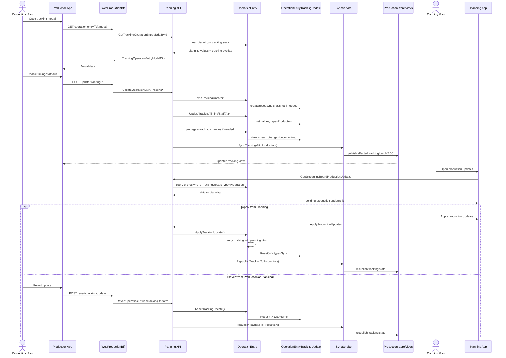
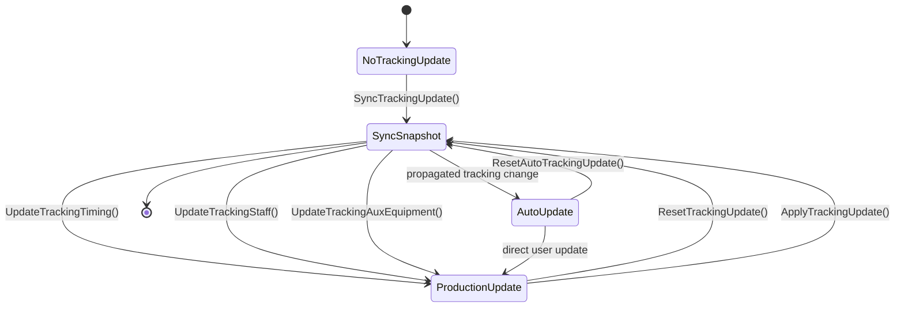

---
categories:
  - "[[Documentation]]"
  - "[[Work]]"
created: 2026-03-11
product: ScpCloud
component:
tags:
  - documentation/intelligen
  - topic/code
---

## Summary

Το `OperationEntryTrackingUpdate` είναι ουσιαστικά το tracking-side shadow state του `OperationEntry`, και το `OperationEntry` το χρησιμοποιεί σαν overlay πάνω από το planning state.
**Πώς το χρησιμοποιεί το `OperationEntry`**
Το `OperationEntry` κρατάει το canonical planning state (`Start`, `Duration`, `AuxEquipment`, `Staff`, `TimingStatus`) και προαιρετικά ένα `TrackingUpdate`. Αν δεν υπάρχει `TrackingUpdate`, όλα τα tracking getters γυρίζουν planning values. Αν υπάρχει, τα tracking getters διαβάζουν από εκεί: `TrackingStart`, `TrackingDuration`, `TrackingEnd`, `TrackingAuxEquipment`, `TrackingStaff`, `TrackingUpdateType` ([OperationEntry.cs](C:/Users/michael/developer/scpCloud/Services/Planning/Planning.Domain/Aggregates/OperationEntryAggregate/OperationEntry.cs#L232), [OperationEntry.cs](C:/Users/michael/developer/scpCloud/Services/Planning/Planning.Domain/Aggregates/OperationEntryAggregate/OperationEntry.cs#L342)).
Το ίδιο object χρησιμοποιείται και σαν state machine:
- `SyncTrackingUpdate()` δημιουργεί ή resetάρει baseline snapshot από το planning state ([OperationEntry.cs](C:/Users/michael/developer/scpCloud/Services/Planning/Planning.Domain/Aggregates/OperationEntryAggregate/OperationEntry.cs#L1278)).
- `UpdateTrackingTiming/AuxEquipment/Staff()` γράφουν user changes πάνω στο tracking layer και το κάνουν `Production` ([OperationEntry.cs](C:/Users/michael/developer/scpCloud/Services/Planning/Planning.Domain/Aggregates/OperationEntryAggregate/OperationEntry.cs#L1259)).
- `SetTrackingStart/SetTrackingDuration()` κάνουν propagated/inferred changes και το update γίνεται `Auto` ([OperationEntry.cs](C:/Users/michael/developer/scpCloud/Services/Planning/Planning.Domain/Aggregates/OperationEntryAggregate/OperationEntry.cs#L637), [OperationEntry.cs](C:/Users/michael/developer/scpCloud/Services/Planning/Planning.Domain/Aggregates/OperationEntryAggregate/OperationEntry.cs#L767)).
- `ApplyTrackingUpdate()` περνάει το tracking state μέσα στο planning state και μετά resetάρει το tracking σε `Sync` ([OperationEntry.cs](C:/Users/michael/developer/scpCloud/Services/Planning/Planning.Domain/Aggregates/OperationEntryAggregate/OperationEntry.cs#L1308)).
- `ResetTrackingUpdate()` πετάει το pending delta και ξαναφέρνει το tracking ίσο με το planning ([OperationEntry.cs](C:/Users/michael/developer/scpCloud/Services/Planning/Planning.Domain/Aggregates/OperationEntryAggregate/OperationEntry.cs#L1341)).
Το ίδιο το `OperationEntryTrackingUpdate` αποθηκεύει και metadata για την εφαρμογή: `LastUpdatedAt`, `LastUpdatedByUser`, `Comment`, `AttentionCodes`, και diff flags όπως `HasStartDatesDifference`, `HasDurationDifference`, `HasAuxEquipmentDifference`, `HasStaffDifference`, `HasTimingStatusDifference` ([OperationEntryTrackingUpdate.cs](C:/Users/michael/developer/scpCloud/Services/Planning/Planning.Domain/Aggregates/OperationEntryAggregate/OperationEntryTrackingUpdate.cs#L69)).
**Πώς το χρησιμοποιεί η εφαρμογή**
Στην production εφαρμογή, όταν ανοίγει το modal ενός operation entry, το backend επιστρέφει και planning και tracking εικόνα μαζί, μαζί με `TrackingUpdateType`, `LastUpdatedByUser`, `ConcurrencyToken`, attention codes και production tracking configuration ([OperationEntryServer.cs](C:/Users/michael/developer/scpCloud/Services/Planning/Planning.Api/GrpcServers/OperationEntryServer.cs#L191), [OperationEntryDto.cs](C:/Users/michael/developer/scpCloud/Services/Planning/Planning.Grpc/Dtos/OperationEntryDto.cs#L225)). Από εκεί το UI κάνει τα `update-tracking-*` calls και το `revert` ([Operations.jsx](C:/Users/michael/developer/scpCloud/WebApps/WebProductionSpa/src/pages/operations/Operations.jsx#L1086), [operationEntryService.js](C:/Users/michael/developer/scpCloud/WebApps/WebProductionSpa/src/services/operationEntryService.js#L15), [schedulingBoardService.js](C:/Users/michael/developer/scpCloud/WebApps/WebProductionSpa/src/services/schedulingBoardService.js#L49)).
Στην planning εφαρμογή, το `Updates` tab δεν φορτώνει όλα τα tracking updates. Φορτώνει μόνο όσα είναι `TrackingUpdateType = Production`, δηλαδή pending production changes που δεν έχουν γίνει ούτε apply ούτε revert ([SchedulingBoardServer.cs](C:/Users/michael/developer/scpCloud/Services/Planning/Planning.Api/GrpcServers/SchedulingBoardServer.cs#L767)). Το DTO εκεί δίνει δίπλα-δίπλα tracked και original values plus diff booleans, ώστε το UI να δείχνει τι ακριβώς άλλαξε ([OperationEntryDto.cs](C:/Users/michael/developer/scpCloud/Services/Planning/Planning.Grpc/Dtos/OperationEntryDto.cs#L241), [UpdatesGroup.jsx](C:/Users/michael/developer/scpCloud/WebApps/WebPlanningSpa/src/pages/updates/updatesTab/UpdatesGroup.jsx#L429)).
**Σημαντική λεπτομέρεια**
Το `OperationEntryTrackingUpdate` δεν είναι απλώς audit log. Είναι ενεργό operational state που:
- επηρεάζει το tracking view της εφαρμογής,
- οδηγεί propagation στο tracking timeline,
- συγχρονίζεται πίσω στην production,
- και μπορεί αργότερα να γίνει νέο planning baseline με `apply`.

## Details

Και πιο “εσωτερικά”, μέσα στο ίδιο το `OperationEntry`:

Σύντομη ανάγνωση:
- `Sync`: tracking = planning baseline.
- `Auto`: tracking άλλαξε έμμεσα από propagation.
- `Production`: tracking άλλαξε άμεσα από user action.
- `Apply`: το tracking γίνεται νέο planning.
- `Revert`: το tracking ξαναγίνεται ίσο με planning.

## Links
[[Tracking updates documentation]]