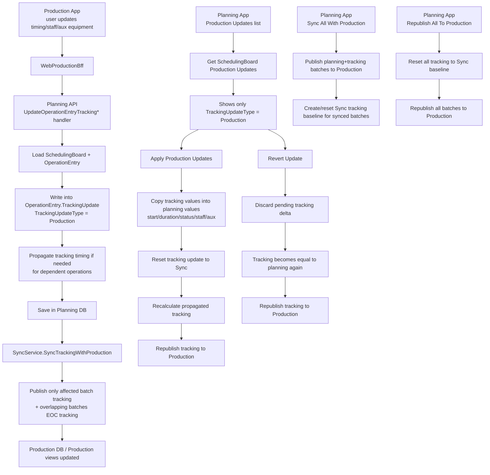
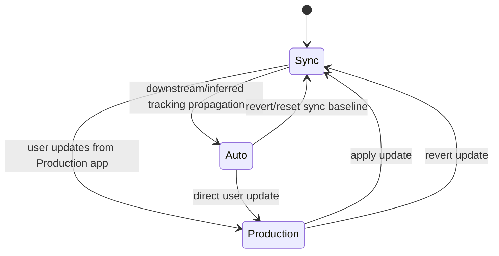

---
categories:
  - "[[Documentation]]"
  - "[[Work]]"
created: 2026-03-11
product: ScpCloud
component:
tags:
  - documentation/intelligen
  - topic/code
---
## Summary
Documentation about tracking updates in production and planning app.

**Μηχανισμός**
Στην `production` εφαρμογή ο χρήστης δεν αλλάζει απευθείας το planning record. Κάνει update πάνω στο `OperationEntry.TrackingUpdate` του planning domain, μέσω των production endpoints για `timing`, `aux equipment`, `staff` και `revert` ([OperationEntryController.cs](C:/Users/michael/developer/scpCloud/ApiGateways/WebProductionBff/Controllers/OperationEntryController.cs#L27), [SchedulingBoardController.cs](C:/Users/michael/developer/scpCloud/ApiGateways/WebProductionBff/Controllers/SchedulingBoardController.cs#L110)).
Υπάρχουν ουσιαστικά 3 states για το tracking update: `Sync`, `Auto`, `Production` ([TrackingUpdateType.cs](C:/Users/michael/developer/scpCloud/Services/Planning/Planning.Domain/Enumerations/TrackingUpdateType.cs#L7)). Το `Production` είναι το “χειροκίνητο update από production user”. Το `Auto` είναι propagated/inferred tracking change. Το `Sync` σημαίνει ότι tracking και planning θεωρούνται ευθυγραμμισμένα.
**Τι κάνει κάθε update**
Το `timing` update γράφει start/duration/status/comment/attention code στο tracking layer και μετά κάνει propagation στα downstream tracking timings, αλλά μόνο όπου επιτρέπεται ([OperationEntry.cs](C:/Users/michael/developer/scpCloud/Services/Planning/Planning.Domain/Aggregates/OperationEntryAggregate/OperationEntry.cs#L1259), [Batch.cs](C:/Users/michael/developer/scpCloud/Services/Planning/Planning.Domain/Aggregates/BatchAggregate/Batch.cs#L274)). Τα `staff` και `aux equipment` updates αλλάζουν μόνο το tracking assignment, όχι το planning assignment ([OperationEntry.cs](C:/Users/michael/developer/scpCloud/Services/Planning/Planning.Domain/Aggregates/OperationEntryAggregate/OperationEntry.cs#L1266), [OperationEntry.cs](C:/Users/michael/developer/scpCloud/Services/Planning/Planning.Domain/Aggregates/OperationEntryAggregate/OperationEntry.cs#L1272)).
Μετά από κάθε production update, το planning API κάνει save και αμέσως στέλνει στη production μόνο το tracking content/EOC του affected batch, συν EOC updates για overlapping batches. Αυτό γίνεται από το `SyncTrackingWithProductionAsync`, άρα το production UI βλέπει αμέσως το νέο tracking state χωρίς full republish ([UpdateOperationEntryTrackingTimingCommandHandler.cs](C:/Users/michael/developer/scpCloud/Services/Planning/Planning.Api/Application/Commands/OperationEntryCommands/UpdateOperationEntryTrackingTimingCommandHandler.cs#L96), [SyncService.cs](C:/Users/michael/developer/scpCloud/Services/Planning/Planning.Api/Services/SyncService.cs#L191)).
**Apply / Sync / Revert**
`Apply production updates` στο planning παίρνει κάθε `TrackingUpdateType.Production`, το γράφει μέσα στο planning `Start/Duration/TimingStatus/AuxEquipment/Staff`, μεταφέρει comments/attention codes, και μετά resetάρει το tracking update σε sync. Μετά ξαναϋπολογίζει propagation και republishes tracking προς production ([SchedulingBoard.cs](C:/Users/michael/developer/scpCloud/Services/Planning/Planning.Domain/Aggregates/SchedulingBoardAggregate/SchedulingBoard.cs#L471), [OperationEntry.cs](C:/Users/michael/developer/scpCloud/Services/Planning/Planning.Domain/Aggregates/OperationEntryAggregate/OperationEntry.cs#L1308), [ApplyProductionUpdatesCommandHandler.cs](C:/Users/michael/developer/scpCloud/Services/Planning/Planning.Api/Application/Commands/SchedulingBoardCommands/ApplyProductionUpdatesCommandHandler.cs#L26)).
`Revert tracking update` δεν εφαρμόζει τίποτα στο planning. Πετάει το pending tracking delta, επαναφέρει το tracking να δείχνει ξανά το current planning state, ξαναϋπολογίζει auto tracking και republishes αυτό το tracking state στη production ([RevertOperationEntriesTrackingUpdatesCommandHandler.cs](C:/Users/michael/developer/scpCloud/Services/Planning/Planning.Api/Application/Commands/SchedulingBoardCommands/RevertOperationEntriesTrackingUpdatesCommandHandler.cs#L28), [OperationEntry.cs](C:/Users/michael/developer/scpCloud/Services/Planning/Planning.Domain/Aggregates/OperationEntryAggregate/OperationEntry.cs#L1341)).
`Sync all with production` δεν σημαίνει “apply τα production updates στο planning”. Σημαίνει publish/refresh των scheduled batches από planning προς production και για όσα batches πάνε/ξαναπάνε production, δημιουργεί baseline tracking `Sync` (`LastSyncedAt`, `SyncTrackingUpdate`) πριν το publish ([SyncAllWithProductionCommandHandler.cs](C:/Users/michael/developer/scpCloud/Services/Planning/Planning.Api/Application/Commands/SchedulingBoardCommands/SyncAllWithProductionCommandHandler.cs#L37), [Batch.cs](C:/Users/michael/developer/scpCloud/Services/Planning/Planning.Domain/Aggregates/BatchAggregate/Batch.cs#L930), [SyncService.cs](C:/Users/michael/developer/scpCloud/Services/Planning/Planning.Api/Services/SyncService.cs#L107)). `Republish all to production` είναι πιο βαρύ: ξαναστέλνει όλα τα batches, αφού πρώτα κάνει full `SyncTrackingUpdates()` ([RepublishAllToProductionCommandHandler.cs](C:/Users/michael/developer/scpCloud/Services/Planning/Planning.Api/Application/Commands/SchedulingBoardCommands/RepublishAllToProductionCommandHandler.cs#L44)).
Σημαντικό constraint: propagation από apply/update δεν πατάει operation entries που έχουν ήδη δικό τους production update ή confirmed planning status, γιατί το domain φιλτράρει με `HasProductionUpdate` και `TimingStatus == Unspecified` ([OperationEntry.cs](C:/Users/michael/developer/scpCloud/Services/Planning/Planning.Domain/Aggregates/OperationEntryAggregate/OperationEntry.cs#L244), [OperationEntry.cs](C:/Users/michael/developer/scpCloud/Services/Planning/Planning.Domain/Aggregates/OperationEntryAggregate/OperationEntry.cs#L406)).
Πρακτικά: τα updates είναι pending tracking deltas που ζουν στο planning, φαίνονται στο planning app ως `production-updates`, μπορούν να γίνουν `apply` ή `revert`, και κάθε αλλαγή τους συγχρονίζεται πίσω στη production προβολή χωρίς να αλλάζει αυτόματα το planning baseline μέχρι να γίνει `apply`.

## Details

Παρακάτω είναι ένα συμπυκνωμένο διάγραμμα του flow όπως λειτουργεί τώρα.

**Main Flow**

**Update Lifecycle**

**Σύντομη ανάγνωση**
- `Production update` σημαίνει pending αλλαγή στο `TrackingUpdate`, όχι άμεση αλλαγή στο planning baseline.
- `Apply` περνάει το tracking στο planning.
- `Revert` πετάει το pending production delta.
- `Sync all` και `Republish all` είναι publish flows προς production, όχι apply των production updates στο planning.

## Links
[[Operation Entry tracking update]]